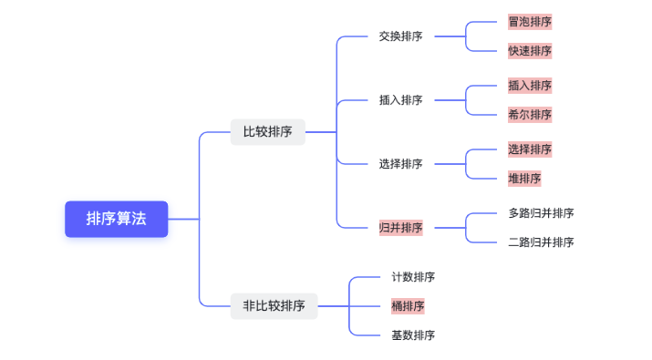
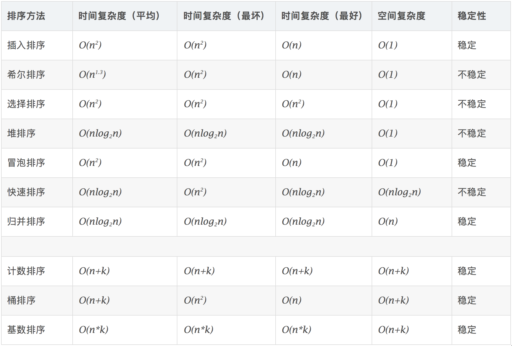
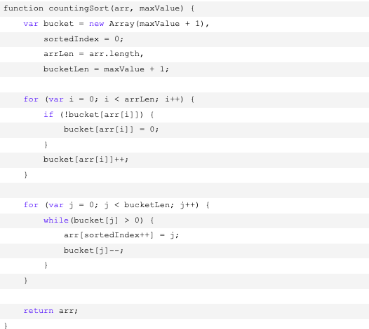
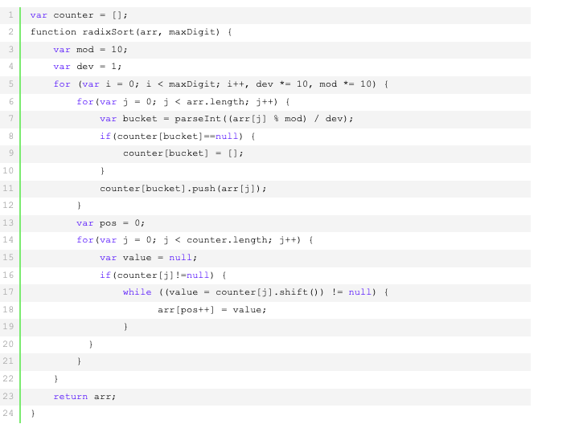

### 0、排序算法大纲

#### 1、排序算法



#### 1、排序算法时间复杂度



### 1、冒泡算法

比喻：相邻冒泡
思路：
- 比较相邻的元素。如果第一个比第二个大，就交换它们两个；
- 对每一对相邻元素作同样的工作，从开始第一对到结尾的最后一对，这样在最后的元素就是最大的数；
- 排除最大的数，接着下一轮继续相同的操作，确定第二大的数...
- 重复步骤1-3，直到排序完成。

```java
//冒泡排序
void bubbleSort(int[] nums){
    if(nums == null || nums.length < 2){
        return;
    }
    int length = nums.length;
    for(int i = 0; i< length-1;i++){
        for(int j = 0; j< length -i -1;j++){
            //相邻元素 当前第一个比第二个大交换
            if(nums[j]>nums[j+1]){ 
                int tmp = num[j];
                num[j] = num[j+1];
                num[j+1] = tmp;
            }
        }
    }
}
```

### 2、快速排序


比喻：选基准，左右各一排
思路：
1. 从数组中取第一个数做为基准 pivot 
2. 采用双指针(头尾两端)遍历，从左往右找到比基准值大的第一个数，从右往左找到比基准值小的第一个数，交换两数位置，直到头尾指针相等或头指针大于尾指针，最后把基准值与头指针的数交换
3. 对左右两边数组，重复上面1，2步骤。(左边的数就比基准值小，右边的数就比基准值大)
4. 左右两边数列递归结束后，排序完成。

```java
void sort(int[] nums){
    if(nums == null || nums.length < 2) return;
    quickSort(nums, 0, nums.length-1);
}

//基准默认取第一个
void quickSort(int[] nums, int left , int right){
   if(left > right) return;
   int i = left;
   int j = right;
   
   //基准
   int pivot = nums[i];
     
   while(i<j){
       //从右边选取第一个比基准小的数
       while(i<j && nums[j] > pivot){
           j++;
       }
       
       //从左边选择第一个比基准大的数
       while(i<j& nums[i] <= pivot){
           //基准 不参与排序
           i++;
       }
       
       //交换
       if(i<j){
           int tmp = nums[i];
           nums[i] = nums[j];
           nums[j] = tmp;
       }
   }
   
   //把基准值与头指针的数交换 
   nums[left] = nums[i];
   nums[i] = pivot;
   
   quickSort(nums,left, i-1);
   quickSort(nums,i+1,right);
}
```


### 3、插入排序


比喻 :抓牌排序
思路：
1. 从第一个元素开始，假定该元素已被排序；
2. 取出下一个元素，在前面已排序的元素序列中，从后向前扫描；
3. 如果该元素（已排序）大于新元素，将该元素移到下一位置；
4. 重复步骤3，直到找到已排序的元素小于或者等于新元素的位置；
5. 将新元素插入到该位置后；
6. 重复步骤2~5。

```java
void  insertionSort(int[] nums){
    if(nums == null || nums.length < 2) return;
    int length = nums.length;
    
    for(int i = 0; i < length -1 ;i++){
        //上一个数的指针
        int preIndex = i;
        //当前值
        int curr = nums[i+1];
        //比喻动作 抓新牌 排序 
        while(preIndex>=0 && curr < nums[preIndex]){
            nums[preIndex+1] = nums[preIndex];
            preIndex--;
        }
         //插入到这个数的后面
         nums[preIndex + 1] = curr;
    }
    
}
```

### 4、希尔排序

比喻：插入排序 ， 步子 从n/2 逐渐 变为 1

思路：
1. 把数组分割成若干h个小组, 然后对每一个小组分别进行插入排序。
2. 每一轮分割的数组的个数逐步缩小，h/2->h/4->h/8，并且进行排序，保证有序。
3. 当h=1时，则数组排序完成。

```java
void shellSort(int[] nums){
    if(nums == null || nums.length < 2) return;
    int length = nums.length;
    int curr;
    
    int gap = length/2;
     while (gap > 0) {
            for (int i = gap; i < length; i++) {
                curr = nums[i];
                int preIndex = i - gap;
                while (preIndex >= 0 && nums[preIndex] > curr) {
                    nums[preIndex + gap] = nums[preIndex];
                    preIndex -= gap;
                }
                nums[preIndex + gap] = curr;
            }
            gap /= 2;
        }
}
```

### 5、选择排序


比喻：遍历剩余数组最小交换
思路：
1. 找到最小的元素，和数组第一个数交换位置。
2. 找到第二小的元素，和数组第二个数交换位置...
3. 直到最后一个元素，排序完成。

```java
  void selectionSort(int[] nums) {
        for (int i = 0; i < nums.length; i++) {
            int minIndex = i;
            for (int j = i + 1; j < nums.length; j++) {
                if (nums[j] < nums[minIndex]) {
                    minIndex = j;
                }
            }
            if (minIndex != i) {
                int temp = nums[i];
                nums[minIndex] = temp;
                nums[i] = nums[minIndex];
            }
        }
    }
```

### 6、堆排序

大顶堆概念：每个节点的值都大于或者等于它的左右子节点的值，所以顶点的数就是最大值。


思路：
1. 对原数组构建成大顶堆。
2. 交换头尾值，尾指针索引减一，固定最大值。
3. 重新构建大顶堆。
4. 重复步骤2~3，直到最后一个元素，排序完成。

```java
protected void sort(int[] nums) {
        if (nums == null || nums.length < 2) {
            return;
        }
        heapSort(nums);
    }

    private void heapSort(int[] nums) {
        if (nums == null || nums.length < 2) {
            return;
        }
        //构建大根堆
        createTopHeap(nums);
        int size = nums.length;
        while (size > 1) {
            //大根堆的交换头尾值，固定最大值在末尾
            swap(nums, 0, size - 1);
            //末尾的索引值往左减1
            size--;
            //重新构建大根堆
            updateHeap(nums, size);
        }
    }

    private void createTopHeap(int[] nums) {
        for (int i = 0; i < nums.length; i++) {
            //当前插入的索引
            int currIndex = i;
            //父节点的索引
            int parentIndex = (currIndex - 1) / 2;
            //如果当前遍历的值比父节点大的话，就交换值。然后继续往上层比较
            while (nums[currIndex] > nums[parentIndex]) {
                //交换当前遍历的值与父节点的值
                swap(nums, currIndex, parentIndex);
                //把父节点的索引指向当前遍历的索引
                currIndex = parentIndex;
                //往上计算父节点索引
                parentIndex = (currIndex - 1) / 2;
            }
        }
    }

    private void updateHeap(int[] nums, int size) {
        int index = 0;
        //左节点索引
        int left = 2 * index + 1;
        //右节点索引
        int right = 2 * index + 2;
        while (left < size) {
            //最大值的索引
            int largestIndex;
            //如果右节点大于左节点，则最大值索引指向右子节点索引
            if (right < size && nums[left] < nums[right]) {
                largestIndex = right;
            } else {
                largestIndex = left;
            }
            //如果父节点大于最大值，则把父节点索引指向最大值索引
            if (nums[index] > nums[largestIndex]) {
                largestIndex = index;
            }
            //如果父节点索引指向最大值索引，证明已经是大根堆，退出循环
            if (largestIndex == index) {
                break;
            }
            //如果不是大根堆，则交换父节点的值
            swap(nums, largestIndex, index);
            //把最大值的索引变成父节点索引
            index = largestIndex;
            //重新计算左节点索引
            left = 2 * index + 1;
            //重新计算右节点索引
            right = 2 * index + 2;
        }
    }

    private void swap(int[] nums, int i, int j) {
        int temp = nums[i];
        nums[i] = nums[j];
        nums[j] = temp;
    }
```


### 7、归并排序


归并排序是采用分治法的典型应用，而且是一种稳定的排序方式，不过需要使用到额外的空间。
思路：
1. 把数组不断划分成子序列，划成长度只有2或者1的子序列。
2. 然后利用临时数组，对子序列进行排序，合并，再把临时数组的值复制回原数组。
3. 反复操作1~2步骤，直到排序完成。
归并排序的优点在于最好情况和最坏的情况的时间复杂度都是O(nlogn)，所以是比较稳定的排序方式。

```java

     void sort(int[] nums) {
        if (nums == null || nums.length < 2) {
            return;
        }
        //归并排序
        mergeSort(0, nums.length - 1, nums, new int[nums.length]);
    }

    private void mergeSort(int start, int end, int[] nums, int[] temp) {
        //递归终止条件
        if (start >= end) {
            return;
        }
        int mid = start + (end - start) / 2;
        //左边进行归并排序
        mergeSort(start, mid, nums, temp);
        //右边进行归并排序
        mergeSort(mid + 1, end, nums, temp);
        //合并左右
        merge(start, end, mid, nums, temp);
    }

    private void merge(int star, int end, int mid, int[] nums, int[] temp) {
        int index = 0;
        int i = star;
        int j = mid + 1;
        while (i <= mid && j <= end) {
            if (nums[i] > nums[j]) {
                temp[index++] = nums[j++];
            } else {
                temp[index++] = nums[i++];
            }
        }
        while (i <= mid) {
            temp[index++] = nums[i++];
        }
        while (j <= end) {
            temp[index++] = nums[j++];
        }
        //把临时数组中已排序的数复制到nums数组中
        if (index >= 0) System.arraycopy(temp, 0, nums, star, index);
    }
```

### 8、堆排序

思路：
1. 找出最大值，最小值。
2. 根据数组的长度，创建出若干个桶。
3. 遍历数组的元素，根据元素的值放入到对应的桶中。
4. 对每个桶的元素进行排序(可使用快排，插入排序等)。
5. 按顺序合并每个桶的元素，排序完成。
对于数组中的元素分布均匀的情况，排序效率较高。相反的，如果分布不均匀，则会导致大部分的数落入到同一个桶中，使效率降低。

```java
    protected void sort(int[] nums) {
        if (nums == null || nums.length < 2) {
            return;
        }
        bucketSort(nums);
    }

    public void bucketSort(int[] nums) {
        if (nums == null || nums.length < 2) {
            return;
        }
        //找出最大值，最小值
        int max = Integer.MIN_VALUE;
        int min = Integer.MAX_VALUE;
        for (int num : nums) {
            min = Math.min(min, num);
            max = Math.max(max, num);
        }
        int length = nums.length;
        //桶的数量
        int bucketCount = (max - min) / length + 1;
        int[][] bucketArrays = new int[bucketCount][];
        //遍历数组，放入桶内
        for (int i = 0; i < length; i++) {
            //找到桶的下标
            int index = (nums[i] - min) / length;
            //添加到指定下标的桶里，并且使用插入排序排序
            bucketArrays[index] = insertSortArrays(bucketArrays[index], nums[i]);
        }
        int k = 0;
        //合并全部桶的
        for (int[] bucketArray : bucketArrays) {
            if (bucketArray == null || bucketArray.length == 0) {
                continue;
            }
            for (int i : bucketArray) {
                //把值放回到nums数组中
                nums[k++] = i;
            }
        }
    }

    //每个桶使用插入排序进行排序
    private int[] insertSortArrays(int[] arr, int num) {
        if (arr == null || arr.length == 0) {
            return new int[]{num};
        }
        //创建一个temp数组，长度是arr数组的长度+1
        int[] temp = new int[arr.length + 1];
        //把传进来的arr数组，复制到temp数组
        for (int i = 0; i < arr.length; i++) {
            temp[i] = arr[i];
        }
        //找到一个位置，插入，形成新的有序的数组
        int i;
        for (i = temp.length - 2; i >= 0 && temp[i] > num; i--) {
            temp[i + 1] = temp[i];
        }
        //插入需要添加的值
        temp[i + 1] = num;
        //返回
        return temp;
    }
```

### 9、计数排序

描述
- 找出待排序的数组中最大和最小的元素；
- 统计数组中每个值为i的元素出现的次数，存入数组C的第i项；
- 对所有的计数累加（从C中的第一个元素开始，每一项和前一项相加）；
- 反向填充目标数组：将每个元素i放在新数组的第C(i)项，每放一个元素就将C(i)减去1。





### 10、基数排序
基数排序是按照低位先排序，然后收集；再按照高位排序，然后再收集；依次类推，直到最高位。有时候有些属性是有优先级顺序的，先按低优先级排序，再按高优先级排序。最后的次序就是高优先级高的在前，高优先级相同的低优先级高的在前。

- 取得数组中的最大数，并取得位数；
- arr为原始数组，从最低位开始取每个位组成radix数组；
- 对radix进行计数排序（利用计数排序适用于小范围数的特点）；

