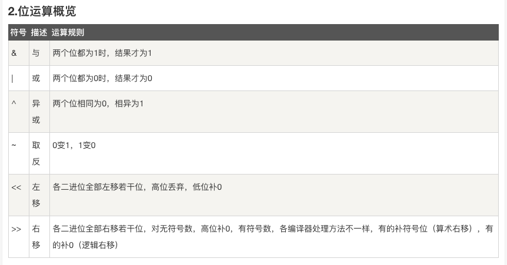

# 0. 剑指 offer 大纲

剑指 offer 大纲

| <strong>类型</strong>                                     | <strong>题目</strong>                                                                                                                                                                 | <strong>leetcode</strong>                                                                                                                                                                                                                                                                                                        |
| --------------------------------------------------------- | ------------------------------------------------------------------------------------------------------------------------------------------------------------------------------------- | -------------------------------------------------------------------------------------------------------------------------------------------------------------------------------------------------------------------------------------------------------------------------------------------------------------------------------- |
| <strong>数组与矩阵</strong>                               | [3. 数组中重复的数字](https://hw59jj30i1.feishu.cn/docx/DYIDd7RAoo2MbAxJGljcNzk9n7d)                                                                                                  | [LCR 120. 寻找文件副本 - 力扣（LeetCode）](https://leetcode.cn/problems/shu-zu-zhong-zhong-fu-de-shu-zi-lcof/solutions/2358068/jian-zhi-offer-03-shu-zu-zhong-zhong-fu-qrgo9/)                                                                                                                                                   |
|                                                           | [4. 二维数组中的查找](https://hw59jj30i1.feishu.cn/docx/KG24dSUlQoXTxixA5kjcLTvRnld)                                                                                                  | [力扣（LeetCode）官网 - 全球极客挚爱的技术成长平台](https://leetcode.cn/problems/er-wei-shu-zu-zhong-de-cha-zhao-lcof/solutions/2358617/er-wei-shu-zu-zhong-de-cha-zhao-by-yinli-ocgf/)                                                                                                                                          |
|                                                           | [5. 替换空格](https://hw59jj30i1.feishu.cn/docx/QIfzdQBaroUwR7xURcTc53fonCh)                                                                                                          | [力扣（LeetCode）官网 - 全球极客挚爱的技术成长平台](https://leetcode.cn/problems/ti-huan-kong-ge-lcof/solutions/2359569/jian-zhi-offer-05-ti-huan-kong-ge-by-yin-5crf/)                                                                                                                                                          |
|                                                           | [41. 字符流中第一个不重复的字符](https://hw59jj30i1.feishu.cn/docx/Ryu3dZUIHoyK2XxSXWbcfr5sn4d)                                                                                       | [387. 字符串中的第一个唯一字符 - 力扣（LeetCode）](https://leetcode.cn/problems/first-unique-character-in-a-string/solutions/2601397/jian-zhi-offer41-zi-fu-liu-zhong-di-yi-g-zvr2/)                                                                                                                                             |
| <strong>堆栈队列</strong>                                 | [9. 用两个栈实现队列](https://hw59jj30i1.feishu.cn/docx/JkrvdPaPRoGI2BxXxeEcJcIXnsf)                                                                                                  | [力扣（LeetCode）官网 - 全球极客挚爱的技术成长平台](https://leetcode.cn/problems/yong-liang-ge-zhan-shi-xian-dui-lie-lcof/solutions/2360998/jian-zhi-offer-09-yong-liang-ge-zhan-shi-0j4k/)                                                                                                                                      |
|                                                           | [30. 最小栈](https://hw59jj30i1.feishu.cn/docx/VyVodXGvGorGIaxPZ7kcXgVknvf)                                                                                                           | [力扣（LeetCode）官网 - 全球极客挚爱的技术成长平台](https://leetcode.cn/problems/bao-han-minhan-shu-de-zhan-lcof/solutions/2487376/jian-zhi-offer-30-zui-xiao-zhan-by-yinli-ugaq/)                                                                                                                                               |
|                                                           | [31. 栈压入弹出](https://hw59jj30i1.feishu.cn/docx/OSJ0d1cnwojemrx3AvgckaPVnpe)                                                                                                       | [力扣（LeetCode）官网 - 全球极客挚爱的技术成长平台](https://leetcode.cn/problems/zhan-de-ya-ru-dan-chu-xu-lie-lcof/solutions/2487378/jian-zhi-offer31-zhan-ya-ru-dan-chu-by-y-mcyd/)                                                                                                                                             |
|                                                           | [40. 最小 k 个数](https://hw59jj30i1.feishu.cn/docx/CT38dxKBzos8oSxCrgDcDOlnnm7)                                                                                                      | [面试题 17.14. 最小 K 个数 - 力扣（LeetCode）](https://leetcode.cn/problems/smallest-k-lcci/solutions/2601082/jian-zhi-offer40-zui-xiao-kge-shu-by-yin-3hip/)                                                                                                                                                                    |
|                                                           | [41. 数据流中的中位数](https://hw59jj30i1.feishu.cn/docx/UnEgdqJUUoAZ7WxfInycTotjneh)                                                                                                 | [LCR 160. 数据流中的中位数 - 力扣（LeetCode）](https://leetcode.cn/problems/shu-ju-liu-zhong-de-zhong-wei-shu-lcof/solutions/2601380/jian-zhi-offer41-shu-ju-liu-zhong-de-zho-9z6t/)                                                                                                                                             |
|                                                           | [41. 字符流中第一个不重复的字符](https://hw59jj30i1.feishu.cn/docx/Ryu3dZUIHoyK2XxSXWbcfr5sn4d)                                                                                       | [387. 字符串中的第一个唯一字符 - 力扣（LeetCode）](https://leetcode.cn/problems/first-unique-character-in-a-string/solutions/2601397/jian-zhi-offer41-zi-fu-liu-zhong-di-yi-g-zvr2/)                                                                                                                                             |
|                                                           | [59. 滑动窗口最大值](https://hw59jj30i1.feishu.cn/docx/UEbSdc5wko3uTRxhJlqcKsNSnRf)                                                                                                   | [239. 滑动窗口最大值 - 力扣（LeetCode）](https://leetcode.cn/problems/sliding-window-maximum/solutions/2606379/jian-zhi-offer59-hua-dong-chuang-kou-zui-wtf7/)                                                                                                                                                                   |
| <strong>双指针</strong>                                   | [57. 两数之和](https://hw59jj30i1.feishu.cn/docx/O9hWd1V4Eo0Jchxz4lTcSEExnhh)                                                                                                         | [LCR 006. 两数之和 II - 输入有序数组 - 力扣（LeetCode）](https://leetcode.cn/problems/kLl5u1/solutions/2605985/jian-zhi-offer57-liang-shu-zhi-he-by-yin-tap8/)                                                                                                                                                                   |
|                                                           | [58. 字符串单词反转](https://hw59jj30i1.feishu.cn/docx/LayCdxzRkoT8tIxhTjCcRmvhnAc)                                                                                                   | [LCR 181. 字符串中的单词反转 - 力扣（LeetCode）](https://leetcode.cn/problems/fan-zhuan-dan-ci-shun-xu-lcof/solutions/2606026/jian-zhi-offer58-dan-ci-fan-zhuan-by-yin-l1lu/)                                                                                                                                                    |
| <strong>链表</strong>                                     | [6. 从尾到头打印链](https://hw59jj30i1.feishu.cn/docx/GQrndPOfxocGFTxAlrNcO4fWnne)                                                                                                    | [力扣（LeetCode）官网 - 全球极客挚爱的技术成长平台](https://leetcode.cn/problems/cong-wei-dao-tou-da-yin-lian-biao-lcof/solutions/2359562/jian-zhi-offer-06-cong-wei-dao-tou-da-yi-wcll/)                                                                                                                                        |
|                                                           | [18. 删除链表的节点](https://hw59jj30i1.feishu.cn/docx/TnUpdO9Leo9GQyx5DqxcRb4jnbe)                                                                                                   | [力扣（LeetCode）官网 - 全球极客挚爱的技术成长平台](https://leetcode.cn/problems/shan-chu-lian-biao-de-jie-dian-lcof/solutions/2367538/jian-zhi-offer-18-shan-chu-lian-biao-de-9rk6w/)                                                                                                                                           |
|                                                           | [22. 链表中倒数第 K 个结点(快慢指针)](https://hw59jj30i1.feishu.cn/docx/VgKDd3BJyo13nwxoIJmcJrjFnqb)                                                                                  | [力扣（LeetCode）官网 - 全球极客挚爱的技术成长平台](https://leetcode.cn/problems/lian-biao-zhong-dao-shu-di-kge-jie-dian-lcof/solutions/2369426/jian-zhi-offer-22-lian-biao-zhong-dao-sh-tokp/)                                                                                                                                  |
|                                                           | [23. 链表中环的入口结点](https://hw59jj30i1.feishu.cn/docx/SEB7d07rfo5Q5GxKqaWciihAnfh)                                                                                               | [力扣（LeetCode）官网 - 全球极客挚爱的技术成长平台](https://leetcode.cn/problems/linked-list-cycle-ii/solutions/2480273/jian-zhi-offer-23-lian-biao-zhong-huan-d-677x/)                                                                                                                                                          |
|                                                           | [24. 反转链表](https://hw59jj30i1.feishu.cn/docx/I1nld38ALoTkGvxQBgJcZCmQnMc)                                                                                                         | [力扣（LeetCode）官网 - 全球极客挚爱的技术成长平台](https://leetcode.cn/problems/reverse-linked-list/solutions/2480312/jian-zhi-offer24-fan-zhuan-lian-biao-by-tjtc9/)                                                                                                                                                           |
|                                                           | [25. 合并两个排序的链表](https://hw59jj30i1.feishu.cn/docx/PFcJdrJ8zoxNt8xDNWucZYD1njf)                                                                                               | [力扣（LeetCode）官网 - 全球极客挚爱的技术成长平台](https://leetcode.cn/problems/merge-two-sorted-lists/solutions/2480374/jian-zhi-offer25-he-bing-liang-ge-pai-xu-fi86/)                                                                                                                                                        |
|                                                           | [35. 复杂链表的复制](https://hw59jj30i1.feishu.cn/docx/QutPdNu4joI46ox3oAEcNxi1nec)                                                                                                   | [LCR 154. 复杂链表的复制 - 力扣（LeetCode）](https://leetcode.cn/problems/fu-za-lian-biao-de-fu-zhi-lcof/solutions/2601026/jian-zhi-offer35-fu-za-lian-biao-de-fu-z-4dcb/)                                                                                                                                                       |
|                                                           | [52. 相交链表](https://hw59jj30i1.feishu.cn/docx/X6FhdOUEooPc58xBacZcuqU6nac)                                                                                                         | [LCR 023. 相交链表 - 力扣（LeetCode）](https://leetcode.cn/problems/3u1WK4/solutions/2604945/jian-zhi-offer52-liang-ge-lian-biao-de-d-mv5n/)                                                                                                                                                                                     |
| <strong>树</strong>                                       | [7. 重建二叉树 ](https://hw59jj30i1.feishu.cn/docx/FM3ddoEkBoB68Exz0yGcuFwvnrc)                                                                                                       | [LCR 124. 推理二叉树 - 力扣（LeetCode）](https://leetcode.cn/problems/zhong-jian-er-cha-shu-lcof/solution/jian-zhi-offer-07-zhong-jian-er-cha-shu-on87b/)                                                                                                                                                                        |
|                                                           | [8. 二叉树下一个节点](https://hw59jj30i1.feishu.cn/docx/TDfxdyQUAoUhQBxMCJwcrYIun7b)                                                                                                  |                                                                                                                                                                                                                                                                                                                                  |
|                                                           | [26. 树的子结构](https://hw59jj30i1.feishu.cn/docx/S5RZdt6X0o3XczxfxV7cWChBnGg)                                                                                                       | [力扣（LeetCode）官网 - 全球极客挚爱的技术成长平台](https://leetcode.cn/problems/shu-de-zi-jie-gou-lcof/solutions/2480438/jian-zhi-offer26-shu-de-zi-jie-gou-by-yi-omev/)                                                                                                                                                        |
|                                                           | [27. 反转二叉树](https://hw59jj30i1.feishu.cn/docx/AenkdrWB6oBwsxxmDqpcSj0Fnpf)                                                                                                       | [力扣（LeetCode）官网 - 全球极客挚爱的技术成长平台](https://leetcode.cn/problems/er-cha-shu-de-jing-xiang-lcof/solutions/2485068/jian-zhi-offer-27-fan-zhuan-er-cha-shu-b-1un9/)                                                                                                                                                 |
|                                                           | [28. 对称二叉树](https://hw59jj30i1.feishu.cn/docx/JH9md2Ek5ozo46xhrHLcTP7Qnxe)                                                                                                       | [力扣（LeetCode）官网 - 全球极客挚爱的技术成长平台](https://leetcode.cn/problems/dui-cheng-de-er-cha-shu-lcof/solutions/2485090/jian-zhi-offer-28-dui-cheng-er-cha-shu-b-y43b/)                                                                                                                                                  |
|                                                           | [32. 从上往下打印二叉树](https://hw59jj30i1.feishu.cn/docx/N60Sdt0SYo4MUwxt3fnceRhTnlc)                                                                                               | [LCR 151. 彩灯装饰记录 III - 力扣（LeetCode）](https://leetcode.cn/problems/cong-shang-dao-xia-da-yin-er-cha-shu-iii-lcof/solution/jian-zhi-offer-32-cong-shang-er-xia-da-y-djtx/)                                                                                                                                               |
|                                                           | [33 二叉搜索树的后序遍历序列](https://hw59jj30i1.feishu.cn/docx/P9MdduufBoBQYqx3Gbfc5S3Fnxe)                                                                                          | [145. 二叉树的后序遍历 - 力扣（LeetCode）](https://leetcode.cn/problems/binary-tree-postorder-traversal/solutions/2600178/jian-zhi-offer-33-er-cha-sou-suo-shu-de-oi2fd/)                                                                                                                                                        |
|                                                           | [34. 二叉树中和为目标值的路径](https://hw59jj30i1.feishu.cn/docx/S9h5dGWO5oAfFfxHysMc8NeHnUd)                                                                                         | [LCR 153. 二叉树中和为目标值的路径 - 力扣（LeetCode）](https://leetcode.cn/problems/er-cha-shu-zhong-he-wei-mou-yi-zhi-de-lu-jing-lcof/solution/jian-zhi-offer34-er-cha-shu-zhong-he-wei-9o5e/)                                                                                                                                  |
|                                                           | [36. 将二叉搜索树转化为排序的双向链表](https://hw59jj30i1.feishu.cn/docx/To7td9qfgo4Es0xFLy3crvfHnae)                                                                                 | [LCR 155. 将二叉搜索树转化为排序的双向链表 - 力扣（LeetCode）](https://leetcode.cn/problems/er-cha-sou-suo-shu-yu-shuang-xiang-lian-biao-lcof/solutions/2601028/jian-zhi-offer36-jiang-er-cha-sou-suo-sh-3mte/)                                                                                                                  |
|                                                           | [37. 序列化与反序列化二叉树](https://hw59jj30i1.feishu.cn/docx/AYS3dHnfdofXVixj7ikcl2MTnvd)                                                                                           | [LCR 156. 序列化与反序列化二叉树 - 力扣（LeetCode）](https://leetcode.cn/problems/xu-lie-hua-er-cha-shu-lcof/solution/jian-zhi-offer37-xu-lie-hua-er-cha-shu-b-nywh/)                                                                                                                                                            |
|                                                           | [54. 二叉查找树的第 K 个结点](https://hw59jj30i1.feishu.cn/docx/ZX5kdE5HSooA2pxqBT2co0ZMnYv)                                                                                          |                                                                                                                                                                                                                                                                                                                                  |
|                                                           | [55. 二叉树深度](https://hw59jj30i1.feishu.cn/docx/TD4ydH42BoqckuxKAqHckGzcnwg)                                                                                                       | [104. 二叉树的最大深度 - 力扣（LeetCode）](https://leetcode.cn/problems/maximum-depth-of-binary-tree/solutions/2604992/jian-zhi-offer55-er-cha-shu-de-shen-du-b-w1pl/)                                                                                                                                                           |
|                                                           | [68. 树中两个节点的最低公共祖先](https://hw59jj30i1.feishu.cn/docx/DPEQdSdnMoiD6fxl6xjcdZBKnLc)                                                                                       | [235. 二叉搜索树的最近公共祖先 - 力扣（LeetCode）](https://leetcode.cn/problems/lowest-common-ancestor-of-a-binary-search-tree/solutions/2607423/jian-zhi-offer68-shu-zhong-liang-ge-jie-y00eh/)                                                                                                                                 |
| <strong>贪心思想</strong>                                 | [14. 剪绳子](https://hw59jj30i1.feishu.cn/docx/CcPHdDChMoO7LFxjapzc2mejnsA)                                                                                                           | [力扣（LeetCode）官网 - 全球极客挚爱的技术成长平台](https://leetcode.cn/problems/jian-sheng-zi-lcof/solutions/2366007/jian-zhi-offer-14-i-jian-sheng-zi-you-xi-iwqf/)                                                                                                                                                            |
|                                                           | [63. 股票最大利润](https://hw59jj30i1.feishu.cn/docx/PA2TdAo7QoUHw9xnPx7cRNsOnth)                                                                                                     | [121. 买卖股票的最佳时机 - 力扣（LeetCode）](https://leetcode.cn/problems/best-time-to-buy-and-sell-stock/solutions/2607344/jian-zhi-offer63-gu-piao-zui-da-li-run-b-3bxb/)                                                                                                                                                      |
| <strong>二分查找</strong>                                 | [11. 旋转数组的最小数字](https://hw59jj30i1.feishu.cn/docx/H9WEdhcG8owFDGxzEyPcfEEvnug)                                                                                               | [力扣（LeetCode）官网 - 全球极客挚爱的技术成长平台](https://leetcode.cn/problems/xuan-zhuan-shu-zu-de-zui-xiao-shu-zi-lcof/solutions/2361066/jian-zhi-offer-11-xuan-zhuan-shu-zu-de-z-awqd/)                                                                                                                                     |
|                                                           | [53. 数字在排序数组中出现的次数](https://hw59jj30i1.feishu.cn/docx/OXAUd5dL1oS7cRxwWwDcTX5DnHc)                                                                                       | [LCR 172. 统计目标成绩的出现次数 - 力扣（LeetCode）](https://leetcode.cn/problems/zai-pai-xu-shu-zu-zhong-cha-zhao-shu-zi-lcof/solutions/2604980/jian-zhi-offer53-shu-zi-zai-pai-xu-shu-z-jz8u/)                                                                                                                                 |
| <strong>分治</strong>                                     | [16. 数值的整数次方](https://hw59jj30i1.feishu.cn/docx/QxB0dBpmxo8GFnxRKjGcuYT2nCg)                                                                                                   | [力扣（LeetCode）官网 - 全球极客挚爱的技术成长平台](https://leetcode.cn/problems/shu-zhi-de-zheng-shu-ci-fang-lcof/solutions/2366085/jian-zhi-offer-16-shu-zhi-de-zheng-shu-c-kbsm/)                                                                                                                                             |
| <strong>搜索</strong>                                     | [12. 矩阵中路径](https://hw59jj30i1.feishu.cn/docx/QRE8dFjDUo7GbZxuyrYchul0nnh)                                                                                                       | [力扣（LeetCode）官网 - 全球极客挚爱的技术成长平台](https://leetcode.cn/problems/ju-zhen-zhong-de-lu-jing-lcof/solutions/2361243/jian-zhi-offer-12-ju-zhen-zhong-de-lu-ji-bk4w/)                                                                                                                                                 |
|                                                           | [13. 机器人的运动范围](https://hw59jj30i1.feishu.cn/docx/N2VadUTQ1oX6jpxfmU5cGHAincf)                                                                                                 | [力扣（LeetCode）官网 - 全球极客挚爱的技术成长平台](https://leetcode.cn/problems/ji-qi-ren-de-yun-dong-fan-wei-lcof/solutions/2361510/jian-zhi-offer-13-ji-qi-ren-de-yun-dong-hatmc/)                                                                                                                                            |
|                                                           | [38. 没有重复元素集合的全排列](https://hw59jj30i1.feishu.cn/docx/K46udpw3Jog36rxIncGcXyAQnnc)                                                                                         | [LCR 083. 全排列 - 力扣（LeetCode）](https://leetcode.cn/problems/VvJkup/solutions/2601039/jian-zhi-offer38-mei-you-zhong-fu-yuan-s-68n4/)                                                                                                                                                                                       |
|                                                           | [38. 有重复数字的全排列。](https://hw59jj30i1.feishu.cn/docx/Q04zdLyPgovT7nx67nKccA2onTf)                                                                                             | [LCR 084. 全排列 II  - 力扣（LeetCode）](https://leetcode.cn/problems/7p8L0Z/solutions/2601048/jian-zhi-offer38-you-zhong-fu-shu-zi-de-xm4gh/)                                                                                                                                                                                   |
| <strong>排序</strong>                                     | [21. 调整数组顺序使奇数位于偶数前面](https://hw59jj30i1.feishu.cn/docx/BfeudsZHoo33DOxCBiHcqPIMnng)                                                                                   | [力扣（LeetCode）官网 - 全球极客挚爱的技术成长平台](https://leetcode.cn/problems/diao-zheng-shu-zu-shun-xu-shi-qi-shu-wei-yu-ou-shu-qian-mian-lcof/solutions/2369404/jian-zhi-offer-21-diao-zheng-shu-zu-shun-5ab7/)                                                                                                             |
|                                                           | [45. 把数组排成最小的数](https://hw59jj30i1.feishu.cn/docx/A9K7dqb5CoYf6gxbiWeck5IPnBd)                                                                                               | 暂无                                                                                                                                                                                                                                                                                                                             |
|                                                           | [51. 数组中的逆序对](https://hw59jj30i1.feishu.cn/docx/UDpBddiAIoiTIXxuxJ5ch6f3nBf)                                                                                                   | [LCR 170. 交易逆序对的总数 - 力扣（LeetCode）](https://leetcode.cn/problems/shu-zu-zhong-de-ni-xu-dui-lcof/solutions/2604867/jian-zhi-offer51-shu-zu-zhong-de-ni-xu-d-j3s2/)                                                                                                                                                     |
| <strong>动态规划</strong>动态规划本质是数学公式的推导展开 | [10. 跳台阶](https://hw59jj30i1.feishu.cn/docx/BFnRdLnJSoy3rMxCR72cHJ67nQe)                                                                                                           | [LCR 127. 跳跃训练 - 力扣（LeetCode）](https://leetcode.cn/problems/qing-wa-tiao-tai-jie-wen-ti-lcof/solutions/2607751/jian-zhi-offer10-tiao-tai-jie-by-yinling-essz/)                                                                                                                                                           |
|                                                           | [42. 连续子数组的最大和](https://hw59jj30i1.feishu.cn/docx/AxQGdFnxXovW8SxFUotc7kFpnSc)                                                                                               | [53. 最大子数组和 - 力扣（LeetCode）](https://leetcode.cn/problems/maximum-subarray/solutions/2601412/jian-zhi-offer42-lian-xu-zi-shu-zu-de-zu-xb1q/)                                                                                                                                                                            |
|                                                           | [47.  礼物的最大价值](https://hw59jj30i1.feishu.cn/docx/C15kdZ8blo0WAYx98C8chgIanWb)  [48. 最长不含重复字符的子字符串](https://hw59jj30i1.feishu.cn/docx/YN4NdYetLod02ex4YZCcGtrJncc) | [LCR 166. 珠宝的最高价值 - 力扣（LeetCode）](https://leetcode.cn/problems/li-wu-de-zui-da-jie-zhi-lcof/solutions/2602990/jian-zhi-offer47-li-wu-de-zui-da-jie-zhi-53vx/)[LCR 016. 无重复字符的最长子串 - 力扣（LeetCode）](https://leetcode.cn/problems/wtcaE1/solutions/2603900/jian-zhi-offer48-wu-zhong-fu-zi-fu-de-zu-s7m9/) |
|                                                           | [49. 丑数](https://hw59jj30i1.feishu.cn/docx/CXEud8qOVo91xkx3qaNcS1gJnwb)                                                                                                             | [263. 丑数 - 力扣（LeetCode）](https://leetcode.cn/problems/ugly-number/solutions/2603937/jian-zhi-offer50-chou-shu-by-yinlingchao-3tgu/)                                                                                                                                                                                        |
|                                                           | [60. n 个骰子的点数](https://hw59jj30i1.feishu.cn/docx/SWd6dI4N5oQSCixjfuccI25mnN0)                                                                                                   |                                                                                                                                                                                                                                                                                                                                  |
|                                                           | [66. 构建乘积数组](https://hw59jj30i1.feishu.cn/docx/RhzedixH2okGpQxgYPZc5amFnlc)                                                                                                     |                                                                                                                                                                                                                                                                                                                                  |
| <strong>数学</strong>                                     | [39. 有序数组中出现次数超过 25% 的元素](https://hw59jj30i1.feishu.cn/docx/EmZSdo7xRoIDZ3xr35rcIlI0n4f)                                                                                | [1287. 有序数组中出现次数超过 25% 的元素 - 力扣（LeetCode）](https://leetcode.cn/problems/element-appearing-more-than-25-in-sorted-array/solutions/2601072/jian-zhi-offer39-you-xu-shu-zu-zhong-chu-0jpv/)                                                                                                                       |
|                                                           | <strong> </strong>[43.  从 1 到 n 整数中 1 出现的次数](https://hw59jj30i1.feishu.cn/docx/Bj1EdfDXqoNXbJxk3HMcrNyLnPd)<strong> </strong>                                               | [233. 数字 1 的个数 - 力扣（LeetCode）](https://leetcode.cn/problems/number-of-digit-one/solutions/2601526/jian-zhi-offer43-cong-1-dao-n-zheng-shu-hlt9a/)                                                                                                                                                                       |
|                                                           | [62. 圆圈中最后剩下的数](https://hw59jj30i1.feishu.cn/docx/B6uhdFL1MoZKLExAyf4cWgYtnef)                                                                                               |                                                                                                                                                                                                                                                                                                                                  |
| <strong>位运算</strong>                                   | [15. 二进制中 1 的个数](https://hw59jj30i1.feishu.cn/docx/BBcUd4HHkoUvwHxT2dQcBf4Lnng)                                                                                                | [力扣（LeetCode）官网 - 全球极客挚爱的技术成长平台](https://leetcode.cn/problems/er-jin-zhi-zhong-1de-ge-shu-lcof/solutions/2366053/jian-zhi-offer-15-er-jin-zhi-zhong-1de-g-k369/)                                                                                                                                              |
|                                                           | [56. 数组中只出现一次的数](https://hw59jj30i1.feishu.cn/docx/DhFGdLII4oTqArxvoYdcDeYPnGc)                                                                                             | [260. 只出现一次的数字 III - 力扣（LeetCode）](https://leetcode.cn/problems/single-number-iii/solutions/2605034/jian-zhi-offer56-shu-zu-zhong-zhi-chu-xi-k51v/)                                                                                                                                                                  |
| <strong>其它</strong>                                     | [17. 打印 1 到 n](https://hw59jj30i1.feishu.cn/docx/SHy9dJJzKo6zw4x2kvzc5Qd7nnV)                                                                                                      | [力扣（LeetCode）官网 - 全球极客挚爱的技术成长平台](https://leetcode.cn/problems/da-yin-cong-1dao-zui-da-de-nwei-shu-lcof/solutions/2367521/jian-zhi-offer-17-da-yin-cong-1dao-zui-d-rme0/)                                                                                                                                      |
|                                                           | [19. 正则表达式匹配](https://hw59jj30i1.feishu.cn/docx/AQcjdtzJVozE3txCzDocc5NrntZ)                                                                                                   | [力扣（LeetCode）官网 - 全球极客挚爱的技术成长平台](https://leetcode.cn/problems/zheng-ze-biao-da-shi-pi-pei-lcof/solutions/2369129/jian-zhi-offer-19-zheng-ze-biao-da-shi-p-b57o/)                                                                                                                                              |
|                                                           | [20. 表示数值的字符串](https://hw59jj30i1.feishu.cn/docx/E2lrdVBLJox71txvWUjcR6frnye)                                                                                                 | [力扣（LeetCode）官网 - 全球极客挚爱的技术成长平台](https://leetcode.cn/problems/biao-shi-shu-zhi-de-zi-fu-chuan-lcof/solutions/2369341/jian-zhi-offer-20-biao-shi-shu-zhi-de-zi-v4x7/)                                                                                                                                          |
|                                                           | [29. 顺时针打印矩阵](https://hw59jj30i1.feishu.cn/docx/WvsbdInQgoq3u9xLzIscXpXTnvh)                                                                                                   | [力扣（LeetCode）官网 - 全球极客挚爱的技术成长平台](https://leetcode.cn/problems/shun-shi-zhen-da-yin-ju-zhen-lcof/solutions/2486410/jian-zhi-offer-29-shun-shi-zhen-da-yin-j-s0kv/)                                                                                                                                             |
|                                                           | [44. 找到第 k 位数字](https://hw59jj30i1.feishu.cn/docx/GZondn5bfowGwhx6mLvcq4EunJe)                                                                                                  | [LCR 163. 找到第 k 位数字 - 力扣（LeetCode）](https://leetcode.cn/problems/shu-zi-xu-lie-zhong-mou-yi-wei-de-shu-zi-lcof/solutions/2601561/jian-zhi-offer44-zhao-dao-di-k-wei-shu-z-xzr8/)                                                                                                                                       |
|                                                           | [46. 把数字翻译成字符串](https://hw59jj30i1.feishu.cn/docx/Q7iFdGgGqo9RakxJshhcqFR8nNe)                                                                                               |                                                                                                                                                                                                                                                                                                                                  |
|                                                           | [61. 扑克牌的顺子](https://hw59jj30i1.feishu.cn/docx/JpjrdOYCvoemb2xW61FcZuyInVe)                                                                                                     |                                                                                                                                                                                                                                                                                                                                  |
|                                                           | [64.  求 1+2+3+...+n](https://hw59jj30i1.feishu.cn/docx/RXRidn3YAoKkgaxy6Wqc5p28nGf)                                                                                                  |                                                                                                                                                                                                                                                                                                                                  |
|                                                           | [65. 不用加减乘除做加法](https://hw59jj30i1.feishu.cn/docx/GNGRdTNXXojQQXxN8VtcgfKonvd)                                                                                               | [面试题 17.01. 不用加号的加法 - 力扣（LeetCode）](https://leetcode.cn/problems/add-without-plus-lcci/solutions/2607347/jian-zhi-offer65-65-bu-yong-jia-jian-che-c0kx/)                                                                                                                                                           |
|                                                           | [67. 把字符串转换成整数](https://hw59jj30i1.feishu.cn/docx/XG5ddhr4cooVyHxMcQKc6eFgnHh)                                                                                               | [8. 字符串转换整数 (atoi) - 力扣（LeetCode）](https://leetcode.cn/problems/string-to-integer-atoi/solutions/2607356/jian-zhi-offer67-zi-fu-chuan-zhuan-huan-ij6k5/)                                                                                                                                                              |

## 参考

[https://github.com/CyC2018/CS-Notes](https://github.com/CyC2018/CS-Notes)
