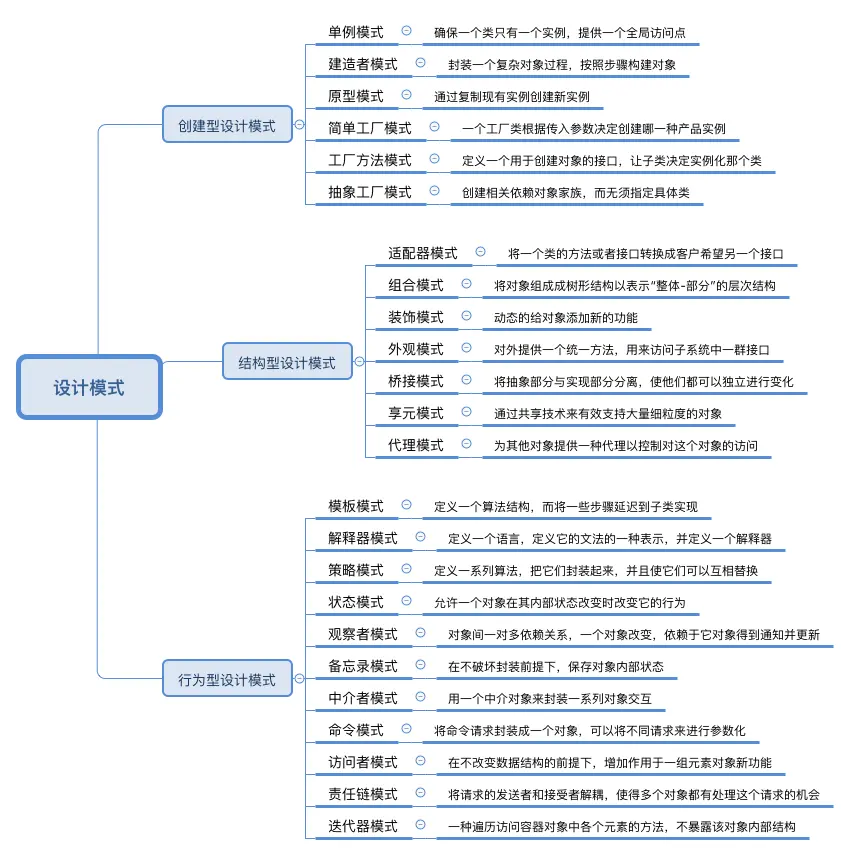

##### 设计模式定义
设计模式在设计者是一种流行的思考设计问题的方法，是一套被反复使用，多数人知晓的，经过分类编目的，代码设计经验的总结。使用了设计模式，是为了使代码具有可重用性，让代码更容易被他人理解和保证代码的可靠性

##### 设计模式按照类型划分
* 创建型设计模式：用来解耦对象的实例化过程。
* 结构型设计模式：将类和对象按照一定规则组合成一个更加强大的结构体。
* 行为型设计模式：定义类和对象的交互行为。
##### 设计模式简单定义

##### 文字版
###### 创建型设计模式
* 单例模式：确保一个类只有一个实例，提供一个全局访问点
* 建造者模式：封装一个复杂对象过程，按照步骤构建对象
* 原型模式：通过复制现有实例创建新实例
* 简单工厂模式：一个工厂类根据传入参数决定创建哪一种产品实例
* 工厂方法模式：定义一个用于创建对象的接口，让子类决定实例化那个类
* 抽象工厂模式：创建相关依赖对象家族，而无须指定具体类

###### 结构型设计模式

* 适配器模式：将一个类的方法或者接口转换成客户希望另一个接口
* 组合模式：将对象组成成树形结构以表示“整体-部分”的层次结构
* 装饰模式：动态的给对象添加新的功能
* 外观模式：对外提供一个统一方法，用来访问子系统中一群接口
* 桥接模式：将抽象部分与实现部分分离，使他们都可以独立进行变化
* 享元模式：通过共享技术来有效支持大量细粒度的对象
* 代理模式：为其他对象提供一种代理以控制对这个对象的访问

###### 行为型设计模式	

* 模板模式：定义一个算法结构，而将一些步骤延迟到子类实现
* 解释器模式：定义一个语言，定义它的文法的一种表示，并定义一个解释器
* 策略模式：定义一系列算法，把它们封装起来，并且使它们可以互相替换
* 状态模式：允许一个对象在其内部状态改变时改变它的行为
* 观察者模式：对象间一对多依赖关系，一个对象改变，依赖于它对象得到通知并更新
* 备忘录模式：在不破坏封装前提下，保存对象内部状态
* 中介者模式:用一个中介对象来封装一系列对象交互
* 命令模式：将命令请求封装成一个对象，可以将不同请求来进行参数化
* 访问者模式：在不改变数据结构的前提下，增加作用于一组元素对象新功能
* 责任链模式：将请求的发送者和接受者解耦，使得多个对象都有处理这个请求的机会
* 迭代器模式：一种遍历访问容器对象中各个元素的方法，不暴露该对象内部结构

##### 参考
[郭孝星:Android系统设计原则与设计模式](https://github.com/BeesAndroid/BeesAndroid/blob/master/doc/Android系统设计原则与设计模式.md)

《Android源码设计模式解析与实战》
