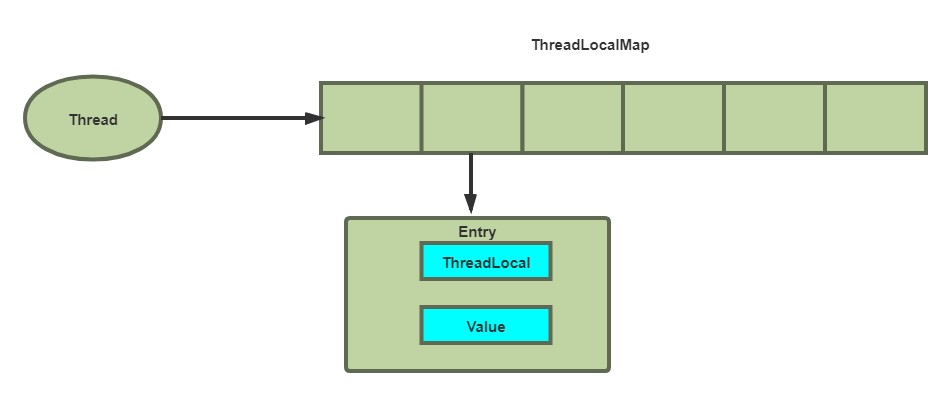

### 一、ThreadLocal的概念

   ThreadLocal 主要是做数据隔离，它是线程的局部变量， 是每一个线程所单独持有的，其他线程不能对其进行访问，相对隔离的。
    当使用ThreadLocal维护变量的时候为每一个使用该变量的线程提供一个独立的变量副本，即每个线程内部都会有一个该变量，这样同时多个线程访问该变量并不会彼此相互影响，因此他们使用的都是自己从内存中拷贝过来的变量的副本，这样就不存在线程安全问题，也不会影响程序的执行性能。

### 二、ThreadLocal解决了什么问题？

   解决多线程的并发访问。ThreadLocal会为每一个线程提供一个独立的变量副本，从而隔离了多个线程对数据的访问冲突。因为每一个线程都拥有自己的变量副本，从而也就没有必要对该变量进行同步了。

### 三、ThreadLocal原理

   每个Thread对象都有一个ThreadLocalMap，当创建一个ThreadLocal的时候，就会将该ThreadLocal对象添加到该Map中，其中键就是ThreadLocal，值可以是任意类型。

1、比较重要的几个方法

* public T get()：从线程上下文环境中获取设置的值。
* public void set(T value)：将值存储到线程上下文环境中，供后续使用。
* public void remove()：清除线程本地上下文环境。

```java

public void set(T value) {
    // 获取当前线程
    Thread t = Thread.currentThread();
    // 通过当前线程获取线程中的ThreadLocal.ThreadLocalMap对象
    ThreadLocalMap map = getMap(t);
    if (map != null)
        // map不为空，则直接赋值
        map.set(this, value);
    else
        // map为空，则创建一个ThreadLocalMap对象
        createMap(t, value);
}
// 根据提供的线程对象，和指定的值，创建一个ThreadLocalMap对象
void createMap(Thread t, T firstValue) {
    t.threadLocals = new ThreadLocalMap(this, firstValue);
}
// threadLocals是Thread类的一个属性
ThreadLocalMap getMap(Thread t) {
    return t.threadLocals;
}
 
/*
Thread 类 182行
 // ThreadLocal values pertaining to this thread. This map is maintained by the ThreadLocal class.
 与该线程有关的ThreadLocal值。这个映射由ThreadLocal类维护
*/
ThreadLocal.ThreadLocalMap threadLocals = null;
```

```java
// ThreadLocalMap中的内部类，存放key，value
static class Entry extends WeakReference<ThreadLocal<?>> {
    // 与此ThreadLocal关联的值
    Object value;
 // k：ThreadLocal的引用，被传递给WeakReference的构造方法
    Entry(ThreadLocal<?> k, Object v) {
        super(k);
        value = v;
    }
}
 
public T get() {
    // 获取当前线程
    Thread t = Thread.currentThread();
    // 通过当前线程获取线程中的ThreadLocal.ThreadLocalMap对象
    ThreadLocalMap map = getMap(t);
    if (map != null) {
        // map不为空，通过this(当前对象，即ThreadLocal对象)获取Entry对象
        ThreadLocalMap.Entry e = map.getEntry(this);
        if (e != null) {
            @SuppressWarnings("unchecked")
            T result = (T)e.value;
            // Entry不为空，则直接返回Entry中的value值
            return result;
        }
    }
    // 如果map或Entry为空，则返回初始值-null
    return setInitialValue();
}
// 设置初始值，初始化ThreadLocalMap对象，并设置value为 null
private T setInitialValue() {
    // 初始化值，此方法返回 null
    T value = initialValue();
    Thread t = Thread.currentThread();
    ThreadLocalMap map = getMap(t);
    if (map != null)
        map.set(this, value);
    else
        createMap(t, value);
    return value;
}
```

```java
public void remove() {
    // 通过当前线程获取线程中的ThreadLocal.ThreadLocalMap对象
    ThreadLocalMap m = getMap(Thread.currentThread());
    if (m != null)
        // 移除对象
        m.remove(this);
}
// 根据key，删除对应的所有值
private void remove(ThreadLocal<?> key) {
    Entry[] tab = table;
    int len = tab.length;
    // 获取key对应的 Entry[] 下标
    int i = key.threadLocalHashCode & (len-1);
    for (Entry e = tab[i];
         e != null;
         // 获取下一个Entry对象
         e = tab[i = nextIndex(i, len)]) {
        if (e.get() == key) {
            e.clear();
            // 通过重新哈希位于staleSlot和下一个null插槽之间的任何可能冲突的条目，来清除陈旧的条目。这还会清除尾随null之前遇到的所有其他过时的条目，防止出现内存泄漏问题
            expungeStaleEntry(i);
            return;
        }
    }
}

```

总结：

* 每个Thread维护着一个ThreadLocalMap的引用
* ThreadLocalMap是ThreadLocal的内部类，用Entry来进行存储
* ThreadLocal创建的副本是存储在自己的threadLocals中的，也就是自己的ThreadLocalMap。
* ThreadLocalMap的键为ThreadLocal对象，而且可以有多个threadLocal变量，因此保存在map中
* 在进行get之前，必须先set，否则会报空指针异常，当然也可以初始化一个，但是必须重写initialValue()方法。
* ThreadLocal本身并不存储值，它只是作为一个key来让线程从ThreadLocalMap获取value。

#### 3、ThreadLocalMap底层结构
 ThreadLocalMap是一个定制化的Hashmap。但是没有链表。
 


在插⼊过程中，根据ThreadLocal对象的hash值，定位到table中的位置i。如果当前位置是空的，就初始化⼀个Entry对象放在位置i上；如果位置i不为空，如果这个Entry对象的key和要设置的key相等，那么就刷新Entry中的value；如果位置i的不为空，而且key不等于entry，那就找下⼀个空位置，直到为空为⽌。这样的话，在get的时候，也会根据ThreadLocal对象的hash值，定位到table中的位置，然后判断该位置Entry对象中的key是否和get的key⼀致，如果不⼀致，就判断下⼀个位置，在冲突严重的情况下，效率会比较低。


#### 4、ThreadLocal的实例以及其值存放在栈还是堆？

  在Java中，栈内存归属于单个线程，每个线程都会有一个栈内存，其存储的变量只能在其所属线程中可见，即栈内存可以理解成线程的私有内存。而堆内存中的对象对所有线程可见。堆内存中的对象可以被所有线程访问。
   所以，是存放在栈上咯？
   然而并不是，因为ThreadLocal实例实际上也是被其创建的类持有（更顶端应该是被线程持有），而ThreadLocal的值其实也是被线程实例持有，它们都是位于堆上，只是通过⼀些技巧将可⻅性修改成了线程可见。

#### 5、如果我想共享线程的ThreadLocal数据怎么办？

  使⽤ InheritableThreadLocal 可以实现多个线程访问ThreadLocal的值，我们在主线程中创建⼀个 InheritableThreadLocal 的实例，然后在⼦线程中得到这个 InheritableThreadLocal 实例设置的值。


### 四、内存泄漏问题

  实际上 ThreadLocalMap 中使用的 key 为 ThreadLocal 的弱引用，弱引用的特点是，如果这个对象只存在弱引用，那么在下一次垃圾回收的时候必然会被清理掉。所以如果 ThreadLocal 没有被外部强引用的情况下，在垃圾回收的时候会被清理掉的，这样一来 ThreadLocalMap中使用这个 ThreadLocal 的 key 也会被清理掉。但是，value 是强引用，不会被清理，这样一来就会出现 key 为 null 的 value。
   ThreadLocalMap实现中已经考虑了这种情况，在调用 set()、get()、remove() 方法的时候，会清理掉 key 为 null 的记录。如果说会出现内存泄漏，那只有在出现了 key 为 null 的记录后，没有手动调用 remove() 方法，并且之后也不再调用 get()、set()、remove() 方法的情况下。
   建议回收自定义的ThreadLocal变量，尤其在线程池场景下，线程经常会被复用，如果不清理自定义的 ThreadLocal变量，可能会影响后续业务逻辑和造成内存泄露等问题。 尽量在代理中使用try-finally块进行回收。