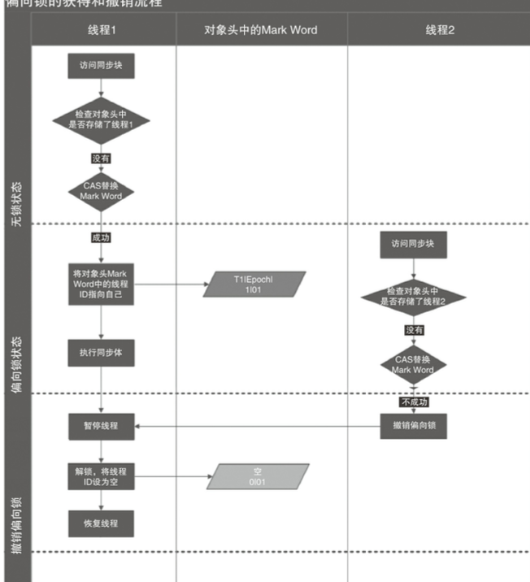

###  1.并发三要素
原子性：不可被中断的一个或一系列操作
可见性： 当一个线程修改一个共享变量时，另一个线程能读到修改的值
有序性：

### 2.volatile原理
volatile 轻量级的synchronized，多处理器保证【可见性】
volatile使用恰当，不会引起线程上下文切换和调度
禁止指令重排


#### volatile
```
volatile Singleton instance = new Singleton()

//汇编指令
0x01a3de1d: movb $0×0,0×1104800(%esi);
0x01a3de24: lock addl $0×0,(%esp);
```
volatile原理
1、Lock前缀指令会引起处理器缓存回写到内存
2、一个处理器的缓存回写到内存会导致其他处理器的缓存无效

### 3.synchronized原理

#### 应用
1. 对于普通同步方法，锁是当前实例对象。
2. 对于静态同步方法，锁是当前类的Class对象
3. 对于同步方法块，锁是Synchonized括号里配置的对象。

用法
```
public class SyncDemo {

    Object A = new Object();

    public synchronized void method() {
        System.out.println( "锁是当前实例对象" );
    }

    public synchronized static void method1() {
        System.out.println( "锁是当前类Class" );
    }

    public void method2() {
        synchronized (A) {
            System.out.println( "锁是synchronized配置对象" );
        }
    }

    public static void main(String[] args){
        SyncDemo demo = new SyncDemo();
        demo.method();
        demo.method2();
        SyncDemo.method1();
    }

}
```

synchronized原理
JVM基于进入和退出Monitor对象来实现方法同步和代码块同步


#### java对象头
synchronized用的锁是存在Java对象头里的


#### 锁的升级与对比
1.锁的级别：无锁状态 < 偏向锁状态 < 轻量级锁状态 < 重量级锁状态

2.锁可以升级，但不能降级 这种策略，目的是为了提高 获得锁和释放锁的效率

###### 偏向锁
场景: 锁不仅不存在多线程竞争，而且总是由同一线程多次获得，为了让线程获得锁的代价更低而引入了偏向锁

偏向锁加锁
当一个线程访问同步块并获取锁时，会在对象头和栈帧中的锁记录里存储锁偏向的线程ID，
以后该线程在进入和退出 同步块时不需要进行CAS操作来加锁和解锁

偏向锁撤销

偏向锁使用了一种等到竞争出现才释放锁的机制

当其他线程尝试竞争偏向锁时， 持有偏向锁的线程才会释放锁。偏向锁的撤销，需要等待全局安全点

######  轻量级锁

Displaced Mark Word ： JVM会先在当前线程的栈桢中创建用于存储锁记录的空间，并将对象头中的Mark Word复制到锁记录中

轻量级锁加锁

1、Displaced Mark Word

2、线程尝试使用 CAS将对象头中的Mark Word替换为指向锁记录的指针

轻量级锁解锁

轻量级解锁时，会使用原子的CAS操作将Displaced Mark Word替换回到对象头
成功，表示没有竞争发生, 失败，表示当前锁存在竞争，锁就会膨胀成重量级锁


##### 锁升级流程




###### 锁的优缺点比较


### 4.原子操作原理

CAS(Compare And Swap)

#### 处理器如何实现原子操作

1. 使用总线锁保证原子性 cpu操作互斥
2. 使用缓存锁保证原子性


#### java实现原子操作
1. 使用循环CAS实现原子操作 
2. juc包 atomic类
3. 使用锁机制实现原子操作 

jvm 中CAS操作利用CMPXCHG指令实现

```
    private AtomicInteger atomicI = new AtomicInteger( 0 );
    //循环CAS
    public void safeCount() {
        for (; ; ) {
            int i = atomicI.get();
            //cas  期望值  更新值
            boolean suc = atomicI.compareAndSet( i, ++i );
            if (suc)
                break;
        }
    }
```

#### CAS实现原子操作的三大问题
1. ABA问题 :使用版本号 
2. 循环时间长开销大
3. 只能保证一个共享变量的原子操作

AtomicStampedReference
A->B->A => 1A->2B->3A
ABA解决方案
```
    private AtomicStampedReference<Integer> atomicStampedRef = new AtomicStampedReference<Integer>( 0,0 );
    public void safeABACount() {
        for (;;){
            //当前值
            int ref = atomicStampedRef.getReference();
            //版本
            int stamp = atomicStampedRef.getStamp();
            boolean suc = atomicStampedRef.compareAndSet( ref, ++ref, stamp, stamp + 1 );
            System.out.println( suc + " ref = " + ref + " stamp = " + stamp );
            if (suc)
                break;
        }
    }
```

### 5.juc编程源码
https://github.com/yinlingchaoliu/juc
