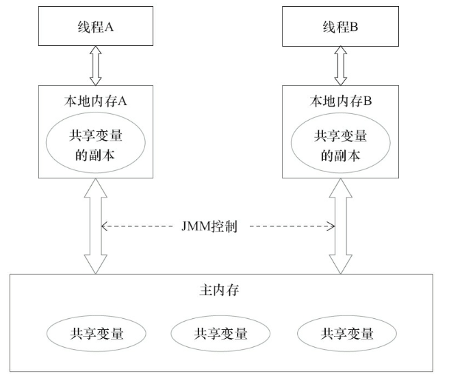

### java内存模型基础
并发编程，两个关键问题：线程通信和线程同步

java并发采用共享内存模型，通信是隐式调用的.



1）线程A把本地内存A更新过的共享变量刷新到主内存中去

2）线程B到主内存中去读取线程A之前已更新过共享变量

这两个步骤实质上是线程A在向线程B发送消息，而且这个通信过程必须要经过主内存。JMM通过控制主内存与每个线程的本地内存之间的交互，来为Java程序员提供 内存可见性保证

### 重排序
执行程序时，为了提高性能，编译器和处理器常常会对指令做重排
1. 编译器优化的重排序
2. 指令级并行的重排序
3. 内存系统的重排序
4. 最终执行的指令序列


内存屏障避免特定指令重排

happens-before (线程内操作按序执行)，实际情况未必，保证结果可见

as-if-serial语义：重排序不能改变执行结果

不改变程序执行结果的前提下，尽可能提高并行度

### java内存模型一致性

1、一个线程中所有操作必须按照程序的顺序来执行
2、所有线程都只能看到一个单一操作执行顺序。在顺序一致性内存模型中，每个操作都必须原子执行且立刻对所有线程可见

### volatile内存语义
当一个volatile变量时，JMM会把本地内存中共享变量值刷新到主内存

1. 防止指令重排
2. volatile 可见性
3. volatile 变量原子性   volatile++这种复合操作不 具有原子性。


### 锁内存含义

临界区互斥执行，还可以让释放锁的线程向获取同一个锁的线程发生消息

当线程释放锁时，JMM会把该线程对应的本地内存中的共享变量刷新到主内存中

当线程获取锁时，JMM会把该线程对应的本地内存置为无效。从而使得被监视器保护的 临界区代码必须从主内存中读取共享变量


总结

线程A释放一个锁，实质上是线程A向接下来将要获取这个锁的某个线程发出了(线程A 对共享变量所做修改的)消息。

线程B获取一个锁，实质上是线程B接收了之前某个线程发出的(在释放这个锁之前对共 享变量所做修改的)消息。

线程A释放锁，随后线程B获取这个锁，这个过程实质上是线程A通过主内存向线程B发送消息。


### final内存含义

1、final修饰，在构造方法中，不能指令重排

2、初次读包含final域对象，与初次读对象中final域，不能指令重排

3、只要对象正确构造(没有内存溢出)，final修饰线程安全

```java
   public class InstanceFactory {
       private static class InstanceHolder {
           public static Instance instance = new Instance();
       }
      public static Instance getInstance() {
          return InstanceHolder.instance ;  // 这里将导致InstanceHolder类被初始化
      } 
  }
```


### Double Check
volatile作用：防止指令重排
```
memory = allocate() //1、分配对象内存空间
ctorInstance(memory) //2、初始化对象
instance = menory //3、设置instance为memory
```
2、3重排 ，导致instance未正确初始化


```java
 public class SafeDoubleCheckedLocking {
       private volatile static Instance instance;
       public static Instance getInstance() {
           if (instance == null) {
               synchronized (SafeDoubleCheckedLocking.class) {
                if (instance == null)
                instance = new Instance();      
              } 
          }
          return instance;
    }
}
```