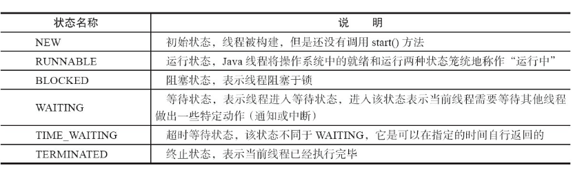
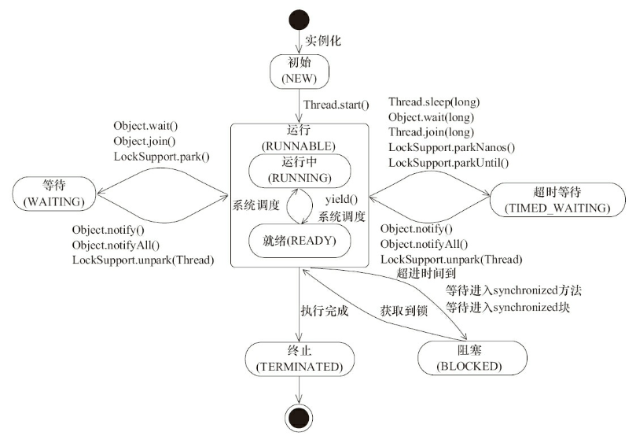

java线程状态






查看线程状态
```java

public class ThreadState {

    public static void main(String[] args) {
        new Thread(new TimeWaiting(), "TimeWaitingThread").start();
        new Thread(new Waiting(), "WaitingThread").start();
        // 使用两个Blocked线程，一个获取锁成功，另一个被阻塞
        new Thread(new Blocked(), "BlockedThread-1").start();
        new Thread(new Blocked(), "BlockedThread-2").start();
    }

    // 该线程不断地进行睡眠
    static class TimeWaiting implements Runnable {
        @Override
        public void run() {
            while (true) {
                sleep(100);
            }
        }
    }

    // 该线程在Waiting.class实例上等待
    static class Waiting implements Runnable {
        @Override
        public void run() {
            while (true) {
                synchronized (Waiting.class) {
                    try {
                        Waiting.class.wait();
                    } catch (InterruptedException e) {
                        e.printStackTrace();
                    }
                }
            }
        }
    }
    
    // 该线程在Blocked.class实例上加锁后，不会释放该锁
    static class Blocked implements Runnable {
        public void run() {
            synchronized (Blocked.class) {
                while (true) {
                    sleep(100);
                }
            }
        }
    }

    public static void sleep(long seconds) {
        try {
            TimeUnit.SECONDS.sleep(seconds);
        } catch (InterruptedException e) {
        }
    }
}

```

线程优先级不能正确执行
Daemon线程
finally 块代码不能清理做清理或关闭逻辑
中断 interrupt:是一个线程的标识位

优雅的终止线程
```java
    class Runner implements Runnable {

        private volatile boolean on = true;

        @Override
        public void run() {

            //中断退出
            while (on && !Thread.currentThread().isInterrupted()){ //循环判断
                // todo  working
            }

        }

        //关闭线程
        public void cancel(){
            on = false;
        }
    }
```

```bash
$ jps
935 Jps
929 ThreadState

$ jstack 929 

```

### Daemon线程
Daemon线程是一种支持型线程，因为它主要被用作程序中后台调度以及支持性工作

Daemon线程被用作完成支持性工作，但是在Java虚拟机退出时Daemon线程中的finally块并不一定会执行


```java
public class Daemon {

    public static void main(String[] args){
        Thread thread = new Thread( new DaemonRunner(),"DaemonRunner" );
        thread.setDaemon( true );
        thread.start();
    }

    static class DaemonRunner implements Runnable{

        @Override
        public void run() {
            try {
                Thread.sleep( 10_000L );
            }catch (Exception e){

            }finally {
                //finally 不一定执行
                System.out.println("DaemonRunner is finish");
            }
        }
    }

}
```


### 优雅停止线程

中断和标识位
```java
/**
 * 优雅退出线程
 */
public class Shutdown {
    
    static class Runner implements Runnable {
        private volatile boolean on = true;
        @Override
        public void run() {

            //中断退出
            while (on && !Thread.currentThread().isInterrupted()){ //循环判断
                // todo  working
            }
        }

        //关闭线程
        public void cancel(){
            on = false;
        }
    }
}

```

### 线程间通信
1. volatile和synchronized关键字
2. 等待/通知机制
3. 管道输入/输出流
4. Thread.join() 等待返回
5. ThreadLocal


生产者-消费者
```java
public class ProduceAndConsume {

    private Object lock = new Object();

    private volatile boolean flag = true;

    private volatile int i = 0;

    //生产者
    public void produce() {

        synchronized (lock) {

            //todo 代码执行逻辑
            i = i + 1;
            System.out.println( "produce: + 1 " + i );

            flag = false;
            lock.notifyAll();
        }

    }

    //消费者
    public void consume() {

        synchronized (lock) {

            while (flag) {
                try {
                    //线程进入waitting状态, 会释放对象锁
                    lock.wait();
                } catch (InterruptedException e) {
                    e.printStackTrace();
                }
            }

            flag = true;

            //todo 执行逻辑

            i = i - 1;
            System.out.println( "consume: -1 " + i );

        }

    }


    public void consumeWait(long mills) {

        synchronized (lock) {
            long future = System.currentTimeMillis() + mills;
            long remaining = mills;

            while (remaining > 0) {
                try {
                    lock.wait( remaining );
                } catch (InterruptedException e) {
                    e.printStackTrace();
                    return;
                }
                remaining = future - System.currentTimeMillis();
            }

            //todo 执行代码


        }
    }

}
```


管道读写
```java
public class Piped {

    private PipedWriter out;
    private PipedReader in;

    public Piped()  {
        out = new PipedWriter();
        in = new PipedReader();
        //输入流于输出进行连接  否则在使用时会抛出IOException
        try {
            out.connect( in );
        } catch (IOException e) {
            e.printStackTrace();
        }
    }

    public void write() throws IOException {
        int receive = 0;
        //读取 系统输入流
        while ((receive = System.in.read()) != -1) {
            out.write( receive );
        }
    }

    public void read() throws IOException {
        int receive = 0;
        while ((receive = in.read()) != -1) {
            System.out.print( (char) receive );
        }
    }

    public void close(){
        try {
            out.close();
        } catch (IOException e) {
            e.printStackTrace();
        }
    }

}


    public void testPipe() {

        final Piped piped = new Piped();
        Thread thread1 = new Thread( new Runnable() {
            @Override
            public void run() {

                try {
                    piped.write();
                } catch (IOException e) {
                    e.printStackTrace();
                }

            }
        } );

        Thread thread2 = new Thread( new Runnable() {
            @Override
            public void run() {

                try {
                    piped.read();
                } catch (IOException e) {
                    e.printStackTrace();
                }

            }
        } );

        thread1.start();
        thread2.start();

        try {
            thread1.join();
            thread2.join();
        } catch (InterruptedException e) {
            e.printStackTrace();
        } finally {
            piped.close();
        }
    }

```

join实现
```java
public final synchronized void join() throws InterruptedException {
   // 条件不满足，继续等待 
  while (isAlive()) {
    wait(0);
  } 
}
```


ThreadLocal
```java
public class Profiler {

    private static final ThreadLocal<Long> TIME_THREAD_LOCAL = new ThreadLocal<Long>();

    public static void begin(){
        TIME_THREAD_LOCAL.set( System.currentTimeMillis() );
    }

    public static long end(){
        return System.currentTimeMillis() - TIME_THREAD_LOCAL.get();
    }

}
```

