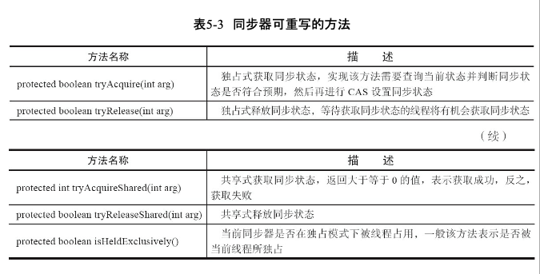
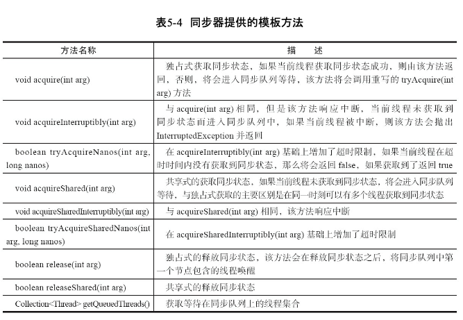
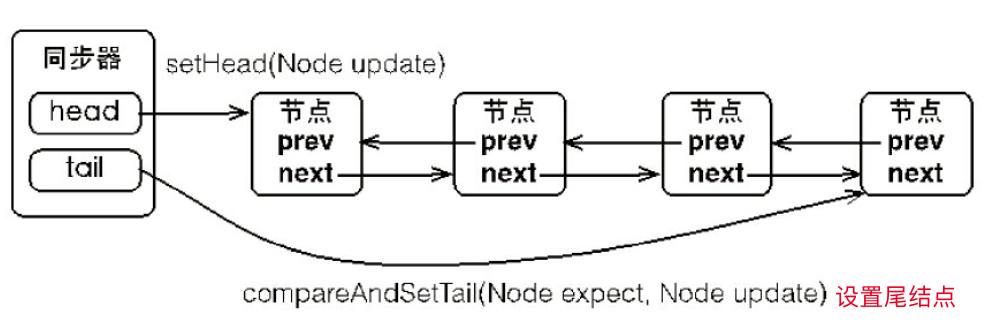

### 锁可操作性

锁获取与释放的可操作性、可中断的获取锁以 及超时获取锁

```java
public class LockUseCase {

    private Lock lock = new ReentrantLock();

    //1. 尝试非阻塞地获取锁
    //2. 能被中断地获取锁
    //3. 超时获取锁
    public void testLock() {
        lock.lock();
        try {
            // todo work
        } finally {
            lock.unlock();
        }
    }

}

```

### 队列同步器 AQS
队列同步器是用来构建锁或者其他同步组件的基础框架，它使用了一个int成员变量表示同步状态，通过内置的FIFO队列来完成资源获取线程的排队工作

#### AQS模版
同步器是实现锁的关键，设计模式模版方法

核心方法 
1. getState()    取当前同步状态。
2. setState(int newState) 设置当前同步状态
3. compareAndSetState(int expect,int update)  使用CAS设置当前状态，该方法能够保证状态 设置的原子性。


同步器提供的模板方法
1. 独占式获取与释放同步状态  : 同一时刻只能有一个线程获取到锁，而其他获取锁的线程只能处于同步队列中等待
2. 共享式获取与释放 同步状态
3. 查询同步队列中的等待线程情况






独占锁
```java

import java.util.concurrent.TimeUnit;
import java.util.concurrent.locks.AbstractQueuedSynchronizer;
import java.util.concurrent.locks.Condition;
import java.util.concurrent.locks.Lock;

class Mutex implements Lock {

    // 静态内部类，自定义同步器
    private static class Sync extends AbstractQueuedSynchronizer {
        // 是否处于占用状态
        protected boolean isHeldExclusively() {
            return getState() == 1;
        }

        // 当状态为0的时候获取锁
        @Override
        protected boolean tryAcquire(int arg) {
            if (compareAndSetState(0, 1)) {
                setExclusiveOwnerThread(Thread.currentThread());
                return true;
            }
            return false;
        }

        // 释放锁，将状态设置为0
        protected boolean tryRelease(int releases) {
            if (getState() == 0) {
                throw new IllegalMonitorStateException();
            }
            setExclusiveOwnerThread(null);
            setState(0);
            return true;
        }

        // 返回一个Condition，每个condition都包含了一个condition队列
        Condition newCondition() {
            return new ConditionObject();
        }

    }

    // 仅需要将操作代理到Sync上即可
    private final Sync sync = new Sync();

    @Override
    public void lock() {
        sync.acquire(1);
    }

    @Override
    public void unlock() {
        sync.release(1);
    }

    @Override
    public boolean tryLock() {
        return sync.tryAcquire(1);
    }

    @Override
    public boolean tryLock(long timeout, TimeUnit unit) throws InterruptedException {
        return sync.tryAcquireNanos(1, unit.toNanos(timeout));
    }

    @Override
    public void lockInterruptibly() throws InterruptedException {
        sync.acquireInterruptibly(1);
    }

    @Override
    public Condition newCondition() {
        return sync.newCondition();
    }
}
```

#### AQS原理

AQS主要包括:同步队列、独占式同 步状态获取与释放、共享式同步状态获取与释放以及超时获取同步状态等同步器的核心数据 结构与模板方法。

##### 1 FIFO双向队列
  
  当前线程获取 同步状态失败时，同步器会将当前线程以及等待状态等信息构造成为一个节点(Node)并将其 加入同步队列，同时会阻塞当前线程，当同步状态释放时，会把首节点中的线程唤醒，使其再 次尝试获取同步状态。
  
  ```java
    static final class Node {
        /**
         * CANCELLED 中断
         * SIGNAL 等待
         * CONDITION 条件
         * PROPAGATE 共享
         * INITIAL 初始状态
         */
        volatile int waitStatus;

        //前驱节点
        volatile Node prev;

        //后继节点
        volatile Node next;

        //线程状态
        volatile Thread thread;

        //等待队列后继节点
        Node nextWaiter;

    }

  ```

 

##### 2、独占式同步状态获取与释放

原理:

获得锁
1. 获取同步状态
2. 失败则构造同步节点，插入队尾
3. 自旋检查同步状态，当有同步状态时，退出自旋

释放锁
设置同步状态,重新引起竞争


本质: 多线程并发时，一个线程获得锁进入业务逻辑，其他线程锁自旋

```java
    //上锁
    public final void acquire(int arg) {
        //获取同步状态
        if (!tryAcquire(arg) &&
            acquireQueued(addWaiter(Node.EXCLUSIVE), arg))
            selfInterrupt();
    }

    private Node addWaiter(Node mode) {
        Node node = new Node(Thread.currentThread(), mode);
        // Try the fast path of enq; backup to full enq on failure
        Node pred = tail;
        if (pred != null) {
            node.prev = pred;
            if (compareAndSetTail(pred, node)) {
                pred.next = node;
                return node;
            }
        }
        enq(node);
        return node;
    }

    final boolean acquireQueued(final Node node, int arg) {
        boolean failed = true;
        try {
            boolean interrupted = false;
            for (;;) {
                final Node p = node.predecessor();
                if (p == head && tryAcquire(arg)) {
                    setHead(node);
                    p.next = null; // help GC
                    failed = false;
                    return interrupted;
                }
                if (shouldParkAfterFailedAcquire(p, node) &&
                    parkAndCheckInterrupt())
                    interrupted = true;
            }
        } finally {
            if (failed)
                cancelAcquire(node);
        }
    }


    private Node enq(final Node node) {
        for (;;) {
            Node t = tail;
            if (t == null) { // Must initialize
                if (compareAndSetHead(new Node()))
                    tail = head;
            } else {
                node.prev = t;
                if (compareAndSetTail(t, node)) {
                    t.next = node;
                    return t;
                }
            }
        }
    }

    public final boolean release(int arg) {
        if (tryRelease(arg)) {
            Node h = head;
            if (h != null && h.waitStatus != 0)
                unparkSuccessor(h);
            return true;
        }
        return false;
    }
```


##### 2、共享式同步状态获取与释放
读写锁

1. 获得同步状态
2. 添加共享节点
3. 退出自旋

本质: 
多线程进入读时，记录共享节点，退出自旋。
一个线程进入写的时候，其他线程进入共享节点进入自旋

```java
    public final void acquireShared(int arg) {
        if (tryAcquireShared(arg) < 0)
            doAcquireShared(arg);
    }

    private void doAcquireShared(int arg) {
        final Node node = addWaiter(Node.SHARED);
        boolean failed = true;
        try {
            boolean interrupted = false;
            for (;;) {
                final Node p = node.predecessor();
                if (p == head) {
                    int r = tryAcquireShared(arg);
                    if (r >= 0) {
                        setHeadAndPropagate(node, r);
                        p.next = null; // help GC
                        if (interrupted)
                            selfInterrupt();
                        failed = false;
                        return;
                    }
                }
                if (shouldParkAfterFailedAcquire(p, node) &&
                    parkAndCheckInterrupt())
                    interrupted = true;
            }
        } finally {
            if (failed)
                cancelAcquire(node);
        }
    }

    public final boolean releaseShared(int arg) {
        if (tryReleaseShared(arg)) {
            doReleaseShared();
            return true;
        }
        return false;
    }

```

两把共享锁
```java
public class TwinsLock implements Lock {

    private static final class Sync extends AbstractQueuedSynchronizer {

        Sync(int count) {
            if (count <= 0) {
                throw new IllegalArgumentException("count must large than zero.");
            }
            setState(count);
        }

        @Override
        protected int tryAcquireShared(int arg) {
            for (; ; ) {
                int current = getState();
                int newCount = current - 1;
                if (newCount < 0 || compareAndSetState(current, newCount)) {
                    return newCount;
                }
            }
        }

        @Override
        protected boolean tryReleaseShared(int arg) {
            for (; ; ) {
                int current = getState();
                int newCount = current + 1;
                if (compareAndSetState(current, newCount)) {
                    return true;
                }
            }
        }

        // 返回一个Condition，每个condition都包含了一个condition队列
        Condition newCondition() {
            return new ConditionObject();
        }
    }

    private final Sync sync = new Sync(2);

    @Override
    public void lock() {
        sync.acquireShared(1);
    }

    @Override
    public void unlock() {
        sync.releaseShared(1);
    }

    @Override
    public void lockInterruptibly() throws InterruptedException {
        sync.acquireSharedInterruptibly(1);
    }

    @Override
    public boolean tryLock() {
        return sync.tryAcquireShared(1) > 0;
    }

    @Override
    public boolean tryLock(long timeout, TimeUnit unit) throws InterruptedException {
        return sync.tryAcquireSharedNanos(1, unit.toNanos(timeout));
    }

    @Override
    public Condition newCondition() {
        return sync.newCondition();
    }
}

```

### 重入锁 ReentrantLock
重入锁 支持一个线程对资源重复加锁
支持获取锁 公平和非公平选择

公平性选择：先对锁进行获取请求一定是先被满足的，这样是公平锁。反之非公平

等待时间最长的线程先获得锁

公平锁机制往往没有非公平锁效率高，并非任何场景都以tps作为指标
公平锁能减少“饥饿”发生的概率

#### 重入锁

1. 线程再次获取锁
2. 锁最终释放

核心: 根据当前线程进行计数器

```java

        final boolean nonfairTryAcquire(int acquires) {
            final Thread current = Thread.currentThread();
            int c = getState();
            if (c == 0) {
                if (compareAndSetState(0, acquires)) {
                    setExclusiveOwnerThread(current);
                    return true;
                }
            }
            else if (current == getExclusiveOwnerThread()) {
                int nextc = c + acquires;
                if (nextc < 0) // overflow
                    throw new Error("Maximum lock count exceeded");
                setState(nextc);
                return true;
            }
            return false;
        }

        protected final boolean tryRelease(int releases) {
            int c = getState() - releases;
            if (Thread.currentThread() != getExclusiveOwnerThread())
                throw new IllegalMonitorStateException();
            boolean free = false;
            if (c == 0) {
                free = true;
                setExclusiveOwnerThread(null);
            }
            setState(c);
            return free;
        }

```

#### 公平锁和非公平锁区别

区别：多了FIFO排队

hasQueuedPredecessors

```java

        protected final boolean tryAcquire(int acquires) {
            final Thread current = Thread.currentThread();
            int c = getState();
            if (c == 0) {
                if (!hasQueuedPredecessors() &&
                    compareAndSetState(0, acquires)) {
                    setExclusiveOwnerThread(current);
                    return true;
                }
            }
            else if (current == getExclusiveOwnerThread()) {
                int nextc = c + acquires;
                if (nextc < 0)
                    throw new Error("Maximum lock count exceeded");
                setState(nextc);
                return true;
            }
            return false;
        }

```

#### 对比

```java 
public class FairAndUnfairTest {

    private static Lock fairLock = new FairAndUnfairLock(true);
    private static Lock unfairLock = new FairAndUnfairLock(false);

    @Test
    public void fair() {
        testLock(fairLock);
    }

    @Test
    public void unfair() {
        testLock(unfairLock);
    }

    /**
     * 测试锁
     * @param lock
     */
    private static void testLock(Lock lock) {
        for (int i = 0; i < 5; i++) {
            new Job(lock).start();

        }
    }

    private static class Job extends Thread {
        private Lock lock;
        public Job(Lock lock) {
            this.lock = lock;
        }
        @Override
        public void run() {

            lock.lock();
            try {
                System.out.print("Lock by ["+getId()+"]");
                System.out.print(" Waiting by [");
                Collection<Thread> threads = ((FairAndUnfairLock)lock).getQueuedThreads();
                for(Thread thread :threads){
                    System.out.print(thread.getId()+",");
                }
                System.out.println("]");
            } catch (Exception e) {
            } finally {
                lock.unlock();
            }
        }
    }

    private static class FairAndUnfairLock extends ReentrantLock {
        public FairAndUnfairLock(boolean fair) {
            super(fair);
        }

        public Collection<Thread> getQueuedThreads() {
            List<Thread> arrayList = new ArrayList<Thread>(super.getQueuedThreads());
            Collections.reverse(arrayList);
            return arrayList;
        }
    }

}
```


输出结果
```
公平锁
Lock by [11] Waiting by []
Lock by [12] Waiting by [13,]
Lock by [13] Waiting by [14,15,]
Lock by [14] Waiting by [15,]
Lock by [15] Waiting by []


非公平锁
Lock by [11] Waiting by []
Lock by [14] Waiting by [12,13,]
Lock by [12] Waiting by [13,15,]
Lock by [13] Waiting by [15,]
Lock by [15] Waiting by []
```

公平锁保证锁获得按照FIFO原则，代价是大量线程切换


### 读写锁 ReentrantReadWriteLock
1. 公平性选择
2. 重进入
3. 锁降级 : 写锁降级为读锁

```java
public class ReadWriteLockDemo {

    private ReentrantReadWriteLock rwlock = new ReentrantReadWriteLock();
    private Lock rlock = rwlock.readLock();
    private Lock wlock = rwlock.writeLock();

    static Map<String, Object> map = new HashMap<String, Object>();

    // 获取一个key对应的value
    public Object get(String key) {
        rlock.lock();
        try {
            return map.get(key);
        } finally {
            rlock.unlock();
        }
    }

    // 设置key对应的value，并返回旧的value
    public Object put(String key, Object value) {
        wlock.lock();
        try {
            return map.put(key, value);
        } finally {
            wlock.unlock();
        }
    }

    // 清空所有的内容
    public void clear() {
        wlock.lock();
        try {
            map.clear();
        } finally {
            wlock.unlock();
        }
    }
    
}

```

#### 读写锁实现原理

1. 读写状态的设计
2. 写锁的获取与释放
3. 读锁的获取与释放
4. 锁降级


整型变量上维护多种状态，就一定需要“按位切割使用”这个变量

高16位表示读，低16位表示写

写锁已经被获取，则当前线程进入等待状态 支持可重入


无写锁被获取，读锁总会被成功地获取，而所做的也只是(线程安全的)增加读状态

```java
        protected final boolean tryAcquire(int acquires) {
            Thread current = Thread.currentThread();
            int c = getState();
            int w = exclusiveCount(c);
            if (c != 0) {
                // 存在读锁或者当前获取线程不是已经获取写锁的线程
                if (w == 0 || current != getExclusiveOwnerThread())
                    return false;
                if (w + exclusiveCount(acquires) > MAX_COUNT)
                    throw new Error("Maximum lock count exceeded");
                // Reentrant acquire
                setState(c + acquires);
                return true;
            }
            if (writerShouldBlock() ||
                !compareAndSetState(c, c + acquires))
                return false;
            setExclusiveOwnerThread(current);
            return true;
        }


        protected final int tryAcquireShared(int unused) {
            Thread current = Thread.currentThread();
            int c = getState();
            if (exclusiveCount(c) != 0 &&
                getExclusiveOwnerThread() != current)
                return -1;
            int r = sharedCount(c);
            if (!readerShouldBlock() &&
                r < MAX_COUNT &&
                compareAndSetState(c, c + SHARED_UNIT)) {
                if (r == 0) {
                    firstReader = current;
                    firstReaderHoldCount = 1;
                } else if (firstReader == current) {
                    firstReaderHoldCount++;
                } else {
                    HoldCounter rh = cachedHoldCounter;
                    if (rh == null || rh.tid != getThreadId(current))
                        cachedHoldCounter = rh = readHolds.get();
                    else if (rh.count == 0)
                        readHolds.set(rh);
                    rh.count++;
                }
                return 1;
            }
            return fullTryAcquireShared(current);
        }

```


#### 锁降级

读写锁不支持升级

降级指把持住当前写锁，再获取读锁，随后释放先前拥有的写锁

```java
public class DegradeLock {
    private ReentrantReadWriteLock lock = new ReentrantReadWriteLock();
    private Lock readLock = lock.readLock();
    private Lock writeLock = lock.writeLock();

    private volatile boolean update = false;
    public void processData() {
        writeLock.lock();
        try{
            //业务xxx
            update = true;
            readLock.lock();
        }finally {
            //先释放读锁
            writeLock.unlock();
        }
        // 锁降级完成，写锁降级为读锁
        try {
            //todo 业务xxx
        }finally {
            readLock.unlock();
        }
    }

}
```

### LockSupport

park() 阻塞当前线程
parkNanos(long nanos) 
unpark() 唤起阻塞

### Condition接口

等待/通知

```java
public class ConditionUseCase {
    private Lock lock = new ReentrantLock();
    private Condition condition = lock.newCondition();

    public void produce(){
        lock.lock();
        try {
            //唤醒所有
            condition.signalAll();
        }finally {
            lock.unlock();
        }
    }

    public void consume() throws InterruptedException {
        lock.lock();
        try {
            condition.wait();
        }finally {
            lock.unlock();
        }
    }
}

```

#### condition实现分析

1. FIFO队列 
2. 等待
3. 通知
4. 