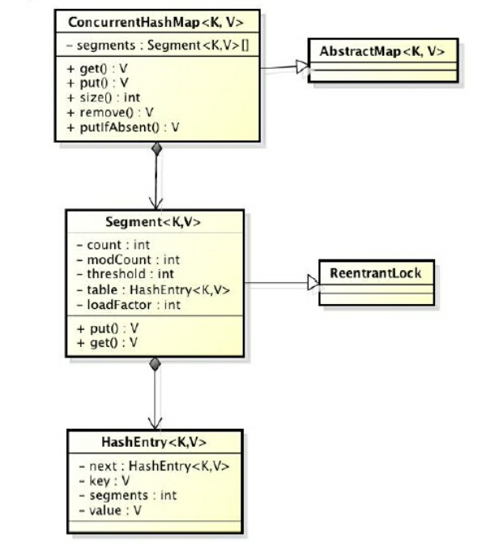
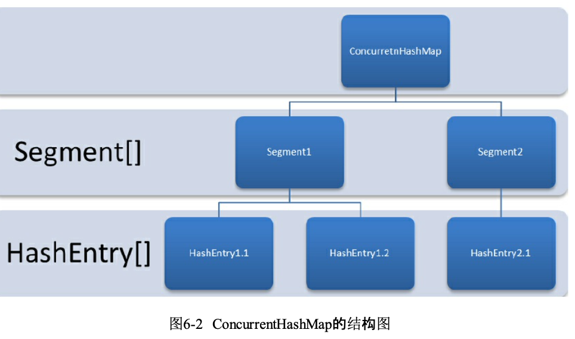
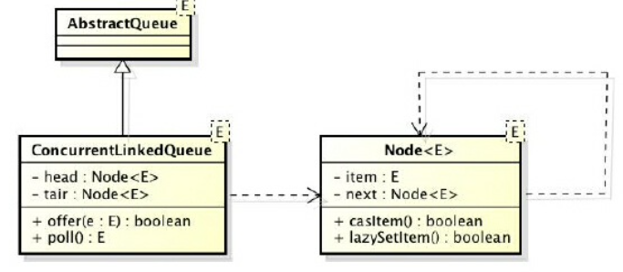

### ConcurrentHashMap

hashMap线程不安全

HashMap在并发执行put操作时会引起死循环，是因为多线程会导致HashMap的Entry链表 形成环形数据结构，一旦形成环形数据结构，Entry的next节点永远不为空，就会产生死循环获取Entry，导致CPU 100%

效率低下的HashTable

HashTable容器使用synchronized来保证线程安全，非常低效


ConcurrentHashMap的锁分段技术可有效提升并发访问率

ConcurrentHashMap是由Segment数组结构和HashEntry数组结构组成






1. 初始化segments数组
2. 初始化segmentShift和segmentMask
3. 初始化每个segment
4. 定位Segment   散列算法定位到Segment
5. get操作  整个get过程不需要加锁，除非读到的值是空才会加锁重读
6. put操作  put方法首先定位到Segment，然后在Segment里进行插入操作


### ConcurrentLinkedQueue
线程安全队列
阻塞算法    入队和出队用同一把锁
非阻塞算法  循环CAS



* 1  入队列 : 
  第一是定位出尾节点;
  第二是使用CAS算法将入队节点设置成尾节点
  不成功则重试

* 2 出队列

```java

    public boolean offer(E e) {
        checkNotNull(e);
        /// 入队前，创建一个入队节点
        final Node<E> newNode = new Node<E>(e);

        // 死循环，入队不成功反复入队。
        for (Node<E> t = tail, p = t;;) {
            Node<E> q = p.next;
            if (q == null) {
                // p is last node
                if (p.casNext(null, newNode)) {
                    if (p != t) // hop two nodes at a time
                        casTail(t, newNode);  // Failure is OK.
                    return true;
                }
            }
            else if (p == q)
                p = (t != (t = tail)) ? t : head;
            else
                // Check for tail updates after two hops.
                p = (p != t && t != (t = tail)) ? t : q;
        }
    }

    public E poll() {
        restartFromHead:
        for (;;) {
            for (Node<E> h = head, p = h, q;;) {
                E item = p.item;

                if (item != null && p.casItem(item, null)) {
                    // Successful CAS is the linearization point
                    // for item to be removed from this queue.
                    if (p != h) // hop two nodes at a time
                        updateHead(h, ((q = p.next) != null) ? q : p);
                    return item;
                }
                else if ((q = p.next) == null) {
                    updateHead(h, p);
                    return null;
                }
                else if (p == q)
                    continue restartFromHead;
                else
                    p = q;
            }
        }
    }
```

### 阻塞队列

1. 队列满阻塞
2. 队列空移除阻塞

* ArrayBlockingQueue:一个由数组结构组成的有界阻塞队列。 
* LinkedBlockingQueue:一个由链表结构组成的有界阻塞队列。
* PriorityBlockingQueue:一个支持优先级排序的无界阻塞队列
* DelayQueue:一个使用优先级队列实现的无界阻塞队列。 
* SynchronousQueue:一个不存储元素的阻塞队列。 
* LinkedTransferQueue:一个由链表结构组成的无界阻塞队列。 
* LinkedBlockingDeque:一个由链表结构组成的双向阻塞队列。

使用通知模式 条件 Condition

```java

        public final void await() throws InterruptedException {
            if (Thread.interrupted())
                throw new InterruptedException();
            Node node = addConditionWaiter();
            int savedState = fullyRelease(node);
            int interruptMode = 0;
            while (!isOnSyncQueue(node)) {
                LockSupport.park(this);
                if ((interruptMode = checkInterruptWhileWaiting(node)) != 0)
                    break;
            }
            if (acquireQueued(node, savedState) && interruptMode != THROW_IE)
                interruptMode = REINTERRUPT;
            if (node.nextWaiter != null) // clean up if cancelled
                unlinkCancelledWaiters();
            if (interruptMode != 0)
                reportInterruptAfterWait(interruptMode);
        }


    public static void park(Object blocker) {
        Thread t = Thread.currentThread();
        setBlocker(t, blocker);
        UNSAFE.park(false, 0L);
        setBlocker(t, null);
    }

  public native void park(boolean var1, long var2);

  void os::PlatformEvent::park() {
   int status = pthread_mutex_lock(_mutex);
   //Linux 条件锁
   status = pthread_cond_wait(_cond, _mutex);
   status = pthread_mutex_unlock(_mutex);
  }
```

### Form/join

并行执行任务的框架，是一个把大任务分割成若干个小任务，最终汇总每个小任务结果后得到大任务结果的框架

窃取算法

1. 分割任务
2. 执行任务并合并结果

```java

public class CountTask extends RecursiveTask<Integer> {
    private static final int THRESHOLD = 2;  // 阈值
    private int start;
    private int end;

    public CountTask(int start, int end) {
        this.start = start;
        this.end = end;
    }

    @Override
    protected Integer compute() {
        int sum = 0;
        // 如果任务足够小就计算任务
        boolean canCompute = (end - start) <= THRESHOLD;
        if (canCompute) {
            for (int i = start; i <= end; i++) {
                sum += i;
            }
        } else {
            // 如果任务大于阈值，就分裂成两个子任务计算
            int middle = (start + end) / 2;
            CountTask leftTask = new CountTask(start, middle);
            CountTask rightTask = new CountTask(middle + 1, end); // 执行子任务
            leftTask.fork();
            rightTask.fork();
            // 等待子任务执行完，并得到其结果
            int leftResult = leftTask.join();
            int rightResult = rightTask.join();
            // 合并子任务
            sum = leftResult + rightResult;
        }
        return sum;
    }

    public static void main(String[] args) {
        ForkJoinPool forkJoinPool = new ForkJoinPool();
        // 生成一个计算任务，负责计算1+2+3+4
        CountTask task = new CountTask(1, 4);
        // 执行一个任务
        Future<Integer> result = forkJoinPool.submit(task);
        try {
            System.out.println(result.get());
        } catch (Exception e) {
        }
    }
}

```