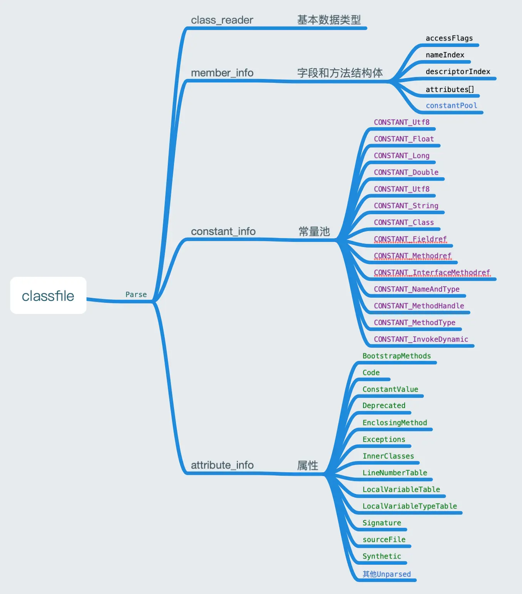

### 知识扩展
class文件有严格规范，保障了“编写一次，四处运行”，但是加载class文件来源，给予足够自由

javap工具 可以反编译class文件，对应图形化工具classpy

go语言 函数名大写外部可以访问，小写不可以访问

### classFile结构体

jvm规范
```go
/*
ClassFile {
    u4             magic;
    u2             minor_version;
    u2             major_version;
    u2             constant_pool_count;
    cp_info        constant_pool[constant_pool_count-1];
    u2             access_flags;
    u2             this_class;
    u2             super_class;
    u2             interfaces_count;
    u2             interfaces[interfaces_count];
    u2             fields_count;
    field_info     fields[fields_count];
    u2             methods_count;
    method_info    methods[methods_count];
    u2             attributes_count;
    attribute_info attributes[attributes_count];
}
*/

type ClassFile struct {
	magic        uint32          // 魔数
	minorVersion uint16          // 次版本号
	majorVersion uint16          // 主版本号
	constantPool ConstantPool    // 常量池
	accessFlags  uint16          // 类访问标志
	thisClass    uint16          // 类常量池索引
	superClass   uint16          // 父类常量池索引（只有Object为0）
	interfaces   []uint16        // 接口常量池索引表
	fields       []*MemberInfo   // 字段表
	methods      []*MemberInfo   // 方法表
	attributes   []AttributeInfo // 属性表
}
```

### 魔数
文件格式必须以某个固定字节开头

class文件 0xCAFEBABE

PDF文件  %PDF

ZIP文件  PK

```go
func (self *ClassFile) readAndCheckMagic(reader *ClassReader) {
	magic := reader.readUint32() // 读取魔数
	if magic != 0xCAFEBABE { // 检查魔数
		panic("java.lang.ClassFormatError: magic!")
	}
}
```

### 版本号

| java版本      | class版本号      |
|-------------|---------------|
| JDK1.0.2    | 45.0~45.3     |
| JDK1.1      | 45.0~45.65535 |
| J2SE1.2     | 46.0          |
| J2SE1.3     | 47.0          |
| J2SE1.4     | 48.0          |
| JAVA SE 5.0 | 49.0          |
| JAVA SE 6   | 50.0          |
| JAVA SE 7   | 51.0          |
| JAVA SE 8   | 52.0          |

说明1.2之前采用主次版本号，从1.2之后，次版本号为0 jdk8 支持检测

```go
// 读取并检查主次版本号
func (self *ClassFile) readAndCheckVersion(reader *ClassReader) {
	self.minorVersion = reader.readUint16() // 次版本号
	self.majorVersion = reader.readUint16() // 主版本号
	switch self.majorVersion {
	case 45: // jdk1.0 ~ jdk1.1，次版本号不为0
		return
	case 46, 47, 48, 49, 50, 51, 52, 53, 54: // jdk1.2 ~ jdk10，此版本号都为0
		if self.minorVersion == 0 {
			return
		}
	}
	panic("java.lang.UnsupportedClassVersionError!")
}
```

### 字段和方法表
```go
type MemberInfo struct {
	accessFlags     uint16 // 字段或方法的访问标志
	nameIndex       uint16 // 字段名或方法名的常量池索引
	descriptorIndex uint16 // 字段或方法的描述符常量池索引
	attributes      []AttributeInfo

	cp ConstantPool
}

//属性
type AttributeInfo interface {
	readInfo(reader *ClassReader)
}
```
### 解析classfile




### 从byte数组树化ClassFile
```go
// 将 []byte 转换成 ClassFile
func Parse(classData []byte) (cf *ClassFile, err error) {
	cr := &ClassReader{classData}
	cf = &ClassFile{}
	cf.read(cr)
	return
}

// 使用 ClassReader 从 ClassReader 中读取内容，赋值给 ClassFile 的各个属性
func (self *ClassFile) read(reader *ClassReader) {
	self.readAndCheckMagic(reader)
	self.readAndCheckVersion(reader)
	self.constantPool = readConstantPool(reader)
	self.accessFlags = reader.readUint16()
	self.thisClass = reader.readUint16()
	self.superClass = reader.readUint16()
	self.interfaces = reader.readUint16s()
	self.fields = readMembers(reader, self.constantPool)
	self.methods = readMembers(reader, self.constantPool)
	self.attributes = readAttributes(reader, self.constantPool)
}
```

### 实战项目地址
https://gitee.com/yinlingchaoliu/jvmgo.git

提交标签classfile
