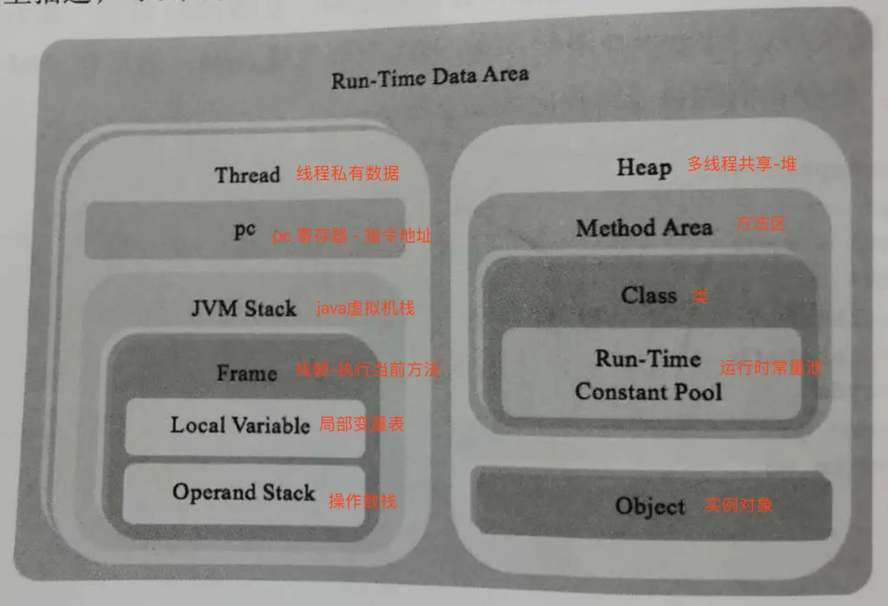

### 知识扩展
rtda 有数据存储和运算功能

存储来自共享数据+私有数据

运算功能来自线程jvm栈帧 用stack计算

`帧计算要重点看 jvm stack jvm frame`

要写一篇文章专门阐述逻辑

运行时数据区(run-time data area) 
| 运行时数据类型 | 创建和销毁时机      |
|---------|--------------|
| 多线程共享数据 | 虚拟机启动创建，退出销毁 |
| 线程私有数据  | 创建线程时创建，退出销毁 |

多线程共享数据
| 多线程共享数据类型 | 位置             | 包含                   |
|-----------|----------------|----------------------|
| 类数据       | 方法区Method Area(在Heap内) | 字段，方法信息，方法字节码，运行时常量池 |
| 类实例（对象）   | 堆Heap          |                      |

### 运行时数据


pc 寄存器 java虚拟机指令地址

jvm Frame 执行当前方法的帧

数据类型

1、基本类型：变量存放数据本身

2、引用类型：变量存放对象引用，真正对象数据在堆里

| 基本数据类型      | 引用类型   |   |
|-------------|--------|---|
| 布尔类型        | 类类型    |   |
| 数字类型（整型和浮点） | 接口类型   |   |
|             | 数组类型   |   |
|             | 特殊null |   |

程序计算通过栈stack来实现

### 实现运行时数据区
tip ： 设计前，先定义好对应结构体，再实现功能

```bash
go run main -test "rtda"  #测试 运行时数据
```

### 实战项目地址
https://gitee.com/yinlingchaoliu/jvmgo.git
