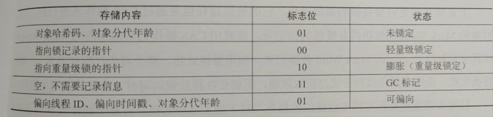

### 运行时数据区

* 程序计数器 所执行字节码的当前执行号指示器，通过改变计数器值来指定下一条要执行的字节码指令
* java虚拟机栈 存放虚拟机栈帧 stack frame 用于存放方法参数，局部变量，操作数栈，方法返回地址等
* 本地方法栈 存放本地方法栈帧 ,执行native方法
* 堆 存放对象实例
* 方法区 用于存储被虚拟机加载的类信息，常量池，静态变量，方法信息等
* 运行时常量池 存放常量信息 (属于方法区一部分)

### 对象的创建
1. new 指令创建对象
2. 检查指令参数是否在常量池中定位到一个类的符号引用，如果没有，执行类加载过程
3. 为新生对象分配内存,初始化为0值
4. 对象头设置状态(类元数据信息，hashCode,对象分代年龄,锁信息)
5. 执行`<init>`方法

内存分配空间策略
1) 指针碰撞：Bump the Pointer 挪到指针 内存规整且连续
2) 空闲列表：Free List 记录那块内存可用 场景 已使用内存和空间交错

解决内存分配并发问题
1) CAS加上重试
2) TLAB 每个线程一个独立分配空间

### 对象内存布局

对象内存区域分为3块区域：对象头、实例数据、对齐填充

1. 对象头：
   1) Mark Word: 存储对象自身运行时数据，如hashcode,分代年龄,锁状态标志,线程持有的锁，偏向线程ID,偏向时间戳
   示例 32bit  25bit hashcode  4bit 分代年龄  2bit锁标志位 1bit 0
   2) 类型指针，指向类元数据class的指针，根据这个来确定那个对象实例的
   3) 数组length:数组对象特有
2. 实例数据：
3. 对齐填充：补位效果

根据标志位来设置对象头信息

### 对象访问定位

通过栈上reference访问对象，来操作堆上具体对象

方位方式2种
1. 使用句柄：Java堆分配句柄池，reference中存储的是对象的句柄
2. 直接指针：reference中存储的是对象的地址,java对象布局考虑访问类型数据相关信息

句柄优点：只改变句柄实例的指针，不改变句柄，即reference不会改变

直接指针：优点是快，节省指针定位开销

### 内存溢出
1. 堆溢出：java.lang.OutOfMemoryError: Java heap space 
   解决方案 如无内存泄漏，则 -Xms=100m -Xmx=100m 调参
2. 虚拟机栈和本地方法栈溢出：java.lang.StackOverflowError 超出虚拟机最大栈深度，创建线程过多导致内存溢出
3. 方法区溢出：java.lang.OutOfMemoryError: Permanent generation space 
4. 本地直接内存溢出：java.lang.OutOfMemoryError: Direct buffer memory 

通过减少最大堆和减少栈容量来换取更多线程

因为系统分配每个进程内存是有限制的,优先分配方法区和堆，剩下是线程私有空间，栈和堆越大，线程的可分配数量越小
