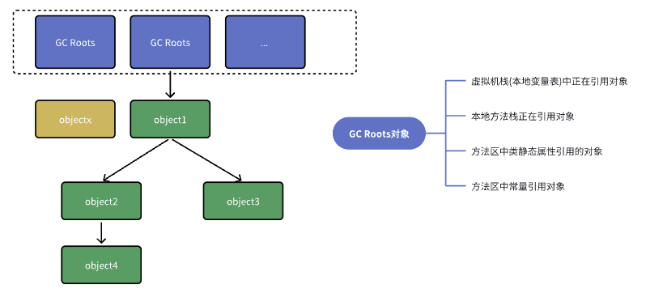
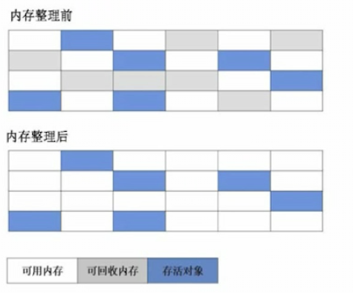
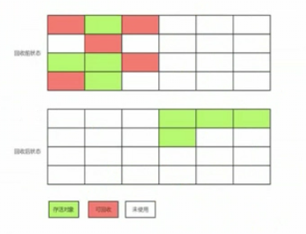
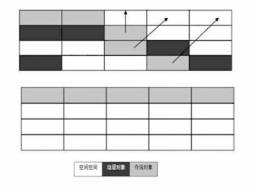
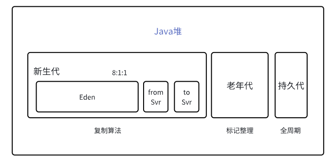
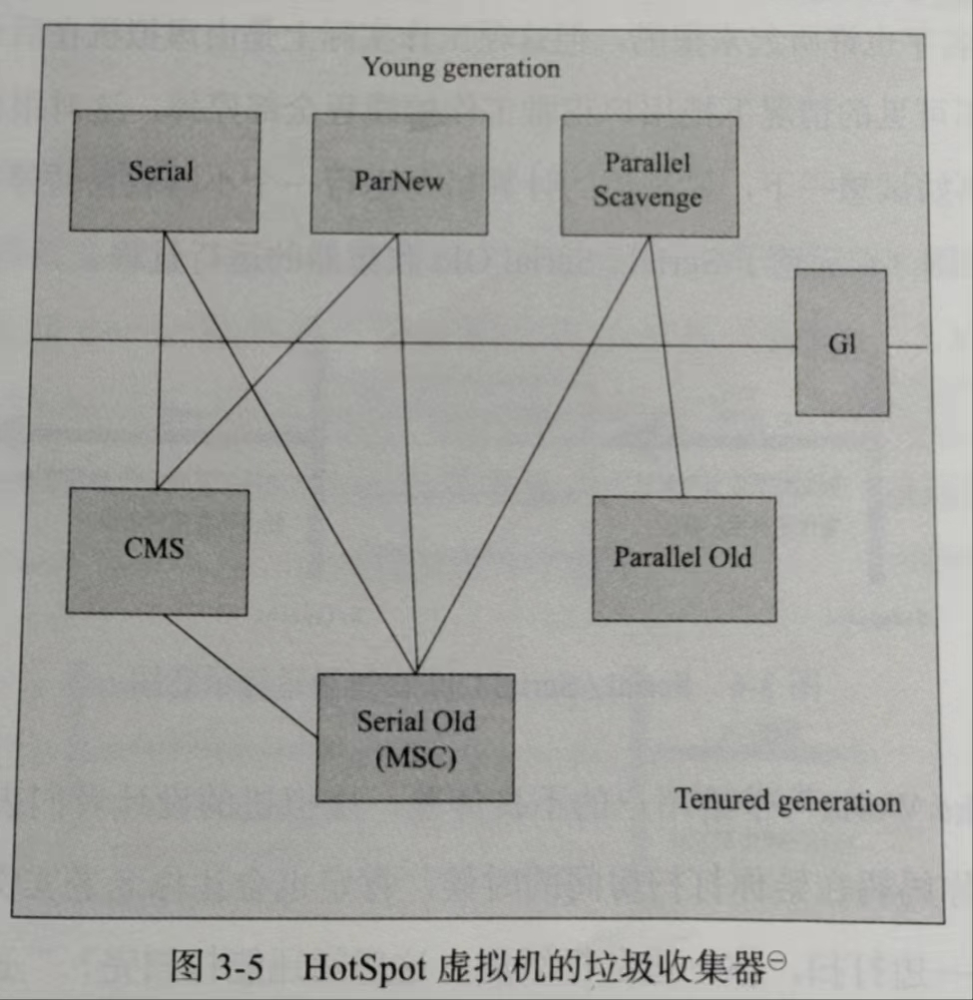

### 1标记算法

#### 1.引用计数算法
每个对象都有一个引用计数器，当对象被引用+1 ，引用失效时就-1 ，当计数器为0时，则该对象设置为可回收的垃圾对象
循环引用，引用计数器失效

#### 2.可达性分析算法
GC Roots对象作为起始点，从GC Roots开始向下搜索，搜索走过的路径叫引用链，当一个对象没有引用链，则该对象不可达，可回收

gcRoot对象
* 虚拟机栈中引用对象
* 本地方法栈中引用对象
* 方法区中类静态属性引用对象
* 方法区中常量引用对象

#### 3.四种引用
* 强引用: 只要强引用存在，垃圾回收器就不会回收该对象 strongReference
* 软引用: 当内存不足时，垃圾回收器会回收该对象  SoftReference
* 弱引用: 被弱引用关联对象只能生存到下一次垃圾收集发生之前 WeakReference
* 虚引用：最弱引用，对象被收集器回收时收到一个系统通知 PhantomReference

#### 4.回收过程
1. 对象不可达
2. 第一次标记筛选，检测对象不可达，有必要执行finalize方法，放入F-Queue队列
3. 第二次标记筛选，检测对象不可达，从F-Queue队列中取出，执行finalize方法

finalize方法回收垃圾不建议，建议try-finally

#### 5. 回收方法区
在永久代回收，性价比不高
回收内容：废弃常量和无用的类

无用类判断标准，满足仅代表可以回收，但不一定
* 该类所有实例已被回收
* 加载该类classloader被回收
* 该类对应的对象没有被任何地方被引用

### 2.收集算法

#### 1.标记-清除算法
首先标记所有需要回收的对象，然后统一回收所有标记对象

缺点：
* 效率问题：标记和清除两个过程效率不高
* 空间问题：产生大量不连续内存碎片

#### 2.复制算法

先把内存一分为二，每次只使用其中一个区域，垃圾回收时，将存活的对象全部拷贝到另外一个区域，然后对之前的区域进行全部回收

商业场景中
Eden:Sur0:Sur1 = 8:1:1

优点是高效
缺点是有一部分空间未利用，当存活对象变多时，效率会降低

#### 3.标记-整理算法
让存活的对象都向一端移动，清理掉端边界外的内存

缺点:耗时

#### 4.分代收集算法
根据对象存活周期划分：新生代、老年代、持久代

年轻代：复制算法 老年代，标记-整理算法 或 标记-清除算法

### 3.算法实现
#### 1.枚举根节点
枚举根节点过程中，对象的引用关系不能发生变化，否则分析结果不能保证，这点导致GC进行时必须停顿所有java线程(Stop The World) STW
采用准确式gc,不需要遍历所有，采用OopMap数据结构达成目标

#### 2.安全点
程序只有到达安全点，才能gc。
在方法调用，循环跳转、异常跳转等，才会产生安全点，考虑是让程序长时间执行

如何让线程跑到安全点，在进入gc问题
* 抢占式中断：先把所有线程全部中断，发现不在安全点线程，恢复运行到安全点再中断
* 主动式中断：不直接操作线程，直接设置中断标志，线程自己运行到标志，自己中断挂起
  
#### 3.安全区域
解决未分配CPU时间，走到安全点挂起。
扩大了安全范围

### 4.垃圾收集器

#### Serial 收集器
进行垃圾收集时，必须暂停其他工作线程，直到它收集结束(STW)

简单高效，应用场景客户端桌面
单CPU场景下

#### ParNew 收集器
Serial收集器多线程版本

多CPU场景下较好

#### Parallel Scavenge 收集器
ParNew收集器多线程版本，关注点在吞吐量优先

#### serial Old 收集器
Serial的老年代版本，单线程收集器

#### Parallel Old 收集器
Parallel Scavenge收集器老年版本，吞吐量优先

#### CMS收集器
最短时间停顿收集器，关注点在响应时间优先
并发收集，低停顿

标记-清除算法，会造成大量内存碎片，空间效率低

#### G1收集器
1、并发并行
2、分代收集
3、空间整合：整体是标记-整理，局部是复制算法
4、可预测的停顿

### 5.内存分配和回收策略

1. 对象优先分配在Eden区
2. 大对象直接进入老年代 (朝生夕死大对象应该避免)
3. 长期存活的对象进入老年代 (15岁，安卓8.0后，永久代被移除6岁) MinorGC 
4. 动态年龄判断，相同年龄对象大小之和>survivor空间大小，则进入老年代
5. 空间分配担保 MinorGC 查看老年代最大连续空间>新生代对象之和，否则触发FullGC 
