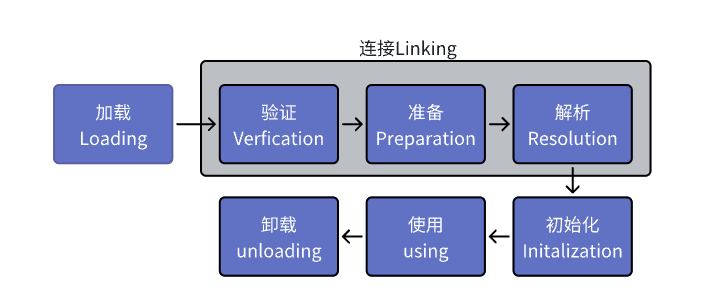

### 类加载时机



加载、验证、准备、初始化 顺序是固定的

必须初始化5种情况
* 遇到 new getstatic、invokestatic putstatic、4条指令
* Reflect包进行反射时
* 初始化一个类，父类未初始化时
* Main类
* 动态支持，解析结果REF_getstatic、REF_putstatic、REF_invokeStatic方法句柄
  
#### 加载
1. 读取二进制字节流.class   
2. 解析方法区运行时数据结构  .classfile
3. 内存生成java.lang.Class对象


#### 验证
1. 验证文件格式
2. 元数据验证
3. 字节码验证

#### 准备
给类变量分配内存并设置初始值

#### 解析
常量池内的符号替换成直接引用过程
1. 类或接口的解析
2. 字段的解析
3. 类方法的解析
4. 接口方法的解析

#### 初始化
init

### 双亲委派模型
1. 启动类加载器 Bootstrap ClassLoader C++ 虚拟机一部分
2. 扩展类加载器 Extension ClassLoader java独立于虚拟机外部
3. 应用类加载器 App ClassLoader
4. 自定义类加载器

类加载器的层次关系，称之为双亲委派模型

双亲委派模型工作过程

如果一个类加载器收到加载请求, 首先不会自己尝试加载这个类，而是委派到它的父类加载器去尝试加载，每层都如此，直到顶层的启动类加载器，直到父加载器反馈无法完成，子加载器才会尝试自己加载

```java
protected Class<?> loadClass(String className, boolean resolve) 
    throws  ClassNotFoundException { 
    //首先检查类是否加载过
    Class<?> clazz = findLoadedClass(className);
    if (clazz == null) {   
        try {   
            //如果存在父节点，加载父加载器ClassLoader 
             if(parent!=null){
                 //如果没有加载过，先调用父加载器的loadClass
                 clazz = parent.loadClass(className, false);
             }else{//否则用启动类加载器
                  clazz= findBootstrapClassOrNull(className);
             }
        } catch (ClassNotFoundException e) {
            //抛出异常说明父类无法完成加载请求
            if(clazz == null){
                clazz = findClass(className);
            }
        }
    } 

    //解析class
    if(resolve){
        resolveClass(clazz)
    }

    return clazz;
}
```

#### 为什么使用双亲委托

1、因为可以避免重复加载，当父类已经加载该类，就没有必要让子类再加载一次。

2、考虑安全因素，如果用自定义同名类来动态替换java核心api中定义类型，存在非常大隐患，除非自定义ClassLoader搜索算法

#### JVM在搜索类中，如何判定两个class相同
1、判断两个类名是否相同

2、是否由同一个类加载器实例加载
