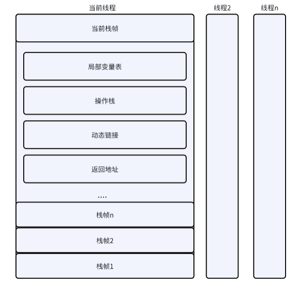

### 运行时栈帧结构 



#### 局部变量表
局部变量表式一组变量值存储空间，用于存放方法参数和方法内部定义的局部变量

* 变量槽slot为最小单位，每个solt存放一个boolean,char,short,int,float,reference,returnAddress类型的值.

* 64位机器，连续2个slot空间为long,double类型分配

* 虚拟机使用索引定位方式使用slot, n 代表第n个slot, long，double采用 n和n+1两个slot

* 为了尽可能节省栈帧空间，局部变量表中Slot是可以重用的。
出现问题，当PC计数器超过作用域，slot交给其他变量复用。会影响到gc回收

```
不使用的对象应手动赋值为null
尤其指分配的大对象
```

```java
//空闲空间未被回收
public class Main(String[] args) {
    {
      byte[] placeHolder = new byte[1024 * 1024 * 100];
    }
    system.gc();
}    
```

#### 操作数栈
操作栈 后入先出
执行指令，是压栈出栈的过程

#### 动态链接
栈帧中指向运行时常量池的引用，持有这个引用为了支持方法调用过程中动态连接

#### 方法返回地址
当一个方法执行后，退出方法
* 方法返回字节指令码  返回值给调用者
* 方法执行遇到异常 athrow指令码  异常给调用者
  

### 方法调用

#### 解析
所有方法调用中目标方法在class文件里面都是常量池中符号引用

类加载解析过程中，会将其中一部分符号引用转化为直接引用

invokestatic指令码，调用静态方法 

invokespecial指令码，调用构造`<init>`方法，

invokevirtual指令码，调用虚方法

invokeinterface指令码，调用接口方法

invokedynamic指令码，调用动态方法

final 修饰方法 是非虚方法

#### 分派
多态实现原理

1) 静态分派
依赖静态类型来定位方法执行版本称之为静态分派

```java
public class Dispatch{

  static class Human{}

  static class Man extends Human{}

  static class Woman extends Human{}

  public void sayHello(Human guy){
    System.out.println("hello,guy!");
  }

  public void sayHello(Man man){
    System.out.println("hello,man!");
  }

  public void sayHello(Woman guy){
    System.out.println("hello,woman!");
  }

  public static void main(String[] args){
    Human man = new Man();
    Human woman = new Woman();
    Dispatch dispatch = new Dispatch();
    dispatch.sayHello(man);
    dispatch.sayHello(woman);
  }

}

 输出结果 ========
 
 hello,guy!
 hello,guy!

```

编译结果
```java
dispatch.sayHello((Man)man);
dispatch.sayHello((Woman)man);
```


2) 动态分派

重写
```java
public class Dispatch{

  static abstract class Human{
    public abstract void sayHello();
  }

  static class Man extends Human{
      @Override
      public void sayHello(){
        System.out.println("hello,man!");
      }
  }

  static class Woman extends Human{
     @Override
     public void sayHello(){
      system.out.println("hello,woman!");
    }
  }

  public static void main(String[] args){
    Human man = new Man();
    Human woman = new Woman();
    man.sayHello();
    woman.sayHello();
  }

}

 输出结果 ========
 
 hello,man!
 hello,woman!

```


3) 单分派和多分派
4) 虚拟分派 虚方法表存放方法实际地址 invokeinterface  
 
 ### 字节码执行引擎
 解释执行

基于栈的解释器

### 文档说明

#### 1.指令集

[指令集文档](./../手动编写jvm虚拟机/7、指令集.md)

#### 2.方法调用和返回

[方法调用和返回文档](./../手动编写jvm虚拟机/12、方法调用和返回.md)

#### 3. 基于栈的解释器

[解释器文档](./../手动编写jvm虚拟机/8、解释器.md)