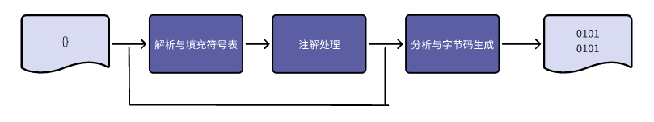
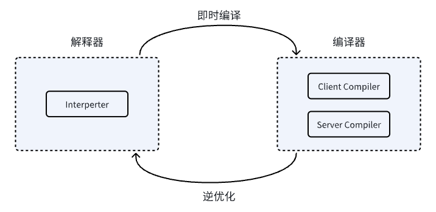

### 早期(编译器)优化



com.sun.tools.javac.main.javaCompiler

```java
void compile(){
  //准备过程: 初始化插入注解处理器
  initProcessAnnotations(processors);

  delegateCompiler = processAnnotations(  // 过程2 :执行注解处理
      enterTrees(stopIfError(CompileStage.PARSE, //过程1:输入符号表
      parseFile(sourceFileObjects))) // 过程1：解析: 词法分析和语法分析
      ,classnames);

  //过程3: 分析及字节码生成
  delegateCompiler.compile2();
}

void compile2(){
  switch(tag){
    case BY_TODO:
      while(!todo.isEmpty()){
         generate( desugar ( flow.attribute(todo.remove())));
      // 生成字节码 | 解语法糖 | 数据流分析 | 符号标注
      }
  }
}
```

#### 1.解析与填充符号表
parseFile()

token -> ast -> flow -> symbol

* 1、词法、语法分析
词法分析是将源代码的字符流转变为标记(Token)的集合

语法分析是根据Token序列构造抽象语法树ast的过程

* 2.填充符号表

enterTrees()

符号表示一组符号地址和符号信息构成的表格


#### 2.注解处理
initProcessAnnotations()

processAnnotations()

doProcess()

插入式编译器插件，可以读取、修改、添加抽象语法树任意元素

插入式插件在处理注解期间对语法树进行修改，编译器将回到解析及填充符号表重新处理,直到所有注解处理器不在修改 ，每一次循环称之为Round

#### 3.语义分析与字节码生成

语法树能保证结构正确，无法保证符合逻辑

语义分析主要任务是对结构上源程序上下文有关性质审查

* token检查

attribute() flow() 检查是否声明变量，变量和赋值之间数据能否匹配

* 数据及控制流分析

局部变量使用前是否赋值，方法的每条路径是否有返回值

* 解语法糖

语法糖对功能没有影响，方便开发人员使用，增强可读性，减少出错

* 字节码生成

将各步骤生成信息(抽象语法树，符号表)转化到字节码写到磁盘中


#### java 语法糖

##### 1. 泛型与类型擦除

泛型编译后成为Object   

泛型遇到重载后不能编译

泛型擦除，对方法code属性中字节码的擦除，实际元数据中，还保留泛型信息，
这是通过反射获得参数化类型的依据

##### 2. 自动装箱与拆箱，遍历循环

```java

public static void main(String[] args) {
  List<Integer> list = Arrays.asList(1,2,3);
  int sum = 0;
  for(Integer i : list){
    sum += i;
  }
}

//自动装箱 拆箱 遍历循环后
public static void main(String[] args) {
  List<Integer> list = Arrays.asList(new Integer[]{
    Integer.valueOf(1),
    Integer.valueOf(2),
    Integer.valueOf(3)});

  int sum = 0;
  for(Iterator it = list.iterator(); it.hasNext();){
    int i = ((Integer)it.next()).intValue();
    sum += i;
  }
}
```

拆箱问题
```java
    public static void main(String[] args) {
        Integer a = 1;
        Integer b = 2;
        Integer c = 3;
        Integer d = 3;
        Integer e = 321;
        Integer f = 321;
        Long g = 3L;

        System.out.println("c == d          :" + (c == d));
        System.out.println("e == f          :" + (e == f));
        System.out.println("c == a + b      :" + (c == a + b));
        System.out.println("c.equals(a+b)   :" + (c.equals(a + b)));
        System.out.println("g==(a+b)        :" + (g == (a + b)));
        System.out.println("g.equals(a+b)   :" + (g.equals(a + b)));
    }

//输出结果
c == d          :true
e == f          :false
c == a + b      :true
c.equals(a+b)   :true
g==(a+b)        :true
g.equals(a+b)   :false

```

* 1. 包装类自动装箱会缓存值为-128~127的Integer对象
* 2. 包装类”==“运算在没有遇到算术运算情况下不会拆箱
* 3. equals比较会先判断类型，再判断内容
* 4. == 比较的是地址

```java
Integer a =1;

//字节码
0:   iconst_1
1:   invokestatic    #16; //Method java/lang/Integer.valueOf:(I)
Ljava/lang/Integer;
4:   astore_1   

// -128~127 有对象换存池 值相同，对象地址相同
public static Integer valueOf(int i) {
	final int offset = 128;
	if (i >= -128 && i <= 127) { // must cache 
	    return IntegerCache.cache[i + offset];
	}
  return new Integer(i);
}

//Integer a = 1 自动装箱
Integer a = Integer.valueOf(1);

```

c == d          :true  自动装箱使用valueOf 对象池，地址相同

e == f          :false 值超过127 ，值相同，但是对象地址不相同

c == a + b      :true  自动装箱使用valueOf 对象池，地址相同

c.equals(a+b)   :true  对象类型相同integer ，值相同

g==(a+b)        :true  拆箱计算a+b时，将结果3转换成long类型，再跟g比较，所以结果true

g.equals(a+b)   :false a+b计算结果装箱为Integer 3的对象，g为Long对象，equals比较时，会使用instanceof判断类型，结果false

##### 3. 条件编译
删除无用代码

#### 实战
编写自定义注解处理器 AbstractProcessor

javaopt + apt技术

### 晚期(运行期)优化



* Client Compiler 简称 C1编译器 
* Server Compiler 简称 C2编译器 

```bash
# 强制启动c1
java -client -version

# 强制启动c2
java -server -version

# 强制启动解释器模式
java -Xint -version

# 强制启动jit模式
java -Xcomp -version
```

即时编译器优化成本地代码需要占用程序运行时间，要编译优化程度更高代码，解释器还要替编译器收集性能监控信息

#### 分层编译策略
第0层，程序解释执行，不开启性能监控Profiling, 可触发第1层编译

第1层，c1编译，将字节码编译成本地代码，简单可靠优化，如果有必要才加入性能监控

第2层，c2编译，将字节码编译成本地代码，编译耗时优化，根据性能监控启动激进优化

#### 编译对象与除法条件
热点代码
* 被多次调用的方法
* 被多次执行的循环体
  
以整个方法作为编译对象，称为栈上替换 OSR编译

#### 热点探测
* 基于采样: 周期性检查栈顶，发现方法经常出现，判定热点方法，优点:简单高效，容易获取调用关系(堆栈中)，缺点:很难精确，一旦阻塞扰乱热点探测
* 基于计数器: 每个方法建立计数器，统计执行次数，当计数器达到阈值，判定热点方法，优点:精确，缺点:需要额外的计数器，需要额外的内存，需要额外的时间 不能直接获得方法调用关系

jvm采用基于计数器(hotspot) 
* 方法计数器 c1
Client 1500次 Server 10000次

统计次数是相对频率，当超过一定时间限度，调用次数不足提交即时编译器，计数器数量减半(热度衰减)，半衰周期

* 回边计数器 c2

client 13995次 server 10700次
没有计数衰减

#### 编译过程

Client Compiler优化
1. 高级中间代码 HIR, 静态分配  方法内联 常量传播
2. 低级中间代码 LIR, 空值检查消除，范围检查消除
3. 线性扫描算法 在LIR寄存器做窥孔优化，产生机器代码

Server Compiler优化

优化级别 GUN C++ -o2 优化水平
1. 普通优化 无用代码消除、循环展开、常量传播、基本块重排序、检查消除、空值检查消除
2. 激进优化 守护内联、分支频率预测


#### 优化技术
无用代码消除 

公共子表达式消除: 代数简化

数组范围检查: 

方法内联: 目标方法复制到调用方法

##### 逃逸分析: 
动态分析对象动态作用域。被外部方法引用，叫方法逃逸。被线程访问到，叫线程逃逸

如果对象不会逃逸，可以进行高效优化，逃逸对象可以通过内联方式处理
1. 栈上分配
2. 同步消除
3. 标量替换

不能保证逃逸分析的性能高于它的消耗

#### java与c++对比
1. 即时编译器运行占用用户程序运行时间
2. java动态类型安全语言,做安全检查
3. java方法接收多态选择频率大于c++
4. java动态扩展语言
5. java对象在堆上分配对象，局部变量在栈上分配，c++多种分配