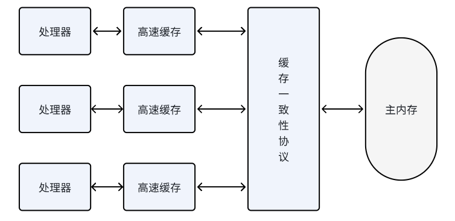
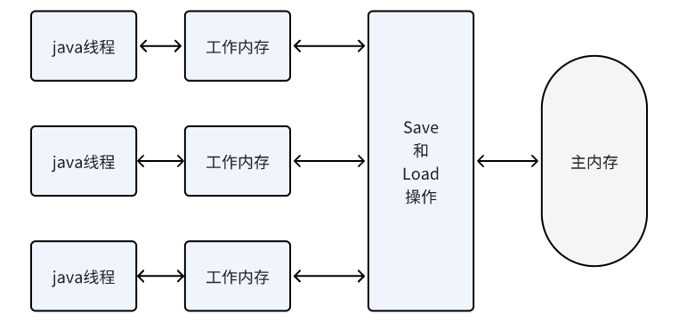
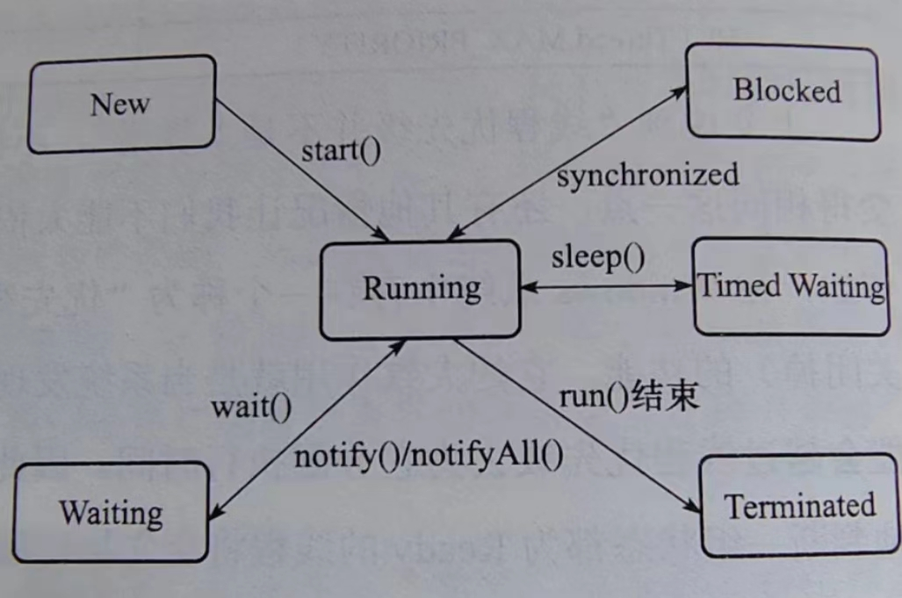
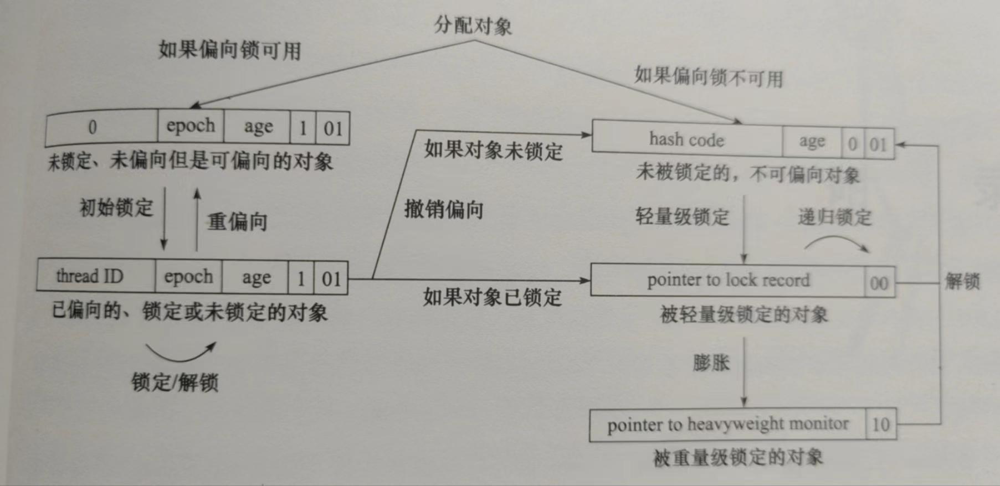

### java内存模型与线程

### 硬件效率与一致性



高速缓存的存储交互解决了处理器与内存的速度矛盾，但是它还是存在一致性问题，即缓存一致性。

多处理器有多个高速缓存(Cache)，他们共享同一主内存(Main Memory)

为了解决一致性问题，各个处理器访问缓存遵循协议 MSI MESI MOSI

本文”内存模型“，在特定操作协议下，对特定内存会高速缓存进行读写的过程抽象

为了使处理器运算单元利用率高，处理器对输入代码进行乱序执行优化(类java指令重新排序)

### java内存模型



#### 内存间交互操作

* lock 锁定  主内存
* unlock 解锁  主内存
* read 读取  主内存
* load 载入  工作内存
* use 使用  工作内存
* assign 赋值  工作内存
* store 存储  工作内存
* write 写入  主内存

读取  read load
写入 store write

#### long double类型特殊规则
读写需要2条指令，非原子操作
根据虚拟机实现情况而定

#### volatile特殊规则
1. 可见性  volatile修饰变量 缓存中存在不一致性，但是每次使用之前都会从主内存中重新读取
2. 禁止指令重新排序  指令 lock addl $0x0,(%esp)  内存屏障 禁止指令重排序

#### 原则
1. 原子性  原子性是指一个操作是不可分割的，要么全部执行，要么不执行
2. 可见性 可见性是指一个线程修改了某个共享变量，其他线程能够立即看到这个修改
3. 有序性 有序性是指线程按照代码的顺序执行
4. 先行发生原则  操作A先发生于B，操作B可以观察到A的副作用

### java与线程
线程是比进程更轻量级调度执行单位，各个线程共享进程资源(内存地址,文件IO),又可以独立调度

Thread 关键实现是native方法,平台实现有关

#### 1. 使用内核线程实现

  操作系统内核线程实现，这种线程由内核来完成线程切换(不直接使用)

  轻量级进程，就是通常所指的线程，每个轻量级线程都有一个内核进程支持，轻量级进程与内核进程1:1关系

  每一个轻量级进程都是一个独立调度单元

  缺点：1、轻量级线程操作，需要系统调用，需要用户态和内核态中来回切换
  2、创建需要消耗内核资源，系统支持轻量级进程数量有限

#### 2. 使用用户线程实现
一个线程只要不是内核线程，就可以任务用户进程

完全建立在用户空间的线程库 进程与用户线程是1:N关系

#### 3.使用用户线程加轻量级进程混合实现
用户线程和轻量级进程比例 n:m

#### 4. java线程的实现
虚拟机决定，采用线程api

#### java线程调度
同步式线程调度: 线程执行时间自己决定

抢占式线程调度:系统分配执行时间

### 状态转换



1. 新建状态  new  线程刚创建，还没有启动
2. 运行状态  runnable  线程已经启动。Ready 就绪状态 Running 运行状态 
3. 无限期等待 waitting 等待被显式唤起 object.wait() thread.join() LockSupport.park() 
4. 限期等待  Timed waitting  超时自动唤起  sleep(time) wait(time) join(time) LockSupport.parkNanos(time)
5. 阻塞 blocked 线程阻塞了，等待一个锁资源 
6. 结束状态 terminated  线程结束


### 线程安全
如果一个对象可以安全的被多个线程同时访问，那么这个对象就是线程安全的

多个线程访问同一个对象时，不需要额外的同步，调用这个对象行为都可以获得正确结果，那么是线程安全的

#### 不可变
不可变对象被构建出来(没有发生this引用逃逸问题),是安全的

基本数据类型 使用final关键字修饰，保证它不可变，比如String  Integer

#### 绝对线程安全
任何情况下，无额外同步措施

原子操作组合业务，是非原子操作的，需要同步方法

#### 相对线程安全

只保证这个对象单独操作是线程安全

#### 线程兼容
调用方正确使用同步手段，保证现场对象在并发环境安全

#### 线程对立
尝试停止和恢复另外线程来实现同步  resume suspend

### 线程安全的实现

#### 互斥同步
互斥同步是指多个线程并发访问共享数据时，保证同一时刻只有一个线程使用，实现同步访问。互斥是实现同步的一种手段

synchronized关键字 ,关键字经过编译后，会在同步块生成monitorenter monitorexit指令,
* 1. 字节码需要reference类型参数来指明锁定和解锁对象
* 2. 执行moniter指令时，monitorenter 尝试获取对象锁，获得+1 没获得阻塞， monitorexit 释放对象锁，-1 计数器为0 释放
* 3. synchronized 可重入的
* 4. 阻塞和唤醒一个线程，都需要操作系统从用户态切换到内核态，需要系统调用

ReentrantLock 实现同步
* 1. 可重入
* 2. 等待可中断： 持有锁线程长时间不释放，等待线程可以选择放弃等待
* 3. 公平锁 按照申请锁顺序来依次获得锁  非公平锁 任何一个等待线程都可以获得锁
* 4. 锁绑定多个条件 可以绑定多个condition 

#### 非阻塞同步
先进行操作，如果没有其他线程操作，则操作成功，否则失败，失败则重新进行操作 

乐观锁

操作和冲突检测是原子性操作

1. 测试并射中
2. 获取并增加
3. 交换
4. 比较并交换CAS
5. 加载/存储

```java
public int incrementAndGet() {
    for(;;){
      int cur = get();
      int next = cur + 1;
      if(compareAndSet(cur,next)){
        return next;
      }
    }
 }
```

存在ABA问题 大部分场景不会影响并发安全性

#### 无同步方案
1. 可重入代码

2. 线程本地存储  ThreadLocal

### 锁优化

#### 自旋锁与自适应自旋锁

不放弃处理器执行时间，忙循环(自旋) 叫自旋锁
自适应自旋 , 自旋时间是由上一次状态决定

优点:避免线程切换开销  缺点消耗处理器资源

#### 锁消除
移除没有同步需求的锁


#### 锁粗化
频繁对一个对象中片段内容加锁，可以合并成一个锁，加到对象上

### 锁升级

#### 0.对象头


#### 1.偏向锁
单线程尝试进入

加锁
* 当锁对象第一次被线程获取时，jvm将对象头标志位设为”01“,即偏向模式
* CAS操作 设置获得锁线程ID记录到对象头中，设置成功
* 持有偏向锁线程每次进入，不在有任何同步操作

释放
* 当有另外线程尝试获取这个锁，偏向模式结束
* 撤销偏向恢复未锁定，或升级轻量锁状态


#### 2.轻量锁
另外线程尝试获得锁

加锁
* 线程创建锁记录(Lock Record)空间，用于存储锁对象
* CAS操作 将对象MarkWord更新为Lock Record指针 称之为 Displaced MarkWord
* 更新锁状态为"00" 轻量锁 加锁成功

膨胀
* 加锁失败，如果markword指向当前线程执行栈帧 继续执行
* 否则，锁对象被强占，两个线程强占同一个锁，轻量锁失效
* 膨胀成重量锁，锁状态为"10" 

解锁
* 将对象原来的MarkWord替换回来

#### 3.重量锁
多线程竞争锁

#### 锁升级流程


