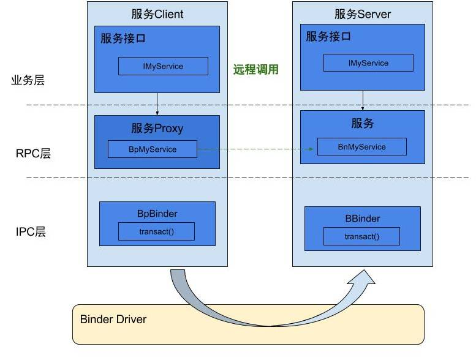
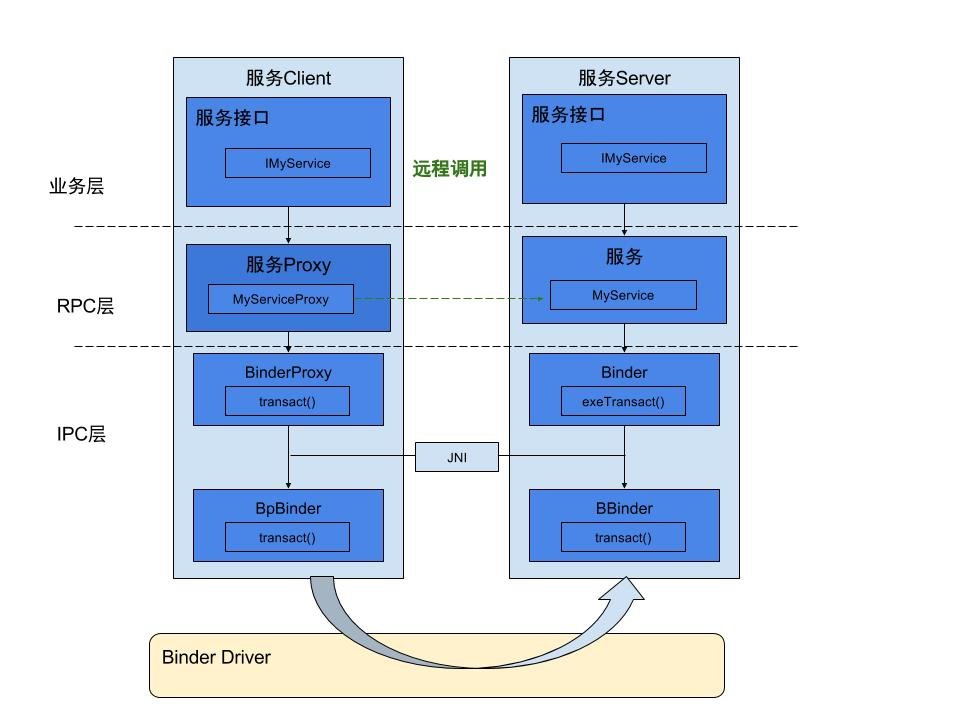
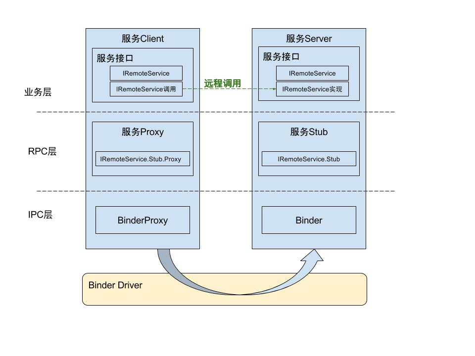

### native binder




```
ClientDemo.cpp: 客户端程序
ServerDemo.cpp：服务端程序
IMyService.h：自定义的MyService服务的头文件
IMyService.cpp：自定义的MyService服务
Android.mk：源码build文件
```

#### 服务注册
将名为”service.myservice”的BnMyService服务添加到ServiceManager，并启动服务
```c
#include "IMyService.h"
int main() {
    //获取service manager引用
    sp < IServiceManager > sm = defaultServiceManager();
    //注册名为"service.myservice"的服务到service manager
    sm->addService(String16("service.myservice"), new BnMyService());
    ProcessState::self()->startThreadPool(); //启动线程池
    IPCThreadState::self()->joinThreadPool(); //把主线程加入线程池
    return 0;
}
```

#### 客户端调用
通过接口引用调用服务端方法
```c
#include "IMyService.h"
int main() {
    //获取service manager引用
    sp < IServiceManager > sm = defaultServiceManager();
    //获取名为"service.myservice"的binder接口
    sp < IBinder > binder = sm->getService(String16("service.myservice"));
    //将biner对象转换为强引用类型的IMyService
    sp<IMyService> cs = interface_cast < IMyService > (binder);
    //利用binder引用调用远程sayHello()方法
    cs->sayHello();
    return 0;
}
```

#### 服务实现
头文件

1. 申明IMyService
2. 申明BpMyService（Binder客户端）
3. 申明BnMyService（Binder的服务端）
```c
namespace android
{
    class IMyService : public IInterface
    {
    public:
        DECLARE_META_INTERFACE(MyService); //使用宏，申明MyService
        virtual void sayHello()=0; //定义方法
    };

    //定义命令字段
    enum
    {
        HELLO = 1,
    };

    //申明客户端BpMyService
    class BpMyService: public BpInterface<IMyService> {
    public:
        BpMyService(const sp<IBinder>& impl);
        virtual void sayHello();
    };

    //申明服务端BnMyService
    class BnMyService: public BnInterface<IMyService> {
    public:
        virtual status_t onTransact(uint32_t code, const Parcel& data, Parcel* reply, uint32_t flags = 0);
        virtual void sayHello();
    };
}
```

服务实现
```c
#include "IMyService.h"
namespace android
{
    //使用宏，完成MyService定义
    IMPLEMENT_META_INTERFACE(MyService, "android.demo.IMyService");

    //客户端
    BpMyService::BpMyService(const sp<IBinder>& impl) :
            BpInterface<IMyService>(impl) {
    }

    // 实现客户端sayHello方法
    void BpMyService::sayHello() {
        printf("BpMyService::sayHello\n");
        Parcel data, reply;
        data.writeInterfaceToken(IMyService::getInterfaceDescriptor());
        remote()->transact(HELLO, data, &reply);
        printf("get num from BnMyService: %d\n", reply.readInt32());
    }

    //服务端，接收远程消息，处理onTransact方法
    status_t BnMyService::onTransact(uint_t code, const Parcel& data,
            Parcel* reply, uint32_t flags) {
        switch (code) {
        case HELLO: {    //收到HELLO命令的处理流程
            printf("BnMyService:: got the client hello\n");
            CHECK_INTERFACE(IMyService, data, reply);
            sayHello();
            reply->writeInt32(2015);
            return NO_ERROR;
        }
            break;
        default:
            break;
        }
        return NO_ERROR;
    }

    // 实现服务端sayHello方法
    void BnMyService::sayHello() {
        printf("BnMyService::sayHello\n");
    };
}
```

#### 编译执行
利用Android.mk编译上述代码，在Android的源码中，通过mm编译后，可生成两个可执行文件ServerDemo，ClientDemo。

执行测试
```bash
# push
adb remount

# adb push ServerDemo ClientDemo
adb push ServerDemo /system/bin
adb push ClientDemo /system/bin

# 启动server
adb shell
/system/bin/ServerDemo

# 启动client
adb shell
/system/bin/ClientDemo
```

### binder framework



native层

* 服务名service.myservice

Server端

* ServerDemo.java：可执行程序
* IMyService.java: 定义IMyService接口
* MyService.java：定义MyService

Client端

* ClientDemo.java：可执行程序
* IMyService.java: 与Server端完全一致
* MyServiceProxy.java：定义MyServiceProxy

#### 服务端注册
```java
public class ServerDemo {
    public static void main(String[] args) {
        System.out.println("MyService Start");
        //准备Looper循环执行
        Looper.prepareMainLooper();
        //设置为前台优先级
        android.os.Process.setThreadPriority(android.os.Process.THREAD_PRIORITY_FOREGROUND);
        //注册服务
        ServiceManager.addService("MyService", new MyService());
        Looper.loop();
    }
}
```

#### 客户端调用
客户端调用
```java
public class ClientDemo {
    public static void main(String[] args) throws RemoteException {
        System.out.println("Client start");
        IBinder binder = ServiceManager.getService("MyService"); //获取名为"MyService"的服务
        IMyService myService = new MyServiceProxy(binder); //创建MyServiceProxy对象
        myService.sayHello("binder"); //通过MyServiceProxy对象调用接口的方法
        System.out.println("Client end");
    }
}
```

服务代理
```java
public class MyServiceProxy implements IMyService {
    private android.os.IBinder mRemote;  //代表BpBinder

    public MyServiceProxy(android.os.IBinder remote) {
        mRemote = remote;
    }

    public java.lang.String getInterfaceDescriptor() {
        return DESCRIPTOR;
    }

    /** 自定义的sayHello()方法 **/
    @Override
    public void sayHello(String str) throws RemoteException {
        android.os.Parcel _data = android.os.Parcel.obtain();
        android.os.Parcel _reply = android.os.Parcel.obtain();
        try {
            _data.writeInterfaceToken(DESCRIPTOR);
            _data.writeString(str);
            mRemote.transact(TRANSACTION_say, _data, _reply, 0);
            _reply.readException();
        } finally {
            _reply.recycle();
            _data.recycle();
        }
    }

    @Override
    public IBinder asBinder() {
        return mRemote;
    }
}
```

#### 服务实现

接口
```java
public interface IMyService extends IInterface {
    static final java.lang.String DESCRIPTOR = "com.gityuan.frameworkBinder.MyServer";
    public void sayHello(String str) throws RemoteException ;
    static final int TRANSACTION_say = android.os.IBinder.FIRST_CALL_TRANSACTION;
}
```

实现
```java
public class MyService extends Binder implements IMyService{

    public MyService() {
        this.attachInterface(this, DESCRIPTOR);
    }

    @Override
    public IBinder asBinder() {
        return this;
    }

    /** 将MyService转换为IMyService接口 **/
    public static com.gityuan.frameworkBinder.IMyService asInterface( android.os.IBinder obj) {
        if ((obj == null)) {
            return null;
        }
        android.os.IInterface iInterface = obj.queryLocalInterface(DESCRIPTOR);
        if (((iInterface != null)&&(iInterface instanceof com.gityuan.frameworkBinder.IMyService))){
            return ((com.gityuan.frameworkBinder.IMyService) iInterface);
        }
        return null;
    }

    /** 服务端，接收远程消息，处理onTransact方法 **/
    @Override
    protected boolean onTransact(int code, Parcel data, Parcel reply, int flags) throws RemoteException {
        switch (code) {
        case INTERFACE_TRANSACTION: {
            reply.writeString(DESCRIPTOR);
            return true;
        }
        case TRANSACTION_say: {
            data.enforceInterface(DESCRIPTOR);
            String str = data.readString();
            sayHello(str);
            reply.writeNoException();
            return true;
        }}
        return super.onTransact(code, data, reply, flags);
    }

    /** 自定义sayHello()方法 **/
    @Override
    public void sayHello(String str) {
        System.out.println("MyService:: Hello, " + str);
    }
}
```

#### 执行
```bash
# push
adb remount

# adb push 执行层
adb push ServerDemo /system/bin
adb push ClientDemo /system/bin

# adb push framework
adb push ServerDemo.jar /system/framework
adb push ClientDemo.jar /system/framework
```

启动服务端
```bash
adb shell
/system/bin/ServerDemo
```

启动客户端
```bash
adb shell
/system/bin/ClientDemo
```

### 应用层aidl



#### aidl接口

```java
interface IRemoteService {
    int getPid();
    MyData getMyData();
}

//实体类型
parcelable MyData;
```

#### 客户端调用

```java
public class ClientActivity extends AppCompatActivity {
    private static final String TAG = "BinderSimple";
    private IRemoteService mRemoteService;
    private boolean mIsBound;
    
    public void clickHandler(View view){
        switch (view.getId()){
            case R.id.btn_bind:
                bindRemoteService();
                break;

            case R.id.btn_unbind:
                unbindRemoteService();
                break;

            case R.id.btn_kill:
                killRemoteService();
                break;
        }
    }

    /**
     * 用语监控远程服务连接的状态
     */
    private ServiceConnection mConnection = new ServiceConnection() {
        @Override
        public void onServiceConnected(ComponentName name, IBinder service) {

            mRemoteService = IRemoteService.Stub.asInterface(service);
            String pidInfo = null;
            try {
                MyData myData = mRemoteService.getMyData();
                pidInfo = "pid="+ mRemoteService.getPid() +
                        ", data1 = "+ myData.getData1() +
                        ", data2="+ myData.getData2();
            } catch (RemoteException e) {
                e.printStackTrace();
            }
            Log.i(TAG, "[ClientActivity] onServiceConnected  "+pidInfo);
        }

        @Override
        public void onServiceDisconnected(ComponentName name) {
            Log.i(TAG, "[ClientActivity] onServiceDisconnected");
            mRemoteService = null;
        }
    };

    /**
     * 绑定远程服务
     */
    private void bindRemoteService(){
        Log.i(TAG, "[ClientActivity] bindRemoteService");
        Intent intent = new Intent(ClientActivity.this, RemoteService.class);
        intent.setAction(IRemoteService.class.getName());
        bindService(intent, mConnection, Context.BIND_AUTO_CREATE);
        mIsBound = true;
    }

    /**
     * 解除绑定远程服务
     */
    private void unbindRemoteService(){
        if(!mIsBound){
            return;
        }
        Log.i(TAG, "[ClientActivity] unbindRemoteService ==>");
        unbindService(mConnection);
        mIsBound = false;
    }

    /**
     * 杀死远程服务
     */
    private void killRemoteService(){
        Log.i(TAG, "[ClientActivity] killRemoteService");
        try {
            android.os.Process.killProcess(mRemoteService.getPid());
        } catch (RemoteException e) {
            e.printStackTrace();
        }
    }
}

```

#### 服务端实现

android:process=":remote"

```java
public class RemoteService extends Service {
    private static final String TAG = "BinderSimple";

    MyData mMyData;

    @Override
    public void onCreate() {
        super.onCreate();
        Log.i(TAG, "[RemoteService] onCreate");
        initMyData();
    }

    @Override
    public IBinder onBind(Intent intent) {
        Log.i(TAG,"[RemoteService] onBind");
        return mBinder;
    }

    @Override
    public boolean onUnbind(Intent intent) {
        Log.i(TAG, "[RemoteService] onUnbind");
        return super.onUnbind(intent);
    }

    @Override
    public void onDestroy() {
        Log.i(TAG, "[RemoteService] onDestroy");
        super.onDestroy();
    }

    /** * 实现IRemoteService.aidl中定义的方法 */
    private final IRemoteService.Stub mBinder = new IRemoteService.Stub() {

        @Override
        public int getPid() throws RemoteException {
            Log.i(TAG,"[RemoteService] getPid()="+android.os.Process.myPid());
            return android.os.Process.myPid();
        }

        @Override
        public MyData getMyData() throws RemoteException {
            Log.i(TAG,"[RemoteService] getMyData() "+ mMyData.toString());
            return mMyData;
        }

        /**此处可用于权限拦截**/
        @Override
        public boolean onTransact(int code, Parcel data, Parcel reply, int flags) throws RemoteException {
            return super.onTransact(code, data, reply, flags);
        }
    };

    /** * 初始化MyData数据 **/
    private void initMyData() {
        mMyData = new MyData();
        mMyData.setData1(10);
        mMyData.setData2(20);
    }
}
```

#### MyData自定义
```java
public class MyData implements Parcelable {
    private int data1;
    private int data2;

    public MyData(){

    }

    protected MyData(Parcel in) {
        readFromParcel(in);
    }

    public static final Creator<MyData> CREATOR = new Creator<MyData>() {
        @Override
        public MyData createFromParcel(Parcel in) {
            return new MyData(in);
        }

        @Override
        public MyData[] newArray(int size) {
            return new MyData[size];
        }
    };

    @Override
    public int describeContents() {
        return 0;
    }

    /** 将数据写入到Parcel **/
    @Override
    public void writeToParcel(Parcel dest, int flags) {
        dest.writeInt(data1);
        dest.writeInt(data2);
    }

    /** 从Parcel中读取数据 **/
    public void readFromParcel(Parcel in){
        data1 = in.readInt();
        data2 = in.readInt();
    }


    public int getData2() {
        return data2;
    }

    public void setData2(int data2) {
        this.data2 = data2;
    }

    public int getData1() {
        return data1;
    }

    public void setData1(int data1) {
        this.data1 = data1;
    }

    @Override
    public String toString() {
        return "data1 = "+ data1 + ", data2="+ data2;
    }
}
```

#### AIDL模版
自动生成 IRemoteService.java 模版代码
```java
package com.gityuan.appbinderdemo;
public interface IRemoteService extends android.os.IInterface {
    public static abstract class Stub extends android.os.Binder implements com.gityuan.appbinderdemo.IRemoteService {
        private static final java.lang.String DESCRIPTOR = "com.gityuan.appbinderdemo.IRemoteService";

        /**
         * Stub构造函数
         */
        public Stub() {
            this.attachInterface(this, DESCRIPTOR);
        }

        /**
         * 将IBinder 转换为IRemoteService interface
         */
        public static com.gityuan.appbinderdemo.IRemoteService asInterface(android.os.IBinder obj) {
            if ((obj == null)) {
                return null;
            }
            android.os.IInterface iin = obj.queryLocalInterface(DESCRIPTOR);
            if (((iin != null) && (iin instanceof com.gityuan.appbinderdemo.IRemoteService))) {
                return ((com.gityuan.appbinderdemo.IRemoteService) iin);
            }
            return new com.gityuan.appbinderdemo.IRemoteService.Stub.Proxy(obj);
        }

        @Override
        public android.os.IBinder asBinder() {
            return this;
        }

        @Override
        public boolean onTransact(int code, android.os.Parcel data, android.os.Parcel reply, int flags) throws android.os.RemoteException {
            switch (code) {
                case INTERFACE_TRANSACTION: {
                    reply.writeString(DESCRIPTOR);
                    return true;
                }
                case TRANSACTION_getPid: {
                    data.enforceInterface(DESCRIPTOR);
                    int _result = this.getPid();
                    reply.writeNoException();
                    reply.writeInt(_result);
                    return true;
                }
                case TRANSACTION_getMyData: {
                    data.enforceInterface(DESCRIPTOR);
                    com.gityuan.appbinderdemo.MyData _result = this.getMyData();
                    reply.writeNoException();
                    if ((_result != null)) {
                        reply.writeInt(1);
                        _result.writeToParcel(reply, android.os.Parcelable.PARCELABLE_WRITE_RETURN_VALUE);
                    } else {
                        reply.writeInt(0);
                    }
                    return true;
                }
            }
            return super.onTransact(code, data, reply, flags);
        }

        private static class Proxy implements com.gityuan.appbinderdemo.IRemoteService {
            private android.os.IBinder mRemote;

            /**
             * Proxy构造函数
             */
            Proxy(android.os.IBinder remote) {
                mRemote = remote;
            }

            @Override
            public android.os.IBinder asBinder() {
                return mRemote;
            }

            public java.lang.String getInterfaceDescriptor() {
                return DESCRIPTOR;
            }

            @Override
            public int getPid() throws android.os.RemoteException {
                android.os.Parcel _data = android.os.Parcel.obtain();
                android.os.Parcel _reply = android.os.Parcel.obtain();
                int _result;
                try {
                    _data.writeInterfaceToken(DESCRIPTOR);
                    mRemote.transact(Stub.TRANSACTION_getPid, _data, _reply, 0);
                    _reply.readException();
                    _result = _reply.readInt();
                } finally {
                    _reply.recycle();
                    _data.recycle();
                }
                return _result;
            }

            @Override
            public com.gityuan.appbinderdemo.MyData getMyData() throws android.os.RemoteException {
                android.os.Parcel _data = android.os.Parcel.obtain();
                android.os.Parcel _reply = android.os.Parcel.obtain();
                com.gityuan.appbinderdemo.MyData _result;
                try {
                    _data.writeInterfaceToken(DESCRIPTOR);
                    mRemote.transact(Stub.TRANSACTION_getMyData, _data, _reply, 0);
                    _reply.readException();
                    if ((0 != _reply.readInt())) {
                        _result = com.gityuan.appbinderdemo.MyData.CREATOR.createFromParcel(_reply);
                    } else {
                        _result = null;
                    }
                } finally {
                    _reply.recycle();
                    _data.recycle();
                }
                return _result;
            }
        }

        static final int TRANSACTION_getPid = (android.os.IBinder.FIRST_CALL_TRANSACTION + 0);
        static final int TRANSACTION_getMyData = (android.os.IBinder.FIRST_CALL_TRANSACTION + 1);
    }

    public int getPid() throws android.os.RemoteException;

    public com.gityuan.appbinderdemo.MyData getMyData() throws android.os.RemoteException;
}
```
