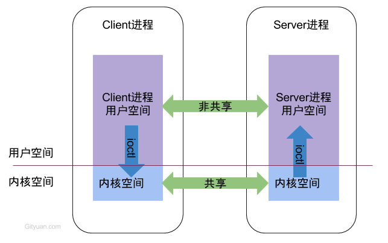
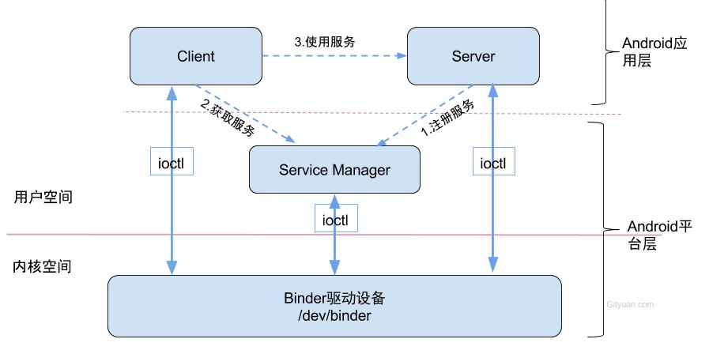
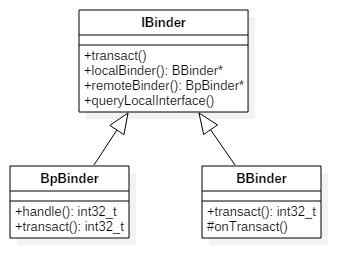

### IPC原理 


进程空间分为用户空间和内核空间，用户空间是彼此不共享的，内核空间是可共享的, Client进程向Server进程通信，就是通过内核空间共享内存来实现的。


### binder原理



ServiceManager是整个Binder通信机制的大管家，是Android进程间通信机制Binder的守护进程

1. 启动serverManager
2. 获取serviceManager 

binder通信

* 注册服务(addService)：Server进程要先注册Service到ServiceManager
* 获取服务(getService)：Client进程使用某个Service前，须先向ServiceManager中获取相应的Service。
* 使用服务：Client与Service交互

binder驱动，位于内核空间
Client,Server,Service Manager位于用户空间
开发人员自定义client server可进行ipc通信

### CS模式

* client端：BpBinder.transact()来发送事务请求；
* server端：BBinder.onTransact()会接收到相应事务。

### 源码目录
Binder架构所涉及的总共有以下5个目录:
```
/framework/base/core/java/               (Java)
/framework/base/core/jni/                (JNI)
/framework/native/libs/binder            (Native)
/framework/native/cmds/servicemanager/   (Native)
/kernel/drivers/staging/android          (Driver)
```

Java framework
```
/framework/base/core/java/android/os/  
    - IInterface.java
    - IBinder.java
    - Parcel.java
    - IServiceManager.java
    - ServiceManager.java
    - ServiceManagerNative.java
    - Binder.java  


/framework/base/core/jni/    
    - android_os_Parcel.cpp
    - AndroidRuntime.cpp
    - android_util_Binder.cpp (核心类)
```

Native framework
```
/framework/native/libs/binder         
    - IServiceManager.cpp
    - BpBinder.cpp
    - Binder.cpp
    - IPCThreadState.cpp (核心类)
    - ProcessState.cpp  (核心类)

/framework/native/include/binder/
    - IServiceManager.h
    - IInterface.h

/framework/native/cmds/servicemanager/
    - service_manager.c
    - binder.c

```

Kernel
```
/kernel/drivers/staging/android/
    - binder.c
    - uapi/binder.h
```