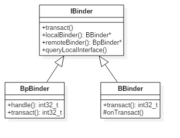

### binder架构


### binder类图


* ServiceManager：通过getIServiceManager方法获取的是ServiceManagerProxy对象； ServiceManager的addService, getService实际工作都交由ServiceManagerProxy的相应方法来处理；

* ServiceManagerProxy：其成员变量mRemote指向BinderProxy对象，ServiceManagerProxy的addService, getService方法最终是交由mRemote来完成。

* ServiceManagerNative：其方法asInterface()返回的是ServiceManagerProxy对象，ServiceManager便是借助ServiceManagerNative类来找到ServiceManagerProxy；

* Binder：其成员变量mObject和方法execTransact()用于native方法

* BinderInternal：内部有一个GcWatcher类，用于处理和调试与Binder相关的垃圾回收。

* IBinder：接口中常量FLAG_ONEWAY：客户端利用binder跟服务端通信是阻塞式的，但如果设置了FLAG_ONEWAY，这成为非阻塞的调用方式，客户端能立即返回，服务端采用回调方式来通知客户端完成情况。另外IBinder接口有一个内部接口DeathDecipient(死亡通告)。


### Binder进程与线程

Binder线程池：每个Server进程在启动时会创建一个binder线程池，并向其中注册一个Binder线程；之后Server进程也可以向binder线程池注册新的线程，或者Binder驱动在探测到没有空闲binder线程时会主动向Server进程注册新的的binder线程。对于一个Server进程有一个最大Binder线程数限制，默认为16个binder线程，例如Android的system_server进程就存在16个线程。对于所有Client端进程的binder请求都是交由Server端进程的binder线程来处理的。

###  Binder传输过程


发送端把binder_transaction节点，插入到目标进程或其子线程的todo队列中，等目标进程或线程不断循环地从todo队列中取出数据并进行相应的操作

### Binder路由


binder的路由原理：BpBinder发送端，根据handler，在当前binder_proc中，找到相应的binder_ref，由binder_ref再找到目标binder_node实体，由目标binder_node再找到目标进程binder_proc。简单地方式是直接把binder_transaction节点插入到binder_proc的todo队列中，完成传输过程。

### 通信过程 AMS


1. 发起端线程向Binder Driver发起binder ioctl请求后, 便采用环不断talkWithDriver,此时该线程处于阻塞状态, 直到收到如下BR_XXX命令才会结束该过程.
* BR_TRANSACTION_COMPLETE: oneway模式下,收到该命令则退出
* BR_REPLY: 非oneway模式下,收到该命令才退出;
* BR_DEAD_REPLY: 目标进程/线程/binder实体为空, 以及释放正在等待reply的binder thread或者binder buffer;
* BR_FAILED_REPLY: 情况较多,比如非法handle, 错误事务栈, security, 内存不足, buffer不足, 数据拷贝失败, 节点创建失败, 各种不匹配等问题
* BR_ACQUIRE_RESULT: 目前未使用的协议;

2. 左图中waitForResponse收到BR_TRANSACTION_COMPLETE,则直接退出循环, 则没有机会执行executeCommand()方法, 故将其颜色画为灰色. 除以上5种BR_XXX命令, 当收到其他BR命令,则都会执行executeCommand过程.

3. 目标Binder线程创建后, 便进入joinThreadPool()方法, 采用循环不断地循环执行getAndExecuteCommand()方法, 当bwr的读写buffer都没有数据时,则阻塞在binder_thread_read的wait_event过程. 另外,正常情况下binder线程一旦创建则不会退出.


### 关键代码

```java
public ComponentName startService(IApplicationThread caller, Intent service, String resolvedType, String callingPackage, int userId) throws RemoteException {
    //获取或创建Parcel对象【见小节2.2】
    Parcel data = Parcel.obtain();
    Parcel reply = Parcel.obtain();
    data.writeInterfaceToken(IActivityManager.descriptor);
    data.writeStrongBinder(caller != null ? caller.asBinder() : null);
    service.writeToParcel(data, 0);
    //写入Parcel数据 【见小节2.3】
    data.writeString(resolvedType);
    data.writeString(callingPackage);
    data.writeInt(userId);

    //通过Binder传递数据【见小节2.5】
    mRemote.transact(START_SERVICE_TRANSACTION, data, reply, 0);
    //读取应答消息的异常情况
    reply.readException();
    //根据reply数据来创建ComponentName对象
    ComponentName res = ComponentName.readFromParcel(reply);
    //【见小节2.2.3】
    data.recycle();
    reply.recycle();
    return res;
}
```

AMN.getDefault

```java
static public IActivityManager getDefault() {
    // [见流程2.4.2]
    return gDefault.get();
}

public abstract class Singleton<IActivityManager> {
    public final IActivityManager get() {
        synchronized (this) {
            if (mInstance == null) {
                //首次调用create()来获取AMP对象[见流程2.4.3]
                mInstance = create();
            }
            return mInstance;
        }
    }
}

private static final Singleton<IActivityManager> gDefault = new Singleton<IActivityManager>() {
    protected IActivityManager create() {
        //获取名为"activity"的服务
        IBinder b = ServiceManager.getService("activity");
        //创建AMP对象[见流程2.4.4]
        IActivityManager am = asInterface(b);
        return am;
    }
};


public abstract class ActivityManagerNative extends Binder implements IActivityManager {
    static public IActivityManager asInterface(IBinder obj) {
        if (obj == null) {
            return null;
        }
        //此处obj = BinderProxy, descriptor = "android.app.IActivityManager"; [见流程2.4.5]
        IActivityManager in = (IActivityManager)obj.queryLocalInterface(descriptor);
        if (in != null) { //此处为null
            return in;
        }
        //[见流程2.4.6]
        return new ActivityManagerProxy(obj);
    }
    ...
}


public class Binder implements IBinder {
    //对于Binder对象的调用,则返回值不为空
    public IInterface queryLocalInterface(String descriptor) {
        //mDescriptor的初始化在attachInterface()过程中赋值
        if (mDescriptor.equals(descriptor)) {
            return mOwner;
        }
        return null;
    }
}

//由上一小节[2.4.4]调用的流程便是此处,返回Null
final class BinderProxy implements IBinder {
    //BinderProxy对象的调用, 则返回值为空
    public IInterface queryLocalInterface(String descriptor) {
        return null;
    }
}

class ActivityManagerProxy implements IActivityManager {
    public ActivityManagerProxy(IBinder remote) {
        mRemote = remote;
    }
}


final class BinderProxy implements IBinder {
    public boolean transact(int code, Parcel data, Parcel reply, int flags) throws RemoteException {
        //用于检测Parcel大小是否大于800k
        Binder.checkParcel(this, code, data, "Unreasonably large binder buffer");
        //【见2.6】
        return transactNative(code, data, reply, flags);
    }
}


```

原生方法
```c
static jboolean android_os_BinderProxy_transact(JNIEnv* env, jobject obj,
    jint code, jobject dataObj, jobject replyObj, jint flags)
{
    ...
    //将java Parcel转为c++ Parcel
    Parcel* data = parcelForJavaObject(env, dataObj);
    Parcel* reply = parcelForJavaObject(env, replyObj);

    //gBinderProxyOffsets.mObject中保存的是new BpBinder(handle)对象
    IBinder* target = (IBinder*) env->GetLongField(obj, gBinderProxyOffsets.mObject);
    ...

    //此处便是BpBinder::transact()【见小节2.7】
    status_t err = target->transact(code, *data, reply, flags);
    ...

    //最后根据transact执行具体情况，抛出相应的Exception
    signalExceptionForError(env, obj, err, true , data->dataSize());
    return JNI_FALSE;
}


status_t BpBinder::transact(
    uint32_t code, const Parcel& data, Parcel* reply, uint32_t flags)
{
    if (mAlive) {
        // 【见小节2.8】
        status_t status = IPCThreadState::self()->transact(
            mHandle, code, data, reply, flags);
        if (status == DEAD_OBJECT) mAlive = 0;
        return status;
    }
    return DEAD_OBJECT;
}


status_t IPCThreadState::transact(int32_t handle,
                                  uint32_t code, const Parcel& data,
                                  Parcel* reply, uint32_t flags)
{
    status_t err = data.errorCheck(); //数据错误检查
    flags |= TF_ACCEPT_FDS;
    ....
    if (err == NO_ERROR) {
         // 传输数据 【见小节2.9】
        err = writeTransactionData(BC_TRANSACTION, flags, handle, code, data, NULL);
    }

    if (err != NO_ERROR) {
        if (reply) reply->setError(err);
        return (mLastError = err);
    }

    // 默认情况下,都是采用非oneway的方式, 也就是需要等待服务端的返回结果
    if ((flags & TF_ONE_WAY) == 0) {
        if (reply) {
            //reply对象不为空 【见小节2.10】
            err = waitForResponse(reply);
        }else {
            Parcel fakeReply;
            err = waitForResponse(&fakeReply);
        }
    } else {
        err = waitForResponse(NULL, NULL);
    }
    return err;
}
```

transact主要过程:

先执行writeTransactionData()已向Parcel数据类型的mOut写入数据，此时mIn还没有数据；
然后执行waitForResponse()方法，循环执行，直到收到应答消息. 调用talkWithDriver()跟驱动交互，收到应答消息，便会写入mIn, 则根据收到的不同响应吗，执行相应的操作。
此处调用waitForResponse根据是否有设置TF_ONE_WAY的标记:

当已设置oneway时, 则调用waitForResponse(NULL, NULL);
当未设置oneway时, 则调用waitForResponse(reply) 或 waitForResponse(&fakeReply)

### 源码目录

```
framework/base/core/java/android/os/
  - IInterface.java
  - IServiceManager.java
  - ServiceManager.java
  - ServiceManagerNative.java(内含ServiceManagerProxy类)

framework/base/core/java/android/os/
  - IBinder.java
  - Binder.java(内含BinderProxy类)
  - Parcel.java

framework/base/core/java/com/android/internal/os/
  - BinderInternal.java

framework/base/core/jni/
  - AndroidRuntime.cpp
  - android_os_Parcel.cpp
  - android_util_Binder.cpp
```