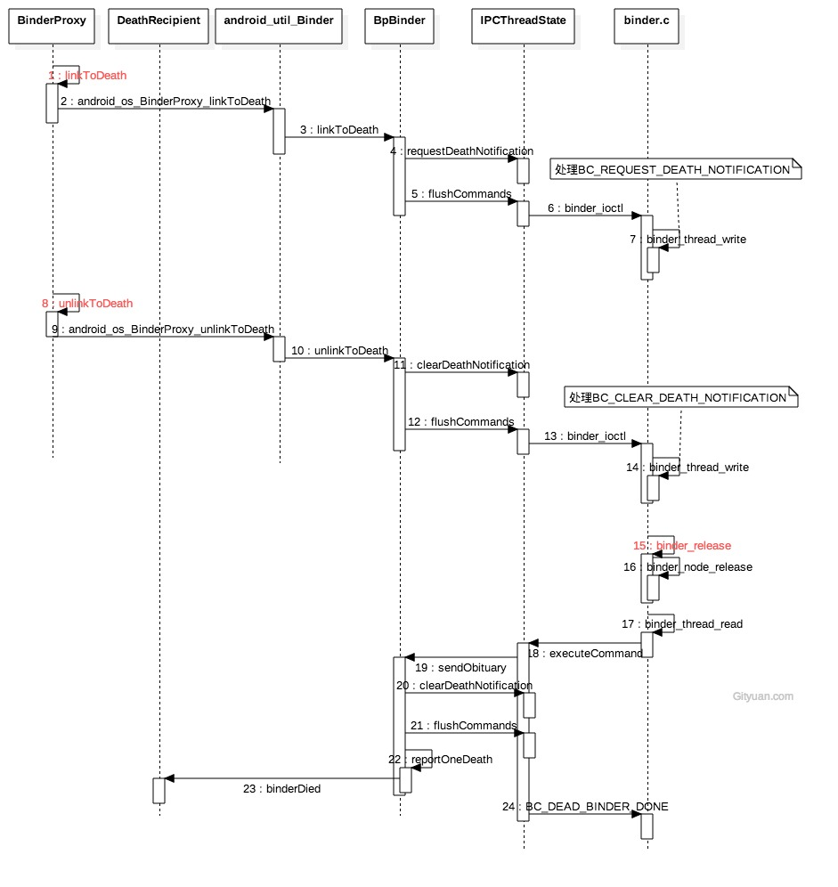

### binder死亡通知
本质: binder client端收尾工作



死亡通知是为了让Bp端(客户端进程)进能知晓Bn端(服务端进程)的生死情况，当Bn端进程死亡后能通知到Bp端。

定义：AppDeathRecipient是继承IBinder::DeathRecipient类，主要需要实现其binderDied()来进行死亡通告。

注册：binder->linkToDeath(AppDeathRecipient)是为了将AppDeathRecipient死亡通知注册到Binder上。

Bp端只需要覆写binderDied()方法，实现一些后尾清除类的工作，则在Bn端死掉后，会回调binderDied()进行相应处理。


linkToDeath过程

1. requestDeathNotification过程向驱动传递的命令BC_REQUEST_DEATH_NOTIFICATION，参数有mHandle和BpBinder对象；
2. binder_thread_write()过程，同一个BpBinder可以注册多个死亡回调，但Kernel只允许注册一次死亡通知。
3. 注册死亡回调的过程，实质就是向binder_ref结构体添加binder_ref_death指针， binder_ref_death的cookie记录BpBinder指针。

unlinkToDeath过程

1. unlinkToDeath只有当该BpBinder的所有mObituaries都被移除，才会向驱动层执行清除死亡通知的动作， 否则只是从native层移除某个recipient。
2. clearDeathNotification过程向驱动传递BC_CLEAR_DEATH_NOTIFICATION，参数有mHandle和BpBinder对象；
3. binder_thread_write()过程，将BINDER_WORK_CLEAR_DEATH_NOTIFICATION事务添加当前当前进程/线程的todo队列

触发死亡回调

1. 服务实体进程：binder_release过程会执行binder_node_release()，loop该binder_node下所有的ref->death对象。 当存在，则将BINDER_WORK_DEAD_BINDER事务添加ref->proc->todo（即ref所在进程的todo队列)
2. 引用所在进程：执行binder_thread_read()过程，向用户空间写入BR_DEAD_BINDER，并触发死亡回调。
3. 发送死亡通知sendObituary

### 核心代码
```java

public final class ActivityManagerService {

    /**
     * 收尾工作
     */
    private final boolean attachApplicationLocked(IApplicationThread thread, int pid) {
        //创建IBinder.DeathRecipient子类对象
        AppDeathRecipient adr = new AppDeathRecipient(app, pid, thread);
        //建立binder死亡回调
        thread.asBinder().linkToDeath(adr, 0);
        app.deathRecipient = adr;
        //取消binder死亡回调
        app.unlinkDeathRecipient();
    }

    private final class AppDeathRecipient implements IBinder.DeathRecipient {
        //触发回调方法
        public void binderDied() {
            synchronized(ActivityManagerService.this) {
                appDiedLocked(mApp, mPid, mAppThread, true);
            }
        }
    }
}

```

接口实现
```java
public class Binder implements IBinder {
    public void linkToDeath(DeathRecipient recipient, int flags) {
    }

    public boolean unlinkToDeath(DeathRecipient recipient, int flags) {
        return true;
    }
}

final class BinderProxy implements IBinder {
    public native void linkToDeath(DeathRecipient recipient, int flags) throws RemoteException;
    public native boolean unlinkToDeath(DeathRecipient recipient, int flags);
}
```


```c
static void android_os_BinderProxy_linkToDeath(JNIEnv* env, jobject obj,
        jobject recipient, jint flags)
{
    if (recipient == NULL) {
        jniThrowNullPointerException(env, NULL);
        return;
    }

    //获取BinderProxy.mObject成员变量值, 即BpBinder对象
    IBinder* target = (IBinder*)env->GetLongField(obj, gBinderProxyOffsets.mObject);
    ...

    //只有Binder代理对象才会进入该分支
    if (!target->localBinder()) {
        DeathRecipientList* list = (DeathRecipientList*)
                env->GetLongField(obj, gBinderProxyOffsets.mOrgue);
        //创建JavaDeathRecipient对象[见小节2.1.1]
        sp<JavaDeathRecipient> jdr = new JavaDeathRecipient(env, recipient, list);
        //建立死亡通知[见小节2.2]
        status_t err = target->linkToDeath(jdr, NULL, flags);
        if (err != NO_ERROR) {
            //添加死亡通告失败, 则从list移除引用[见小节2.1.3]
            jdr->clearReference();
            signalExceptionForError(env, obj, err, true /*canThrowRemoteException*/);
        }
    }
}

```

### 代码路径
```markdown
frameworks/base/core/java/android/os/Binder.java
frameworks/base/core/jni/android_util_Binder.cpp
frameworks/native/libs/binder/BpBinder.cpp
```