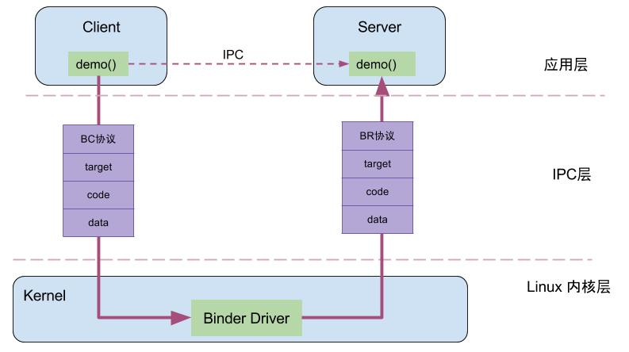
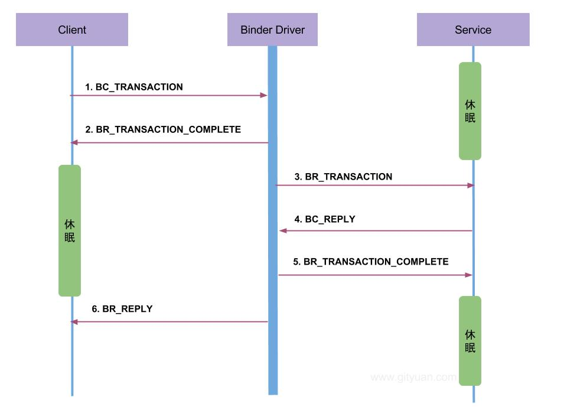
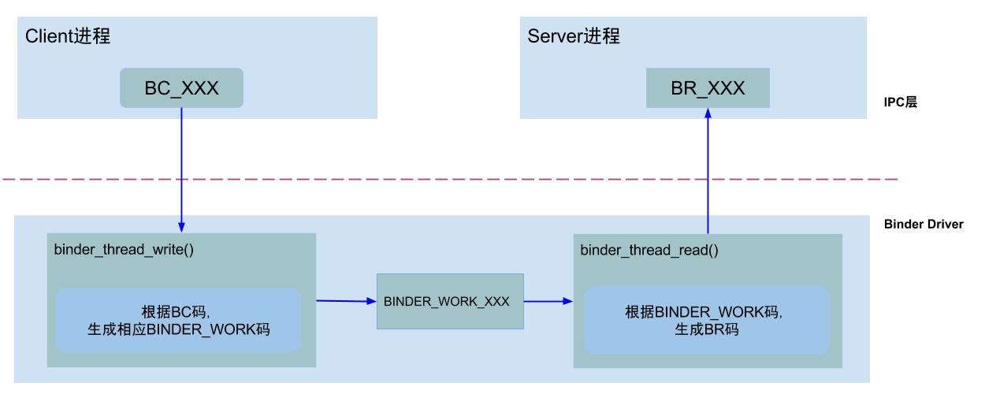
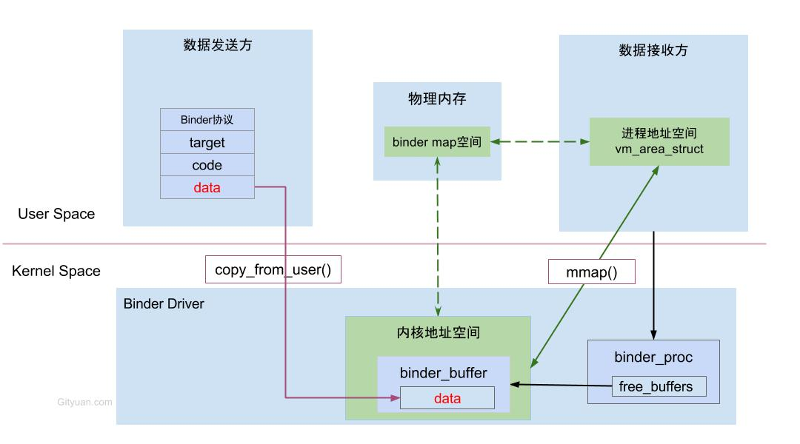
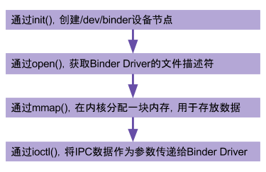

### 驱动分层



业务层: demo()便是Client端和Server共同协商好的统一方法
IPC层: handle、RPC数据、代码、协议
内核层: Binder Driver

### Binder通信过程



Binder协议
* BINDER_COMMAND_PROTOCOL：binder请求码，以”BC_“开头，简称BC码，用于从IPC层传递到Binder Driver层；
* BINDER_RETURN_PROTOCOL ：binder响应码，以”BR_“开头，简称BR码，用于从Binder Driver层传递到IPC层；

Binder IPC通信进程的交互：
* client进程执行binder_thread_write，根据BC_XXX命令，生成相应的binder_work；
* server进程执行binder_thread_read，根据binder_work.type类型，生成BR_XXX，发送到用户空间处理。



### 一次拷贝



### 核心方法

binder_thread_write
```c
binder_thread_write(){
    while (ptr < end && thread->return_error == BR_OK) {
        get_user(cmd, (uint32_t __user *)ptr)；//获取IPC数据中的Binder协议(BC码)
        switch (cmd) {
            case BC_INCREFS: ...
            case BC_ACQUIRE: ...
            case BC_RELEASE: ...
            case BC_DECREFS: ...
            case BC_INCREFS_DONE: ...
            case BC_ACQUIRE_DONE: ...
            case BC_FREE_BUFFER: ... break;
            
            case BC_TRANSACTION:
            case BC_REPLY: {
                struct binder_transaction_data tr;
                copy_from_user(&tr, ptr, sizeof(tr))； //拷贝用户空间tr到内核
                //创建事务
                binder_transaction(proc, thread, &tr, cmd == BC_REPLY);
                break;

            case BC_REGISTER_LOOPER: ...
            case BC_ENTER_LOOPER: ...
            case BC_EXIT_LOOPER: ...
            case BC_REQUEST_DEATH_NOTIFICATION: ...
            case BC_CLEAR_DEATH_NOTIFICATION:  ...
            case BC_DEAD_BINDER_DONE: ...
            }
        }
    }
}

```

binder_transaction
```c
static void binder_transaction(struct binder_proc *proc,
               struct binder_thread *thread,
               struct binder_transaction_data *tr, int reply){
    //根据各种判定，获取以下信息：
    struct binder_thread *target_thread； //目标线程
    struct binder_proc *target_proc；    //目标进程
    struct binder_node *target_node；    //目标binder节点
    struct list_head *target_list；      //目标TODO队列
    wait_queue_head_t *target_wait；     //目标等待队列
    ...
    
    //分配两个结构体内存
    struct binder_transaction *t = kzalloc(sizeof(*t), GFP_KERNEL);
    struct binder_work *tcomplete = kzalloc(sizeof(*tcomplete), GFP_KERNEL);
    //从target_proc分配一块buffer【见小节3.2】
    t->buffer = binder_alloc_buf(target_proc, tr->data_size,

    for (; offp < off_end; offp++) {
        switch (fp->type) {
        case BINDER_TYPE_BINDER: ...
        case BINDER_TYPE_WEAK_BINDER: ...
        case BINDER_TYPE_HANDLE: ...
        case BINDER_TYPE_WEAK_HANDLE: ...
        case BINDER_TYPE_FD: ...
        }
    }
    //向目标进程的target_list添加BINDER_WORK_TRANSACTION事务
    t->work.type = BINDER_WORK_TRANSACTION;
    list_add_tail(&t->work.entry, target_list);
    //向当前线程的todo队列添加BINDER_WORK_TRANSACTION_COMPLETE事务
    tcomplete->type = BINDER_WORK_TRANSACTION_COMPLETE;
    list_add_tail(&tcomplete->entry, &thread->todo);
    if (target_wait)
        wake_up_interruptible(target_wait);
    return;
}
```

binder_thread_read
```c
binder_thread_read（）{
    wait_for_proc_work = thread->transaction_stack == NULL &&
            list_empty(&thread->todo);
    //根据wait_for_proc_work来决定wait在当前线程还是进程的等待队列
    if (wait_for_proc_work) {
        ret = wait_event_freezable_exclusive(proc->wait, binder_has_proc_work(proc, thread));
        ...
    } else {
        ret = wait_event_freezable(thread->wait, binder_has_thread_work(thread));
        ...
    }
    
    while (1) {
        //当&thread->todo和&proc->todo都为空时，goto到retry标志处，否则往下执行：
        struct binder_transaction_data tr;
        struct binder_transaction *t = NULL;
        switch (w->type) {
          case BINDER_WORK_TRANSACTION: ...
          case BINDER_WORK_TRANSACTION_COMPLETE: ...
          case BINDER_WORK_NODE: ...
          case BINDER_WORK_DEAD_BINDER: ...
          case BINDER_WORK_DEAD_BINDER_AND_CLEAR: ...
          case BINDER_WORK_CLEAR_DEATH_NOTIFICATION: ...
        }
        ...
    }
done:
    *consumed = ptr - buffer;
    //当满足请求线程加已准备线程数等于0，已启动线程数小于最大线程数(15)，
    //且looper状态为已注册或已进入时创建新的线程。
    if (proc->requested_threads + proc->ready_threads == 0 &&
        proc->requested_threads_started < proc->max_threads &&
        (thread->looper & (BINDER_LOOPER_STATE_REGISTERED |
         BINDER_LOOPER_STATE_ENTERED))) {
        proc->requested_threads++;
        // 生成BR_SPAWN_LOOPER命令，用于创建新的线程
        put_user(BR_SPAWN_LOOPER, (uint32_t __user *)buffer)；
    }
    return 0;
}
```
### binder驱动底层方法
驱动设备的初始化(binder_init)，打开 (binder_open)，映射(binder_mmap)，数据操作(binder_ioctl)。




### 核心代码

binder_init

```c
static int __init binder_init(void)
{
    int ret;
    //创建名为binder的工作队列
    binder_deferred_workqueue = create_singlethread_workqueue("binder");

    binder_debugfs_dir_entry_root = debugfs_create_dir("binder", NULL);
    if (binder_debugfs_dir_entry_root)
        binder_debugfs_dir_entry_proc = debugfs_create_dir("proc",
                         binder_debugfs_dir_entry_root);

     // 注册misc设备
    ret = misc_register(&binder_miscdev);
    if (binder_debugfs_dir_entry_root) {
       //在debugfs文件系统中创建一系列的文件
    }
    return ret;
}

```

结构体
```c
static struct miscdevice binder_miscdev = {
    .minor = MISC_DYNAMIC_MINOR, //次设备号 动态分配
    .name = "binder",     //设备名
    .fops = &binder_fops  //设备的文件操作结构，这是file_operations结构
};

static const struct file_operations binder_fops = {
    .owner = THIS_MODULE,
    .poll = binder_poll,
    .unlocked_ioctl = binder_ioctl,
    .compat_ioctl = binder_ioctl,
    .mmap = binder_mmap,
    .open = binder_open,
    .flush = binder_flush,
    .release = binder_release,
};
```
