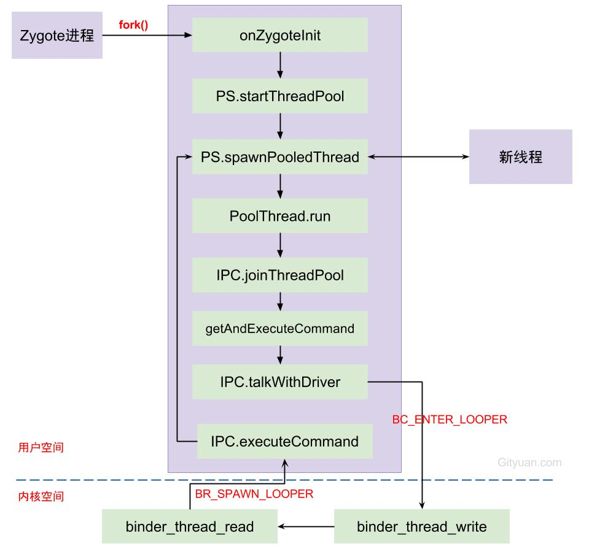

### binder池总结


每次由Zygote fork出新进程的过程中，伴随着创建binder线程池，调用spawnPooledThread来创建binder主线程。当线程执行binder_thread_read的过程中，发现当前没有空闲线程，没有请求创建线程，且没有达到上限，则创建新的binder线程。

Binder的transaction有3种类型：

* call: 发起进程的线程不一定是在Binder线程， 大多數情況下，接收者只指向进程，并不确定会有哪个线程来处理，所以不指定线程；
* reply: 发起者一定是binder线程，并且接收者线程便是上次call时的发起线程(该线程不一定是binder线程，可以是任意线程)。
* async: 与call类型差不多，唯一不同的是async是oneway方式不需要回复，发起进程的线程不一定是在Binder线程， 接收者只指向进程，并不确定会有哪个线程来处理，所以不指定线程。

Binder系统中可分为3类binder线程：

* Binder主线程：进程创建过程会调用startThreadPool()过程中再进入spawnPooledThread(true)，来创建Binder主线程。编号从1开始，也就是意味着binder主线程名为binder_1，并且主线程是不会退出的。
* Binder普通线程：是由Binder Driver来根据是否有空闲的binder线程来决定是否创建binder线程，回调spawnPooledThread(false) ，isMain=false，该线程名格式为binder_x。
* Binder其他线程：其他线程是指并没有调用spawnPooledThread方法，而是直接调用IPC.joinThreadPool()，将当前线程直接加入binder线程队列。例如： mediaserver和servicemanager的主线程都是binder线程，但system_server的主线程并非binder线程。

### Binder线程创建
1. Process.start() 向zygote进程发起创建socket消息
2. Zygote.forkAndSpecialize() fork新进程
3. 新进程调用RuntimeInit.nativeZygoteInit 方法
4. jni映射调用c++方法 app_main.cpp中onZygoteInit
5. 打开/dev/binder驱动设备
6. startThreadPool()是创建一个新的binder线程，不断进行talkWithDriver()

### 核心代码
```c
virtual void onZygoteInit() {
    //获取ProcessState对象
    sp<ProcessState> proc = ProcessState::self();
    //启动新binder线程 
    proc->startThreadPool();
}
```

* 对于isMain=true的情况下， command为BC_ENTER_LOOPER，代表的是Binder主线程，不会退出的线程；
* 对于isMain=false的情况下，command为BC_REGISTER_LOOPER，表示是由binder驱动创建的线程。

```c

//主binder池
void ProcessState::startThreadPool()
{
    AutoMutex _l(mLock);    //多线程同步
    if (!mThreadPoolStarted) {
        mThreadPoolStarted = true;
        spawnPooledThread(true);  
    }
}

//普通binder线程
status_t IPCThreadState::executeCommand(int32_t cmd)
{
    status_t result = NO_ERROR;
    switch ((uint32_t)cmd) {
      ...
      case BR_SPAWN_LOOPER:
          //创建新的binder线程 【见小节2.3】
          mProcess->spawnPooledThread(false);
          break;
      ...
    }
    return result;
}

void ProcessState::spawnPooledThread(bool isMain)
{
    if (mThreadPoolStarted) {
        //获取Binder线程名
        String8 name = makeBinderThreadName();
        //此处isMain=true
        sp<Thread> t = new PoolThread(isMain);
        t->run(name.string());
    }
}


class PoolThread : public Thread
{
public:
    PoolThread(bool isMain)
        : mIsMain(isMain)
    {
    }

protected:
    virtual bool threadLoop() {
        IPCThreadState::self()->joinThreadPool(mIsMain); //【见小节2.4】
        return false;
    }
    const bool mIsMain;
};


void IPCThreadState::joinThreadPool(bool isMain)
{
    //创建Binder线程
    mOut.writeInt32(isMain ? BC_ENTER_LOOPER : BC_REGISTER_LOOPER);
    set_sched_policy(mMyThreadId, SP_FOREGROUND); //设置前台调度策略

    status_t result;
    do {
        processPendingDerefs(); //清除队列的引用[见小节2.5]
        result = getAndExecuteCommand(); //处理下一条指令[见小节2.6]

        if (result < NO_ERROR && result != TIMED_OUT
                && result != -ECONNREFUSED && result != -EBADF) {
            abort();
        }

        if(result == TIMED_OUT && !isMain) {
            break; ////非主线程出现timeout则线程退出
        }
    } while (result != -ECONNREFUSED && result != -EBADF);

    mOut.writeInt32(BC_EXIT_LOOPER);  // 线程退出循环
    talkWithDriver(false); //false代表bwr数据的read_buffer为空
}
```

调用链
onZygoteInit->startThreadPool->spawnPooledThread->PoolThread->joinThreadPool->talkWithDriver

### binder池上限

默认地，每个进程的binder线程池的线程个数上限为15，该上限不统计通过BC_ENTER_LOOPER命令创建的binder主线程， 只计算BC_REGISTER_LOOPER命令创建的线程。 对此，或者很多人不理解，例个栗子：某个进程的主线程执行如下方法，那么该进程可创建的binder线程个数上限是多少呢？

```c
ProcessState::self()->setThreadPoolMaxThreadCount(6);  // 6个线程
ProcessState::self()->startThreadPool();   // 1个线程
IPCThread::self()->joinThreadPool();   // 1个线程
```

1. binder池 可使用 6个
2. 通过startThreadPool()创建的主线程不算在最大线程上限 1个
3. 当前线程成为binder线程 1个
4. binder线程个数上限为8


### binder_thread_read

当发生以下3种情况之一，便会进入done：

1. 当前线程的return_error发生error的情况；
2. 当Binder驱动向client端发送死亡通知的情况；
3. 当类型为BINDER_WORK_TRANSACTION(即收到命令是BC_TRANSACTION或BC_REPLY)的情况；

任何一个Binder线程当同时满足以下条件，则会生成用于创建新线程的BR_SPAWN_LOOPER命令：

1. 当前进程中没有请求创建binder线程，即requested_threads = 0；
2. 当前进程没有空闲可用的binder线程，即ready_threads = 0；（线程进入休眠状态的个数就是空闲线程数）
3. 当前进程已启动线程个数小于最大上限(默认15)；
4. 当前线程已接收到BC_ENTER_LOOPER或者BC_REGISTER_LOOPER命令，即当前处于BINDER_LOOPER_STATE_REGISTERED或者BINDER_LOOPER_STATE_ENTERED状态。【小节2.6】已设置状态为BINDER_LOOPER_STATE_ENTERED，显然这条件是满足的


### 代码路径
```markdown
frameworks/base/cmds/app_process/app_main.cpp
frameworks/native/libs/binder/ProcessState.cpp
framework/native/libs/binder/IPCThreadState.cpp
kernel/drivers/staging/android/binder.c
```