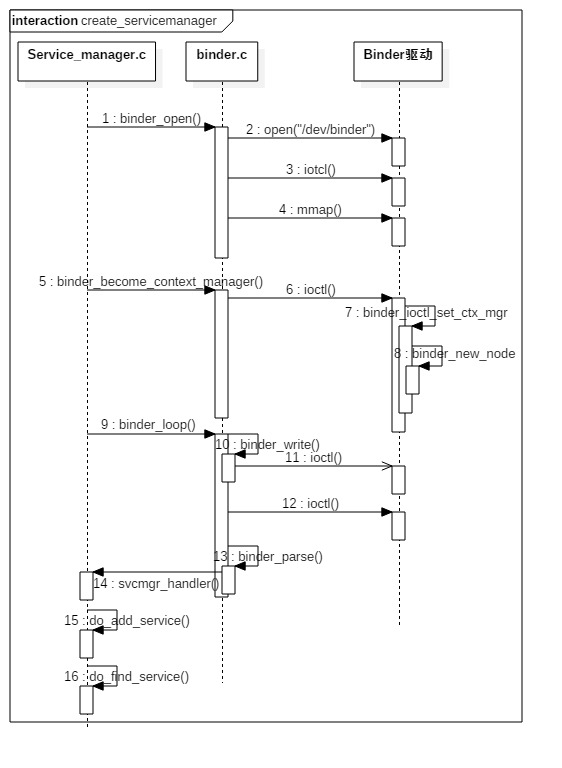

### 启动serviceManage

ServiceManager最核心的两个功能为查询和注册服务：

* 注册服务：记录服务名和handle信息，保存到svclist列表；
* 查询服务：根据服务名查询相应的的handle信息。

### 启动流程


ServiceManager启动流程
* 打开binder驱动：binder_open；
* 注册成为binder服务的大管家(守护进程)：binder_become_context_manager；
* 进入无限循环，处理client端发来的请求：binder_loop；
* 注册服务的过程，根据服务名称，但同一个服务已注册，重新注册前会先移除之前的注册信息
* 死亡通知: 当binder所在进程死亡后,会调用binder_release方法,然后调用binder_node_release.这个过程便会发出死亡通知的回调.


### 启动命令
init进程解析init.rc文件, 启动service_manager进程
```bash
service servicemanager /system/bin/servicemanager
    class core
    user system
    group system
    critical
    onrestart restart healthd
    onrestart restart zygote
    onrestart restart media
    onrestart restart surfaceflinger
    onrestart restart drm
```

### 启动流程核心代码
```c
int main(int argc, char **argv) {
    struct binder_state *bs;
    //打开binder驱动，申请128k字节大小的内存空间 【见小节2.2】
    bs = binder_open(128*1024);
    ...

    //成为上下文管理者 【见小节2.3】
    if (binder_become_context_manager(bs)) {
        return -1;
    }

    selinux_enabled = is_selinux_enabled(); //selinux权限是否使能
    sehandle = selinux_android_service_context_handle();
    selinux_status_open(true);

    if (selinux_enabled > 0) {
        if (sehandle == NULL) {  
            abort(); //无法获取sehandle
        }
        if (getcon(&service_manager_context) != 0) {
            abort(); //无法获取service_manager上下文
        }
    }
    ...

    //进入无限循环，处理client端发来的请求 【见小节2.4】
    binder_loop(bs, svcmgr_handler);
    return 0;
}
```

### loop循环和解析
loop循环
```c
void binder_loop(struct binder_state *bs, binder_handler func) {
    int res;
    struct binder_write_read bwr;
    uint32_t readbuf[32];

    bwr.write_size = 0;
    bwr.write_consumed = 0;
    bwr.write_buffer = 0;

    readbuf[0] = BC_ENTER_LOOPER;
    //将BC_ENTER_LOOPER命令发送给binder驱动，让Service Manager进入循环 
    binder_write(bs, readbuf, sizeof(uint32_t));

    for (;;) {
        bwr.read_size = sizeof(readbuf);
        bwr.read_consumed = 0;
        bwr.read_buffer = (uintptr_t) readbuf;

        res = ioctl(bs->fd, BINDER_WRITE_READ, &bwr); //进入循环，不断地binder读写过程
        if (res < 0) {
            break;
        }

        res = binder_parse(bs, 0, (uintptr_t) readbuf, bwr.read_consumed, func);
        if (res == 0) {
            break;
        }
        if (res < 0) {
            break;
        }
    }
}
```

解析处理
```c
int binder_parse(struct binder_state *bs, struct binder_io *bio,
                 uintptr_t ptr, size_t size, binder_handler func)
{
    int r = 1;
    uintptr_t end = ptr + (uintptr_t) size;

    while (ptr < end) {
        uint32_t cmd = *(uint32_t *) ptr;
        ptr += sizeof(uint32_t);
        switch(cmd) {
        case BR_NOOP:  //无操作，退出循环
            break;
        case BR_TRANSACTION_COMPLETE:
            break;
        case BR_INCREFS:
        case BR_ACQUIRE:
        case BR_RELEASE:
        case BR_DECREFS:
            ptr += sizeof(struct binder_ptr_cookie);
            break;
        case BR_TRANSACTION: {
            struct binder_transaction_data *txn = (struct binder_transaction_data *) ptr;
            ...
            binder_dump_txn(txn);
            if (func) {
                unsigned rdata[256/4];
                struct binder_io msg; 
                struct binder_io reply;
                int res;
                bio_init(&reply, rdata, sizeof(rdata), 4);
                bio_init_from_txn(&msg, txn); //从txn解析出binder_io信息
                res = func(bs, txn, &msg, &reply);
                //回复
                binder_send_reply(bs, &reply, txn->data.ptr.buffer, res);
            }
            ptr += sizeof(*txn);
            break;
        }
        case BR_REPLY: {
            struct binder_transaction_data *txn = (struct binder_transaction_data *) ptr;
            ...
            binder_dump_txn(txn);
            if (bio) {
                bio_init_from_txn(bio, txn);
                bio = 0;
            }
            ptr += sizeof(*txn);
            r = 0;
            break;
        }
        case BR_DEAD_BINDER: {
            struct binder_death *death = (struct binder_death *)(uintptr_t) *(binder_uintptr_t *)ptr;
            ptr += sizeof(binder_uintptr_t);
            // binder死亡消息
            death->func(bs, death->ptr);
            break;
        }
        case BR_FAILED_REPLY:
            r = -1;
            break;
        case BR_DEAD_REPLY:
            r = -1;
            break;
        default:
            return -1;
        }
    }
    return r;
}
```

### 注册服务和查询服务

查询服务
```c
uint32_t do_find_service(struct binder_state *bs, const uint16_t *s, size_t len, uid_t uid, pid_t spid)
{
    //查询相应的服务 【见小节3.1.1】
    struct svcinfo *si = find_svc(s, len);

    if (!si || !si->handle) {
        return 0;
    }

    if (!si->allow_isolated) {
        uid_t appid = uid % AID_USER;
        //检查该服务是否允许孤立于进程而单独存在
        if (appid >= AID_ISOLATED_START && appid <= AID_ISOLATED_END) {
            return 0;
        }
    }

    //服务是否满足查询条件
    if (!svc_can_find(s, len, spid)) {
        return 0;
    }
    return si->handle;
}

```

注册服务
```c
int do_add_service(struct binder_state *bs,
                   const uint16_t *s, size_t len,
                   uint32_t handle, uid_t uid, int allow_isolated,
                   pid_t spid)
{
    struct svcinfo *si;

    if (!handle || (len == 0) || (len > 127))
        return -1;

    //权限检查【见小节3.2.1】
    if (!svc_can_register(s, len, spid)) {
        return -1;
    }

    //服务检索【见小节3.1.1】
    si = find_svc(s, len);
    if (si) {
        if (si->handle) {
            svcinfo_death(bs, si); //服务已注册时，释放相应的服务【见小节3.2.2】
        }
        si->handle = handle;
    } else {
        si = malloc(sizeof(*si) + (len + 1) * sizeof(uint16_t));
        if (!si) {  //内存不足，无法分配足够内存
            return -1;
        }
        si->handle = handle;
        si->len = len;
        memcpy(si->name, s, (len + 1) * sizeof(uint16_t)); //内存拷贝服务信息
        si->name[len] = '\0';
        si->death.func = (void*) svcinfo_death;
        si->death.ptr = si;
        si->allow_isolated = allow_isolated;
        si->next = svclist; // svclist保存所有已注册的服务
        svclist = si;
    }

    //以BC_ACQUIRE命令，handle为目标的信息，通过ioctl发送给binder驱动
    binder_acquire(bs, handle);
    //以BC_REQUEST_DEATH_NOTIFICATION命令的信息，通过ioctl发送给binder驱动，主要用于清理内存等收尾工作。[见小节3.3]
    binder_link_to_death(bs, handle, &si->death);
    return 0;
}

```

### 代码路径
```markdown
framework/native/cmds/servicemanager/
  - service_manager.c
  - binder.c
  
kernel/drivers/ (不同Linux分支路径略有不同)
  - staging/android/binder.c
  - android/binder.c 
```