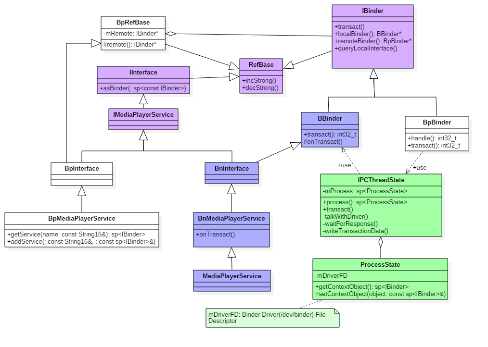
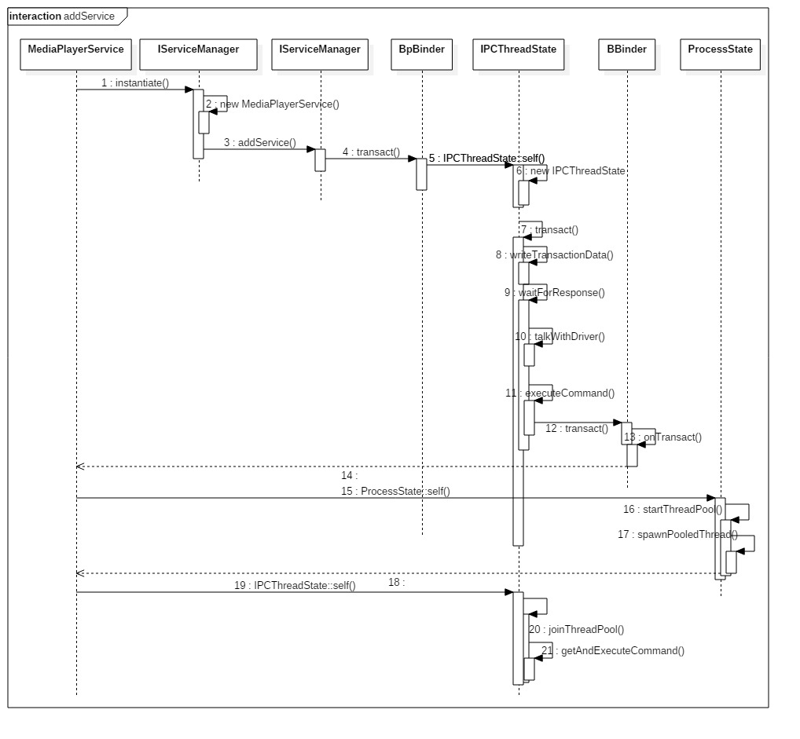
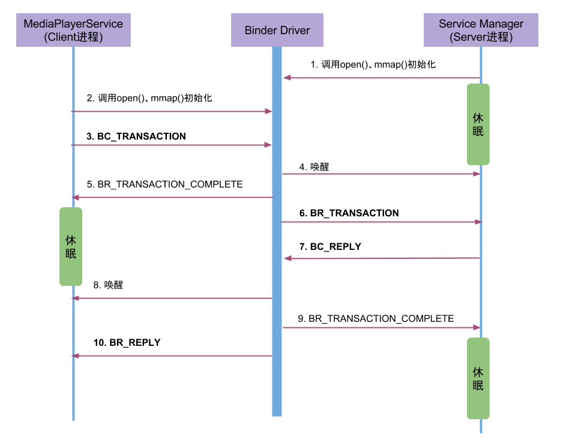

### 注册服务







#### 流程
1. MediaPlayerService进程调用ioctl()向Binder驱动发送IPC数据
2. Binder驱动收到该Binder请求，生成BR_TRANSACTION命令
3. Service Manager的线程收到请求，调用服务注册函数将服务”media.player”注册到服务目录中。当服务注册完成后，生成IPC应答数据(BC_REPLY)
4. Binder驱动收到该Binder应答请求，生成BR_REPLY命令，在MediaPlayerService收到该命令后，知道服务注册完成便可以正常使用

#### 本质: 
* client和serviceManager通过binder驱动通信,
* client在驱动写入指定数据，登记状态。
* serverManager在looper中发现数据，登记注册服务，生成应答数据通知client
* client收到应答数据，完成注册服务。

### 核心代码
```c
int main(int argc __unused, char** argv)
{
    InitializeIcuOrDie();
    //获得ProcessState实例对象【见小节2.1】
    sp<ProcessState> proc(ProcessState::self());
    //获取BpServiceManager对象
    sp<IServiceManager> sm = defaultServiceManager();
    AudioFlinger::instantiate();
    //注册多媒体服务  【见小节3.1】
    MediaPlayerService::instantiate();
    ResourceManagerService::instantiate();
    CameraService::instantiate();
    AudioPolicyService::instantiate();
    SoundTriggerHwService::instantiate();
    RadioService::instantiate();
    registerExtensions();
    //启动Binder线程池
    ProcessState::self()->startThreadPool();
    //当前线程加入到线程池
    IPCThreadState::self()->joinThreadPool();
 }

void MediaPlayerService::instantiate() {
    //注册服务【见小节3.2】
    defaultServiceManager()->addService(String16("media.player"), new MediaPlayerService());
}

virtual status_t addService(const String16& name, const sp<IBinder>& service, bool allowIsolated) {
    Parcel data, reply; //Parcel是数据通信包
    //写入头信息"android.os.IServiceManager"
    data.writeInterfaceToken(IServiceManager::getInterfaceDescriptor());   
    data.writeString16(name);        // name为 "media.player"
    data.writeStrongBinder(service); // MediaPlayerService对象【见小节3.2.1】
    data.writeInt32(allowIsolated ? 1 : 0); // allowIsolated= false
    //remote()指向的是BpBinder对象【见小节3.3】
    status_t err = remote()->transact(ADD_SERVICE_TRANSACTION, data, &reply);
    return err == NO_ERROR ? reply.readExceptionCode() : err;
}
```

### 获取服务

请求服务(getService)过程，就是向servicemanager进程查询指定服务，

当执行binder_transaction()时，会区分请求服务所属进程情况。

1. 当请求服务的进程与服务属于不同进程，则为请求服务所在进程创建binder_ref对象，指向服务进程中的binder_node;
最终readStrongBinder()，返回的是BpBinder对象；
2. 当请求服务的进程与服务属于同一进程，则不再创建新对象，只是引用计数加1，并且修改type为BINDER_TYPE_BINDER或BINDER_TYPE_WEAK_BINDER。
最终readStrongBinder()，返回的是BBinder对象的真实子类；

```c++
sp<IMediaPlayerService>&
IMediaDeathNotifier::getMediaPlayerService()
{
    Mutex::Autolock _l(sServiceLock);
    if (sMediaPlayerService == 0) {
        sp<IServiceManager> sm = defaultServiceManager(); //获取ServiceManager
        sp<IBinder> binder;
        do {
            //获取名为"media.player"的服务 
            binder = sm->getService(String16("media.player"));
            if (binder != 0) {
                break;
            }
            usleep(500000); // 0.5s
        } while (true);

        if (sDeathNotifier == NULL) {
            sDeathNotifier = new DeathNotifier(); //创建死亡通知对象
        }

        //将死亡通知连接到binder 【见流程14】
        binder->linkToDeath(sDeathNotifier);
        sMediaPlayerService = interface_cast<IMediaPlayerService>(binder);
    }
    return sMediaPlayerService;
}


virtual sp<IBinder> getService(const String16& name) const
    {
        unsigned n;
        for (n = 0; n < 5; n++){
            sp<IBinder> svc = checkService(name);
            if (svc != NULL) return svc;
            sleep(1);
        }
        return NULL;
    }


virtual sp<IBinder> checkService( const String16& name) const
{
    Parcel data, reply;
    //写入RPC头
    data.writeInterfaceToken(IServiceManager::getInterfaceDescriptor());
    //写入服务名
    data.writeString16(name);
    remote()->transact(CHECK_SERVICE_TRANSACTION, data, &reply);
    return reply.readStrongBinder();
}
```


### 代码路径
```markdown
framework/native/libs/binder/
  - Binder.cpp
  - BpBinder.cpp
  - IPCThreadState.cpp
  - ProcessState.cpp
  - IServiceManager.cpp
  - IInterface.cpp
  - Parcel.cpp

frameworks/native/include/binder/
  - IInterface.h (包括BnInterface, BpInterface)
```