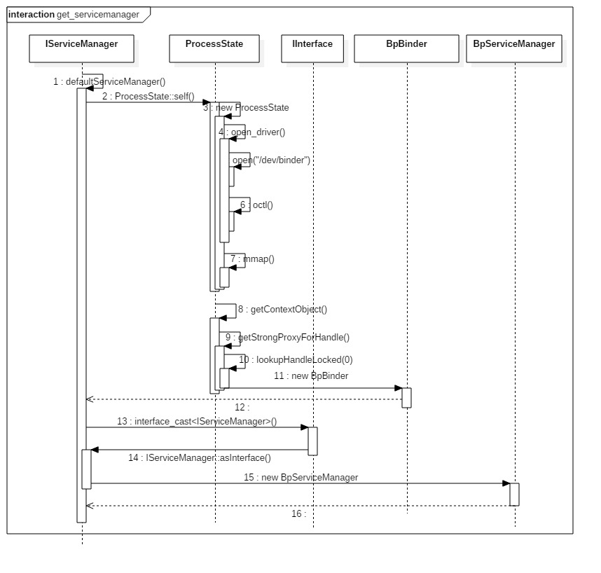

### 获得serviceManage

defaultServiceManager 等价于 new BpServiceManager(new BpBinder(0));

ProcessState::self()主要工作：

* 调用open()，打开/dev/binder驱动设备；
* 再利用mmap()，创建大小为1M-8K的内存地址空间；
*设定当前进程最大的最大并发Binder线程个数为16。BpServiceManager巧妙将通信层与业务层逻辑合为一体，

通过继承接口IServiceManager实现了接口中的业务逻辑函数；

* 通过成员变量mRemote= new BpBinder(0)进行Binder通信工作。
* BpBinder通过handler来指向所对应BBinder, 在整个Binder系统中handle=0代表
* ServiceManager所对应的BBinder


<strong class="red">client端 server端相对于serverManage都是客户端, 所以是bpBinder</strong>



### 核心代码

```c
sp<IServiceManager> defaultServiceManager()
{
    if (gDefaultServiceManager != NULL) return gDefaultServiceManager;
    {
        AutoMutex _l(gDefaultServiceManagerLock); //加锁
        while (gDefaultServiceManager == NULL) {
             //【见下文小节二,三,四】
            gDefaultServiceManager = interface_cast<IServiceManager>(
                ProcessState::self()->getContextObject(NULL));
            if (gDefaultServiceManager == NULL)
                sleep(1);
        }
    }
    return gDefaultServiceManager;
}

sp<ProcessState> ProcessState::self()
{
    Mutex::Autolock _l(gProcessMutex);
    if (gProcess != NULL) {
        return gProcess;
    }

    //实例化ProcessState 【见小节2.2】
    gProcess = new ProcessState;
    return gProcess;
}


template<typename INTERFACE>
inline sp<INTERFACE> interface_cast(const sp<IBinder>& obj)
{
    return INTERFACE::asInterface(obj); //【见小节4.2】
}

//模版函数
//位于IServiceManager.h文件 【见小节4.3】
DECLARE_META_INTERFACE(ServiceManager)
//位于IServiceManager.cpp文件 【见小节4.4】
IMPLEMENT_META_INTERFACE(ServiceManager,"android.os.IServiceManager")

```

### 使用模版方法
```c
//用于申明asInterface(),getInterfaceDescriptor()
#define DECLARE_META_INTERFACE(INTERFACE)
#define IMPLEMENT_META_INTERFACE(INTERFACE, NAME) //用于实现上述两个方法
```


```c
// 实现BPServiceManager对象
IMPLEMENT_META_INTERFACE(ServiceManager,"android.os.IServiceManager")

==> 转换为
const android::String16 IServiceManager::descriptor(“android.os.IServiceManager”);
const android::String16& IServiceManager::getInterfaceDescriptor() const
{
     return IServiceManager::descriptor;
}

 android::sp<IServiceManager> IServiceManager::asInterface(const android::sp<android::IBinder>& obj)
{
       android::sp<IServiceManager> intr;
        if(obj != NULL) {
           intr = static_cast<IServiceManager *>(
               obj->queryLocalInterface(IServiceManager::descriptor).get());
           if (intr == NULL) {
               intr = new BpServiceManager(obj);
            }
        }
       return intr;
}

IServiceManager::IServiceManager () { }
IServiceManager::~ IServiceManager() { }
```

### 代码路径
```markdown
framework/native/libs/binder/
  - ProcessState.cpp
  - BpBinder.cpp
  - Binder.cpp
  - IServiceManager.cpp

framework/native/include/binder/
  - IServiceManager.h
  - IInterface.h
```