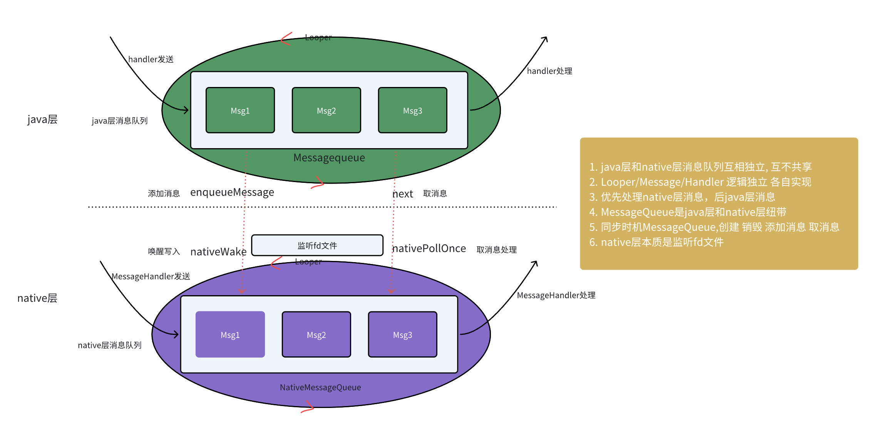
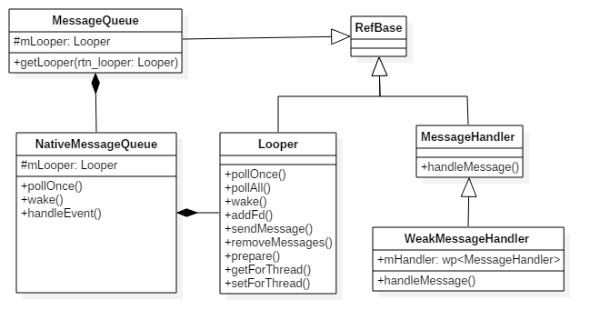
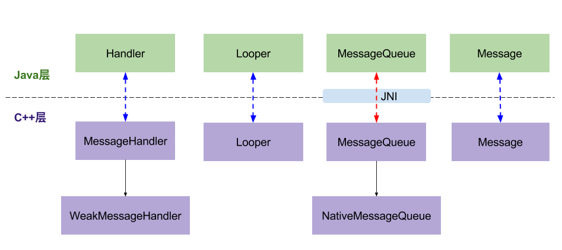

### handler整体架构



### 消息队列





* Java层和Native层的MessageQueue通过JNI建立关联，彼此之间能相互调用
* native层实现 Handler/Looper/Message 与java层没有真正关联，逻辑独立,单独实现
* 消息处理流程是先处理Native Message，再处理Native Request，最后处理Java Message (上层消息少,响应时间长的原因)

### native层关键方法
```java
private native static long nativeInit();
private native static void nativeDestroy(long ptr);
private native void nativePollOnce(long ptr, int timeoutMillis);
private native static void nativeWake(long ptr);
private native static boolean nativeIsPolling(long ptr);
private native static void nativeSetFileDescriptorEvents(long ptr, int fd, int events);
```

### nativeInit
```java
new MessageQueue()->nativeInit()->android_os_MessageQueue_nativeInit->new NativeMessageQueue->new Looper()->epoll_ctl
```

```c
MessageQueue(boolean quitAllowed) {
    mQuitAllowed = quitAllowed;
    //mPtr记录native消息队列的信息
    mPtr = nativeInit();  
}

static jlong android_os_MessageQueue_nativeInit(JNIEnv* env, jclass clazz) {
    //初始化native消息队列
    NativeMessageQueue* nativeMessageQueue = new NativeMessageQueue();
    nativeMessageQueue->incStrong(env); //增加引用计数
    return reinterpret_cast<jlong>(nativeMessageQueue);
}

NativeMessageQueue::NativeMessageQueue()
            : mPollEnv(NULL), mPollObj(NULL), mExceptionObj(NULL) {

    //类比于java层的Looper
    mLooper = Looper::getForThread(); //获取TLS中的Looper对象
    if (mLooper == NULL) {
        mLooper = new Looper(false); //创建native层的Looper
        Looper::setForThread(mLooper); //保存native层的Looper到TLS
    }
}

Looper::Looper(bool allowNonCallbacks) :
        mAllowNonCallbacks(allowNonCallbacks), mSendingMessage(false),
        mPolling(false), mEpollFd(-1), mEpollRebuildRequired(false),
        mNextRequestSeq(0), mResponseIndex(0), mNextMessageUptime(LLONG_MAX) {
    mWakeEventFd = eventfd(0, EFD_NONBLOCK); //构造唤醒事件的fd
    AutoMutex _l(mLock);
    rebuildEpollLocked();  //重建Epoll事件
}

void Looper::rebuildEpollLocked() {
    if (mEpollFd >= 0) {
        close(mEpollFd); //关闭旧的epoll实例
    }
    mEpollFd = epoll_create(EPOLL_SIZE_HINT); //创建新的epoll实例，并注册wake管道
    struct epoll_event eventItem;
    memset(& eventItem, 0, sizeof(epoll_event)); //把未使用的数据区域进行置0操作
    eventItem.events = EPOLLIN; //可读事件
    eventItem.data.fd = mWakeEventFd;
    //将唤醒事件(mWakeEventFd)添加到epoll实例(mEpollFd)
    int result = epoll_ctl(mEpollFd, EPOLL_CTL_ADD, mWakeEventFd, & eventItem);

    for (size_t i = 0; i < mRequests.size(); i++) {
        const Request& request = mRequests.valueAt(i);
        struct epoll_event eventItem;
        request.initEventItem(&eventItem);
        //将request队列的事件，分别添加到epoll实例
        int epollResult = epoll_ctl(mEpollFd, EPOLL_CTL_ADD, request.fd, & eventItem);
    }
}
```

Looper对象中的mWakeEventFd添加到epoll监控，以及mRequests也添加到epoll的监控范围内。

### nativeDestroy 销毁
```java
dispose->nativeDestroy()->android_os_MessageQueue_nativeDestroy->decStrong
```

### nativePollOnce

nativePollOnce用于提取消息队列中的消息，提取消息的调用链
```java
next()->nativePollOnce()->android_os_MessageQueue_nativePollOnce->NativeMessageQueue.pollOnce->Looper.pollOnce()->pollInner->epoll_wait->awoken
```


### nativeWake 唤醒


### 源码路径
```markdown
framework/base/core/java/andorid/os/MessageQueue.java
framework/base/core/jni/android_os_MessageQueue.cpp
framework/base/core/java/andorid/os/Looper.java

system/core/libutils/Looper.cpp
system/core/include/utils/Looper.h
system/core/libutils/RefBase.cpp

framework/base/native/android/looper.cpp
framework/native/include/android/looper.h
```