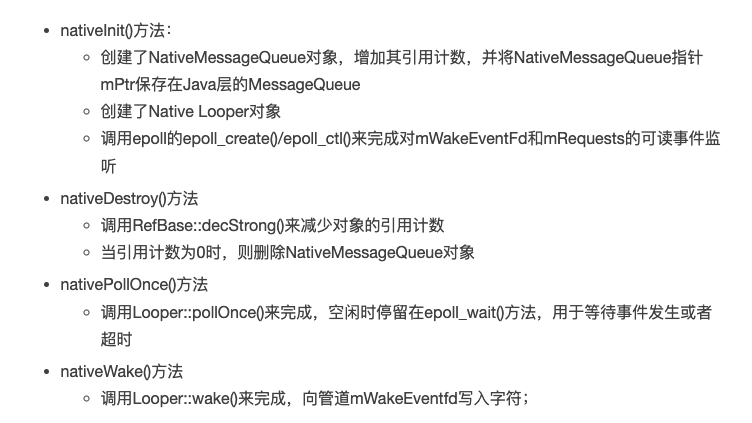
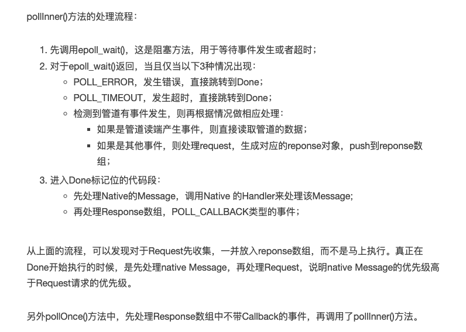

### handler整体架构


### 消息队列


* Java层和Native层的MessageQueue通过JNI建立关联，彼此之间能相互调用
* native层实现 Handler/Looper/Message 与java层没有真正关联，逻辑独立,单独实现
* 消息处理流程是先处理Native Message，再处理Native Request，最后处理Java Message (上层消息少,响应时间长的原因)

### native层关键方法
```java
private native static long nativeInit();
private native static void nativeDestroy(long ptr);
private native void nativePollOnce(long ptr, int timeoutMillis);
private native static void nativeWake(long ptr);
private native static boolean nativeIsPolling(long ptr);
private native static void nativeSetFileDescriptorEvents(long ptr, int fd, int events);
```



### 发送消息sendMessage和唤醒

```java
Looper::sendMessage->Looper::sendMessageDelayed->sendMessageAtTime
```

发送消息维护到 MessageEnvelope wake 管道
```c
void Looper::sendMessageAtTime(nsecs_t uptime, const sp<MessageHandler>& handler,
        const Message& message) {
    size_t i = 0;
    { //请求锁
        AutoMutex _l(mLock);
        size_t messageCount = mMessageEnvelopes.size();
        //找到message应该插入的位置i
        while (i < messageCount && uptime >= mMessageEnvelopes.itemAt(i).uptime) {
            i += 1;
        }
        //加入消息 维护在 mMessageEnvelopes
        MessageEnvelope messageEnvelope(uptime, handler, message);
        mMessageEnvelopes.insertAt(messageEnvelope, i, 1);
        //如果当前正在发送消息，那么不再调用wake()，直接返回。
        if (mSendingMessage) {
            return;
        }
    } //释放锁
    //当把消息加入到消息队列的头部时，需要唤醒poll循环。
    if (i == 0) {
        wake();
    }
}
```

### nativeWake 唤醒poll循环

```java
MessageQueue.enqueueMessage->nativeWake->android_os_MessageQueue_nativeWake->NativeMessageQueue::wake->Looper::wake->write(1)
```

```c
void Looper::wake() {
    uint64_t inc = 1;
    // 向管道mWakeEventFd写入字符1
    ssize_t nWrite = TEMP_FAILURE_RETRY(write(mWakeEventFd, &inc, sizeof(uint64_t)));
    if (nWrite != sizeof(uint64_t)) {
        if (errno != EAGAIN) {
            ALOGW("Could not write wake signal, errno=%d", errno);
        }
    }
}
```

* 写入字符'1' ,用于需要唤醒poll循环

### nativePollOnce 取出消息和处理消息

nativePollOnce用于提取消息队列中的消息，提取消息的调用链
```java
MessageQueue.next()->nativePollOnce()->android_os_MessageQueue_nativePollOnce->NativeMessageQueue::pollOnce->Looper::pollOnce()->Looper::pollInner->epoll_wait->awoken
```

* nativePollOnce 对java层阻塞及时作用，对native层队列进行读取消息和消息处理

```c
int Looper::pollInner(int timeoutMillis) {
    int result = POLL_WAKE;
    mResponses.clear();
    mResponseIndex = 0;
    mPolling = true; //即将处于idle状态
    struct epoll_event eventItems[EPOLL_MAX_EVENTS]; //fd最大个数为16
    //等待事件发生或者超时，在nativeWake()方法，向管道写端写入字符，则该方法会返回；
    int eventCount = epoll_wait(mEpollFd, eventItems, EPOLL_MAX_EVENTS, timeoutMillis);

    mPolling = false; //不再处于idle状态
    mLock.lock();  //请求锁
    if (mEpollRebuildRequired) {
        mEpollRebuildRequired = false;
        rebuildEpollLocked();  // epoll重建，直接跳转Done;
        goto Done;
    }
    if (eventCount < 0) {
        if (errno == EINTR) {
            goto Done;
        }
        result = POLL_ERROR; // epoll事件个数小于0，发生错误，直接跳转Done;
        goto Done;
    }
    if (eventCount == 0) {  //epoll事件个数等于0，发生超时，直接跳转Done;
        result = POLL_TIMEOUT;
        goto Done;
    }

    //循环遍历，处理所有的事件
    for (int i = 0; i < eventCount; i++) {
        int fd = eventItems[i].data.fd;
        uint32_t epollEvents = eventItems[i].events;
        if (fd == mWakeEventFd) {
            if (epollEvents & EPOLLIN) {
                awoken(); //已经唤醒了，则读取并清空管道数据
            }
        } else {
            ssize_t requestIndex = mRequests.indexOfKey(fd);
            if (requestIndex >= 0) {
                int events = 0;
                if (epollEvents & EPOLLIN) events |= EVENT_INPUT;
                if (epollEvents & EPOLLOUT) events |= EVENT_OUTPUT;
                if (epollEvents & EPOLLERR) events |= EVENT_ERROR;
                if (epollEvents & EPOLLHUP) events |= EVENT_HANGUP;
                //处理request，生成对应的reponse对象，push到响应数组
                pushResponse(events, mRequests.valueAt(requestIndex));
            }
        }
    }
Done: ;
    //再处理Native的Message，调用相应回调方法
    mNextMessageUptime = LLONG_MAX;
    while (mMessageEnvelopes.size() != 0) {
        nsecs_t now = systemTime(SYSTEM_TIME_MONOTONIC);
        const MessageEnvelope& messageEnvelope = mMessageEnvelopes.itemAt(0);
        if (messageEnvelope.uptime <= now) {
            {
                sp<MessageHandler> handler = messageEnvelope.handler;
                Message message = messageEnvelope.message;
                mMessageEnvelopes.removeAt(0);
                mSendingMessage = true;
                mLock.unlock();  //释放锁
                //todo 处理消息事件
                handler->handleMessage(message);
            }
            mLock.lock();  //请求锁
            mSendingMessage = false;
            result = POLL_CALLBACK; // 发生回调
        } else {
            mNextMessageUptime = messageEnvelope.uptime;
            break;
        }
    }
    mLock.unlock(); //释放锁

    //处理带有Callback()方法的Response事件，执行Reponse相应的回调方法
    for (size_t i = 0; i < mResponses.size(); i++) {
        Response& response = mResponses.editItemAt(i);
        if (response.request.ident == POLL_CALLBACK) {
            int fd = response.request.fd;
            int events = response.events;
            void* data = response.request.data;
            // 处理请求的回调方法
            int callbackResult = response.request.callback->handleEvent(fd, events, data);
            if (callbackResult == 0) {
                removeFd(fd, response.request.seq); //移除fd
            }
            response.request.callback.clear(); //清除reponse引用的回调方法
            result = POLL_CALLBACK;  // 发生回调
        }
    }
    return result;
}

void Looper::awoken() {
    uint64_t counter;
    //不断读取管道数据，目的就是为了清空管道内容
    TEMP_FAILURE_RETRY(read(mWakeEventFd, &counter, sizeof(uint64_t)));
}
```




### nativeInit 创建消息队列和Looper
```java
new MessageQueue()->nativeInit()->android_os_MessageQueue_nativeInit->new NativeMessageQueue->new Looper()->epoll_ctl
```

```c
MessageQueue(boolean quitAllowed) {
    mQuitAllowed = quitAllowed;
    //mPtr记录native消息队列的信息
    mPtr = nativeInit();  
}

static jlong android_os_MessageQueue_nativeInit(JNIEnv* env, jclass clazz) {
    //初始化native消息队列
    NativeMessageQueue* nativeMessageQueue = new NativeMessageQueue();
    nativeMessageQueue->incStrong(env); //增加引用计数
    return reinterpret_cast<jlong>(nativeMessageQueue);
}

NativeMessageQueue::NativeMessageQueue()
            : mPollEnv(NULL), mPollObj(NULL), mExceptionObj(NULL) {

    //类比于java层的Looper
    mLooper = Looper::getForThread(); //获取TLS中的Looper对象
    if (mLooper == NULL) {
        mLooper = new Looper(false); //创建native层的Looper
        Looper::setForThread(mLooper); //保存native层的Looper到TLS
    }
}

Looper::Looper(bool allowNonCallbacks) :
        mAllowNonCallbacks(allowNonCallbacks), mSendingMessage(false),
        mPolling(false), mEpollFd(-1), mEpollRebuildRequired(false),
        mNextRequestSeq(0), mResponseIndex(0), mNextMessageUptime(LLONG_MAX) {
    mWakeEventFd = eventfd(0, EFD_NONBLOCK); //构造唤醒事件的fd
    AutoMutex _l(mLock);
    rebuildEpollLocked();  //重建Epoll事件
}

void Looper::rebuildEpollLocked() {
    if (mEpollFd >= 0) {
        close(mEpollFd); //关闭旧的epoll实例
    }
    mEpollFd = epoll_create(EPOLL_SIZE_HINT); //创建新的epoll实例，并注册wake管道
    struct epoll_event eventItem;
    memset(& eventItem, 0, sizeof(epoll_event)); //把未使用的数据区域进行置0操作
    eventItem.events = EPOLLIN; //可读事件
    eventItem.data.fd = mWakeEventFd;
    //将唤醒事件(mWakeEventFd)添加到epoll实例(mEpollFd)
    int result = epoll_ctl(mEpollFd, EPOLL_CTL_ADD, mWakeEventFd, & eventItem);

    for (size_t i = 0; i < mRequests.size(); i++) {
        const Request& request = mRequests.valueAt(i);
        struct epoll_event eventItem;
        request.initEventItem(&eventItem);
        //将request队列的事件，分别添加到epoll实例
        int epollResult = epoll_ctl(mEpollFd, EPOLL_CTL_ADD, request.fd, & eventItem);
    }
}
```

Looper对象中的mWakeEventFd添加到epoll监控，以及mRequests也添加到epoll的监控范围内。

### nativeDestroy 销毁
```java
dispose->nativeDestroy()->android_os_MessageQueue_nativeDestroy->decStrong
```

### 常用结构体
Message
```c
struct Message {
    Message() : what(0) { }
    Message(int what) : what(what) { }
    int what; // 消息类型
};
```

信息bean
```c
struct Request { //请求结构体
    int fd;
    int ident;
    int events;
    int seq;
    sp<LooperCallback> callback;
    void* data;
    void initEventItem(struct epoll_event* eventItem) const;
};

struct Response { //响应结构体
    int events;
    Request request;
};

struct MessageEnvelope { //信封结构体
    MessageEnvelope() : uptime(0) { }
    MessageEnvelope(nsecs_t uptime, const sp<MessageHandler> handler,
            const Message& message) : uptime(uptime), handler(handler), message(message) {
    }
    nsecs_t uptime;
    sp<MessageHandler> handler;
    Message message;
};
```
* MessageEnvelope正如其名字，信封。MessageEnvelope里面记录着收信人(handler)，发信时间(uptime)，信件内容(message)
* 采用mMessageEnvelopes 维护消息列表

MessageHandler 消息处理
```c
class MessageHandler : public virtual RefBase {
protected:
    virtual ~MessageHandler() { }
public:
    virtual void handleMessage(const Message& message) = 0;
};
```

LooperCallback
```c
class LooperCallback : public virtual RefBase {
protected:
    virtual ~LooperCallback() { }
public:
    //用于处理指定的文件描述符的poll事件
    virtual int handleEvent(int fd, int events, void* data) = 0;
};
```

### 源码路径
```markdown
framework/base/core/java/andorid/os/MessageQueue.java
framework/base/core/jni/android_os_MessageQueue.cpp
framework/base/core/java/andorid/os/Looper.java

system/core/libutils/Looper.cpp
system/core/include/utils/Looper.h
system/core/libutils/RefBase.cpp

framework/base/native/android/looper.cpp
framework/native/include/android/looper.h
```