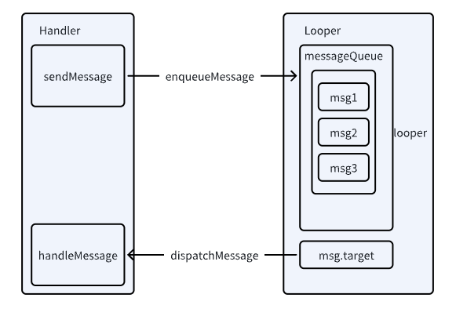
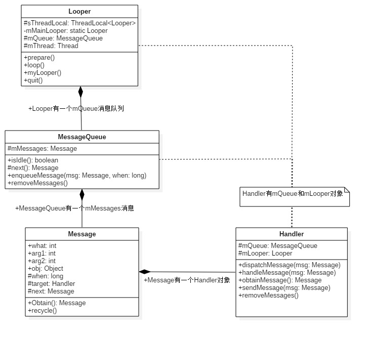
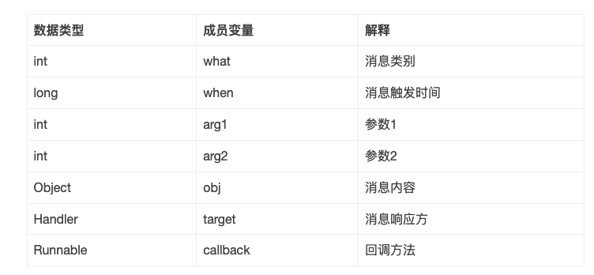

### handler整体架构


### handler模型


* Message：消息分为硬件产生的消息(如按钮、触摸)和软件生成的消息；
* MessageQueue：消息队列的主要功能向消息池投递消息(MessageQueue.enqueueMessage)和取走消息池的消息(MessageQueue.next)；
* Handler：消息辅助类，主要功能向消息池发送各种消息事件(Handler.sendMessage)和处理相应消息事件(Handler.handleMessage)；
* Looper：不断循环执行(Looper.loop)，按分发机制将消息分发给目标处理者。

### handler类图


### 典型案例

```java
class LooperThread extends Thread {
    public Handler mHandler;

    //发送消息
    public void sendMessage(Message msg) {
        mHandler.sendMessage(msg);
    }

    @Override
    public void run() {
        //Looper初始化
        Looper.prepare(); 

        mHandler = new Handler() { 
            //处理消息
            public void handleMessage(Message msg) {
                //TODO 定义消息处理逻辑
            }
        };

        //Looper开始循环
        Looper.loop();
    }
}
```

### handler构建
默认构造
```java
public Handler() {
    this(null, false);
}

public Handler(Callback callback, boolean async) {
    //匿名类、内部类或本地类都必须申明为static，否则会警告可能出现内存泄露
    if (FIND_POTENTIAL_LEAKS) {
        final Class<? extends Handler> klass = getClass();
        if ((klass.isAnonymousClass() || klass.isMemberClass() || klass.isLocalClass()) &&
                (klass.getModifiers() & Modifier.STATIC) == 0) {
            Log.w(TAG, "The following Handler class should be static or leaks might occur: " +
                klass.getCanonicalName());
        }
    }
    //必须先执行Looper.prepare()，才能获取Looper对象，否则为null.
    mLooper = Looper.myLooper();  //从当前线程的TLS中获取Looper对象
    if (mLooper == null) {
        throw new RuntimeException("");
    }
    mQueue = mLooper.mQueue; //消息队列，来自Looper对象
    mCallback = callback;  //回调方法
    mAsynchronous = async; //设置消息是否为异步处理方式
}
```

有参数构造
```java
public Handler(Looper looper) {
    this(looper, null, false);
}

public Handler(Looper looper, Callback callback, boolean async) {
    mLooper = looper;
    mQueue = looper.mQueue;
    mCallback = callback;
    mAsynchronous = async;
}
```

### 消息入队(handler发送)
sendMessage流程
```java
Handler.sendMessage->sendMessageDelayed->sendMessageAtTime->enqueueMessage->queue.enqueueMessage
```
1. 入队时，如果没有数据放在头，如果有则需要遍历队列数据(按照when从小到大插入)，进行插入操作

post流程
```java
Handler.post->getPostMessage->sendMessageDelayed->sendMessageAtTime->enqueueMessage->queue.enqueueMessage
```

入队时 设置msg.target = this, 是当前handler
```java
private boolean enqueueMessage(MessageQueue queue, Message msg, long uptimeMillis) {
    msg.target = this;
    if (mAsynchronous) {
        msg.setAsynchronous(true);
    }
    return queue.enqueueMessage(msg, uptimeMillis); 
}
```


### 消息出队(handler处理)
```java
ActivityThread.main->Looper.loop()->mQueue.next()->msg.target.dispatchMessage->handler.handleMessage
```

分发处理
```java
public void dispatchMessage(Message msg) {
    if (msg.callback != null) {
        //当Message存在回调方法，回调msg.callback.run()方法；
        handleCallback(msg);
    } else {
        if (mCallback != null) {
            //当Handler存在Callback成员变量时，回调方法handleMessage()；
            if (mCallback.handleMessage(msg)) {
                return;
            }
        }
        //Handler自身的回调方法handleMessage()
        handleMessage(msg);
    }
}
```

* Message的回调方法：message.callback.run()，优先级最高；
* Handler的回调方法：Handler.mCallback.handleMessage(msg)，优先级仅次于1；
* Handler的默认方法：Handler.handleMessage(msg)，优先级最低。

### 消息循环

```java
ActivityThread.main->Looper.prepareMainLooper()->prepare()->sThreadLocal.set(new Looper())->new MessageQueue()->loop()
```
1. ThreadLocal 用于私有当前线程Looper对象
2. [ThreadLocal 说明文档](/basis/java/threadLocal.md)

loop循环遍历消息
```java
public static void loop() {
    final Looper me = myLooper();  //获取TLS存储的Looper对象
    final MessageQueue queue = me.mQueue;  //获取Looper对象中的消息队列

    Binder.clearCallingIdentity();
    //确保在权限检查时基于本地进程，而不是调用进程。
    final long ident = Binder.clearCallingIdentity();

    for (;;) { //进入loop的主循环方法
        Message msg = queue.next(); //可能会阻塞
        if (msg == null) { //没有消息，则退出循环
            return;
        }

        //默认为null，可通过setMessageLogging()方法来指定输出，用于debug功能
        Printer logging = me.mLogging;  
        if (logging != null) {
            logging.println(">>>>> Dispatching to " + msg.target + " " +
                    msg.callback + ": " + msg.what);
        }
        msg.target.dispatchMessage(msg); //用于分发Message 【见3.2】
        if (logging != null) {
            logging.println("<<<<< Finished to " + msg.target + " " + msg.callback);
        }

        //恢复调用者信息
        final long newIdent = Binder.clearCallingIdentity();
        msg.recycleUnchecked();  //将Message放入消息池
    }
}
```

### MessageQueue

#### 创建MessageQueue
```java
MessageQueue(boolean quitAllowed) {
    mQuitAllowed = quitAllowed;
    //通过native方法初始化消息队列，其中mPtr是供native代码使用
    mPtr = nativeInit();
}
```

#### next 取出消息
```java
Message next() {
    final long ptr = mPtr;
    if (ptr == 0) { //当消息循环已经退出，则直接返回
        return null;
    }
    int pendingIdleHandlerCount = -1; // 循环迭代的首次为-1
    int nextPollTimeoutMillis = 0;
    for (;;) {
        if (nextPollTimeoutMillis != 0) {
            Binder.flushPendingCommands();
        }
        //阻塞操作，当等待nextPollTimeoutMillis时长，或者消息队列被唤醒，都会返回
        nativePollOnce(ptr, nextPollTimeoutMillis);
        synchronized (this) {
            final long now = SystemClock.uptimeMillis();
            Message prevMsg = null;
            Message msg = mMessages;
            //当消息的Handler为空时，则查询异步消息
            if (msg != null && msg.target == null) {
                //当查询到异步消息，则立刻退出循环
                do {
                    prevMsg = msg;
                    msg = msg.next;
                } while (msg != null && !msg.isAsynchronous());
            }
            if (msg != null) {
                if (now < msg.when) {
                    //当异步消息触发时间大于当前时间，则设置下一次轮询的超时时长
                    nextPollTimeoutMillis = (int) Math.min(msg.when - now, Integer.MAX_VALUE);
                } else {
                    // 获取一条消息，并返回
                    mBlocked = false;
                    if (prevMsg != null) {
                        prevMsg.next = msg.next;
                    } else {
                        mMessages = msg.next;
                    }
                    msg.next = null;
                    //设置消息的使用状态，即flags |= FLAG_IN_USE
                    msg.markInUse();
                    return msg;   //成功地获取MessageQueue中的下一条即将要执行的消息
                }
            } else {
                //没有消息
                nextPollTimeoutMillis = -1;
            }
            //消息正在退出，返回null
            if (mQuitting) {
                dispose();
                return null;
            }
            //当消息队列为空，或者是消息队列的第一个消息时
            if (pendingIdleHandlerCount < 0 && (mMessages == null || now < mMessages.when)) {
                pendingIdleHandlerCount = mIdleHandlers.size();
            }
            if (pendingIdleHandlerCount <= 0) {
                //没有idle handlers 需要运行，则循环并等待。
                mBlocked = true;
                continue;
            }
            if (mPendingIdleHandlers == null) {
                mPendingIdleHandlers = new IdleHandler[Math.max(pendingIdleHandlerCount, 4)];
            }
            mPendingIdleHandlers = mIdleHandlers.toArray(mPendingIdleHandlers);
        }
        //只有第一次循环时，会运行idle handlers，执行完成后，重置pendingIdleHandlerCount为0.
        for (int i = 0; i < pendingIdleHandlerCount; i++) {
            final IdleHandler idler = mPendingIdleHandlers[i];
            mPendingIdleHandlers[i] = null; //去掉handler的引用
            boolean keep = false;
            try {
                keep = idler.queueIdle();  //idle时执行的方法
            } catch (Throwable t) {
                Log.wtf(TAG, "IdleHandler threw exception", t);
            }
            if (!keep) {
                synchronized (this) {
                    mIdleHandlers.remove(idler);
                }
            }
        }
        //重置idle handler个数为0，以保证不会再次重复运行
        pendingIdleHandlerCount = 0;
        //当调用一个空闲handler时，一个新message能够被分发，因此无需等待可以直接查询pending message.
        nextPollTimeoutMillis = 0;
    }
}
```

* nativePollOnce 阻塞操作 等待时长
* 空闲时，会执行IdelHandler中方法
* 发现异步消息优先执行，其次同步消息

#### enqueueMessage 添加消息

```java
boolean enqueueMessage(Message msg, long when) {
    // 每一个普通Message必须有一个target
    if (msg.target == null) {
        throw new IllegalArgumentException("Message must have a target.");
    }
    if (msg.isInUse()) {
        throw new IllegalStateException(msg + " This message is already in use.");
    }
    synchronized (this) {
        if (mQuitting) {  //正在退出时，回收msg，加入到消息池
            msg.recycle();
            return false;
        }
        msg.markInUse();
        msg.when = when;
        Message p = mMessages;
        boolean needWake;
        if (p == null || when == 0 || when < p.when) {
            //p为null(代表MessageQueue没有消息） 或者msg的触发时间是队列中最早的， 则进入该该分支
            msg.next = p;
            mMessages = msg;
            needWake = mBlocked; //当阻塞时需要唤醒
        } else {
            //将消息按时间顺序插入到MessageQueue。一般地，不需要唤醒事件队列，除非
            //消息队头存在barrier，并且同时Message是队列中最早的异步消息。
            needWake = mBlocked && p.target == null && msg.isAsynchronous();
            Message prev;
            for (;;) {
                prev = p;
                p = p.next;
                if (p == null || when < p.when) {
                    break;
                }
                if (needWake && p.isAsynchronous()) {
                    needWake = false;
                }
            }
            msg.next = p;
            prev.next = msg;
        }
        //消息没有退出，我们认为此时mPtr != 0
        if (needWake) {
            nativeWake(mPtr);
        }
    }
    return true;
}
```
* 按照when 排序插入到MessageQueue中
* 普通消息不唤醒队列，同步屏障+异步消息nativeWake 唤醒
* 普通消息必须有一个target

### 同步屏障 & 异步消息
让重要的消息尽可能早的得到执行
* msg.target = null 是屏障消息特点
#### 场景
* ViewRootImpl接收屏幕垂直同步信息事件用于驱动UI测绘
* ActivityThread接收AMS的事件驱动生命周期
* InputMethodMessage分发软键盘输入事件
* PhoneWindowManager分发电话页面各种事件


```java
public int postSyncBarrier() {
    return postSyncBarrier(SystemClock.uptimeMillis());
}

//添加屏障
private int postSyncBarrier(long when) {
    synchronized (this) {
        final int token = mNextBarrierToken++;
        final Message msg = Message.obtain();
        msg.markInUse();
        msg.when = when;
        msg.arg1 = token;

        Message prev = null;
        Message p = mMessages;
        if (when != 0) {
            while (p != null && p.when <= when) {
                prev = p;
                p = p.next;
            }
        }
        if (prev != null) {
            msg.next = p;
            prev.next = msg;
        } else {
            msg.next = p;
            mMessages = msg;
        }
        return token;
    }
}

//移除屏障
public void removeSyncBarrier(int token) {
     synchronized (this) {
         Message prev = null;
         Message p = mMessages;
         //从消息队列找到 target为空,并且token相等的Message
         while (p != null && (p.target != null || p.arg1 != token)) {
             prev = p;
             p = p.next;
         }
         final boolean needWake;
         if (prev != null) {
             prev.next = p.next;
             needWake = false;
         } else {
             mMessages = p.next;
             needWake = mMessages == null || mMessages.target != null;
         }
         p.recycleUnchecked();

         if (needWake && !mQuitting) {
             nativeWake(mPtr);
         }
     }
 }
```

### 消息池
每个消息用Message表示，Message主要包含以下内容：



静态变量sPool的数据类型为Message，通过next成员变量，维护一个消息池；

静态变量MAX_POOL_SIZE代表消息池的可用大小；消息池的默认大小为50。

```java
//申请
public static Message obtain() {
    synchronized (sPoolSync) {
        if (sPool != null) {
            Message m = sPool;
            sPool = m.next;
            m.next = null; //从sPool中取出一个Message对象，并消息链表断开
            m.flags = 0; // 清除in-use flag
            sPoolSize--; //消息池的可用大小进行减1操作
            return m;
        }
    }
    return new Message(); // 当消息池为空时，直接创建Message对象
}

//回收
public void recycle() {
    if (isInUse()) { //判断消息是否正在使用
        if (gCheckRecycle) { //Android 5.0以后的版本默认为true,之前的版本默认为false.
            throw new IllegalStateException("This message cannot be recycled because it is still in use.");
        }
        return;
    }
    recycleUnchecked();
}

//对于不再使用的消息，加入到消息池
void recycleUnchecked() {
    //将消息标示位置为IN_USE，并清空消息所有的参数。
    flags = FLAG_IN_USE;
    what = 0;
    arg1 = 0;
    arg2 = 0;
    obj = null;
    replyTo = null;
    sendingUid = -1;
    when = 0;
    target = null;
    callback = null;
    data = null;
    synchronized (sPoolSync) {
        if (sPoolSize < MAX_POOL_SIZE) { //当消息池没有满时，将Message对象加入消息池
            next = sPool;
            sPool = this;
            sPoolSize++; //消息池的可用大小进行加1操作
        }
    }
}

```

### handler内存泄漏
static 静态内部类 ， context使用weakreference
```java
    //其他线程中 退出looper循环
    Looper.myLooper().quitSafely();

    //移除handler所有空消息
    handler.removeCallbacksAndMessages(null);

    //静态内部类
    static class SafeHandler extends Handler {
        WeakReference<Context> contextWeakReference;
        public MyHandler(Context context) {
            contextWeakReference = new WeakReference<>(context);
        }
 
        @Override
        public void handleMessage(@NonNull Message msg) {
            // 上下文释放 避免回调
            if (contextWeakReference.get() == null) {
              return;
            }

            super.handleMessage(msg);
            Log.d(TAG, (String) msg.obj);
        }
    }
```

### 源码路径
```markdown
framework/base/core/java/andorid/os/
  - Handler.java
  - Looper.java
  - Message.java
  - MessageQueue.java
```