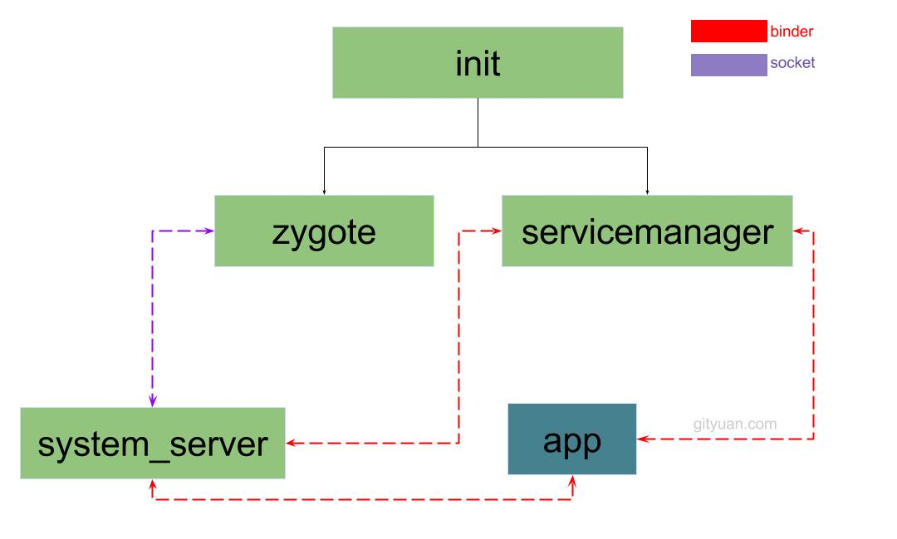
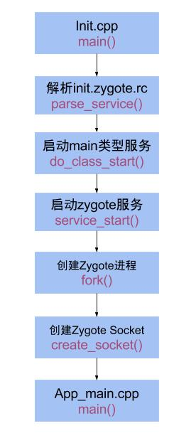
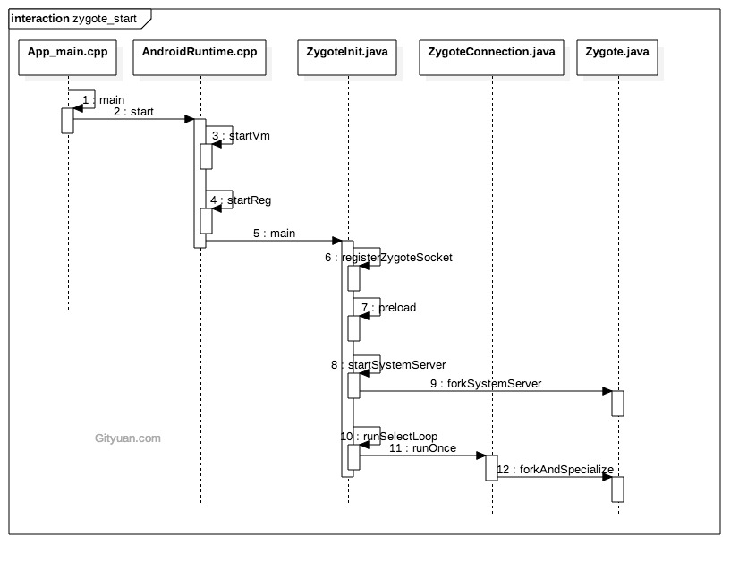
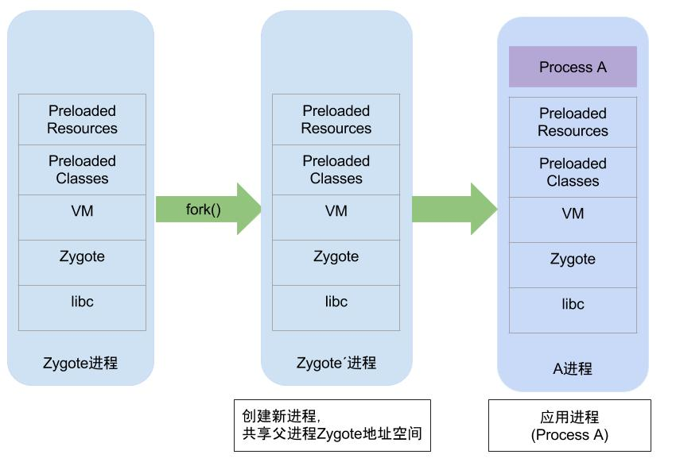
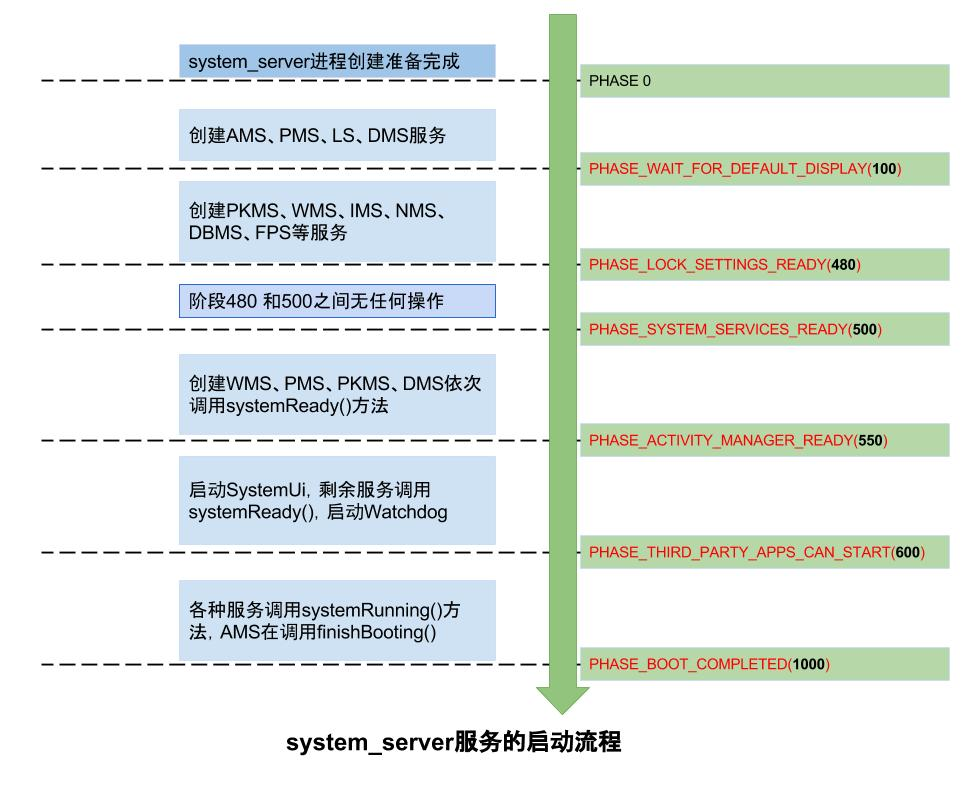
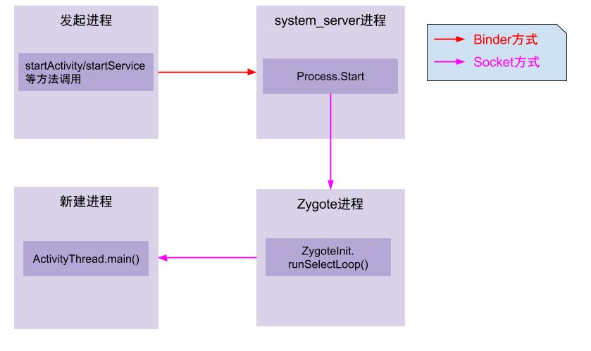

### Android启动流程


* linux内核启动创建Init进程(pid=1)
* init进程创建zygote进程(java孵化进程)和 servicemanager
* zygote通过fork生成system_server进程
* system_server通过zygote和servcemanager创建app进程
  
### init进程

```c
int main(int argc, char** argv) {
    signal_handler_init();  //初始化子进程退出的信号处理过程

    init_parse_config_file("/init.rc"); //解析init.rc文件

    //执行rc文件中触发器为 on early-init的语句
    action_for_each_trigger("early-init", action_add_queue_tail);
    //执行rc文件中触发器为 on init的语句
    action_for_each_trigger("init", action_add_queue_tail);
    //执行rc文件中触发器为 on late-init的语句
    action_for_each_trigger("late-init", action_add_queue_tail);

    while (true) {
        if (!waiting_for_exec) {
            execute_one_command();
            restart_processes();
        }
        epoll_event ev;
        //循环 等待事件发生
        int nr = TEMP_FAILURE_RETRY(epoll_wait(epoll_fd, &ev, 1, timeout));
        if (nr == -1) {
            ERROR("epoll_wait failed: %s\n", strerror(errno));
        } else if (nr == 1) {
            ((void (*)()) ev.data.ptr)();
        }
    }
    return 0;
}
```
* 分析和运行init.rc文件
* 创建zygote进程和system_server进程(通过rc文件创建)
* 处理子进程的终止(signal方式)


### init.rc配置

```java
//启动zygote进程  后启动system_server进程
service zygote /system/bin/app_process -Xzygote /system/bin --zygote --start-system-server

//创建socket
    socket zygote stream 660 root system   
```
* 先创建zygote进程 
* 后创建system_server进程
* 创建名为zygote socket



### zygote进程启动



#### App_main.cpp

```c++

int main(int argc, char* const argv[])
{
    AppRuntime runtime(argv[0], computeArgBlockSize(argc, argv));
    //设置进程名
    if (!niceName.isEmpty()) {
        runtime.setArgv0(niceName.string());
        set_process_name(niceName.string());
    }

    if (zygote) {
        // 启动AppRuntime
        runtime.start("com.android.internal.os.ZygoteInit", args, zygote);
    } else if (className) {
        runtime.start("com.android.internal.os.RuntimeInit", args, zygote);
    }
}
```

在app_process进程启动过程，有两个分支：

* 当zygote为true时，则执行ZygoteInit.main()
* 当zygote为false时，则执行RuntimeInit.main()

#### AndroidRuntime

```c++
void AndroidRuntime::start(const char* className, const Vector<String8>& options, bool zygote)
{
    // 虚拟机创建
    if (startVm(&mJavaVM, &env, zygote) != 0) {
        return;
    }
    onVmCreated(env);
    // JNI方法注册
    if (startReg(env) < 0) {
        return;
    }
    //调用com.android.internal.os.ZygoteInit#main()方法
     env->CallStaticVoidMethod(startClass, startMeth, strArray);
}

```
* 创建虚拟机
* 注册JNI方法
* 反射调用ZygoteInit#main方法

#### ZygoteInit

```java
public static void main(String argv[]) {
    try {
        registerZygoteSocket(socketName); //为Zygote注册socket
        preload(); // 预加载类和资源
        if (startSystemServer) {
            //启动system_server走这个流程
            startSystemServer(abiList, socketName);
        }
        runSelectLoop(abiList); //进入循环模式
    } catch (MethodAndArgsCaller caller) {
        caller.run(); //启动system_server中会讲到。
    }
}

```
* 为zygote注册socket
* 预加载类和资源(为fork创建做准备)
* 循环等待消息(等待AMS消息)
* startSystemServer 启动进程





#### 接收AMS消息进行处理

```c++
private static void runSelectLoop(String abiList) throws MethodAndArgsCaller {
    while (true) {
        //多路复用 轮询等待消息
        runOnce();
    }
}

//ZygoteConnection.java
boolean runOnce() throws ZygoteInit.MethodAndArgsCaller {

        //读取socket客户端发送过来的参数列表
    args = readArgumentList();
    try {
        descriptors = mSocket.getAncillaryFileDescriptors();
    } catch (IOException ex) {
        ...
        return true;
    }

    try {
        //将binder客户端传递过来的参数，解析成Arguments对象格式
        parsedArgs = new Arguments(args);
        //创建App进程
        pid = Zygote.forkAndSpecialize(parsedArgs.uid, parsedArgs.gid, parsedArgs.gids,
                parsedArgs.debugFlags, rlimits, parsedArgs.mountExternal, parsedArgs.seInfo,
                parsedArgs.niceName, fdsToClose, parsedArgs.instructionSet,
                parsedArgs.appDataDir);
    }
    if (pid == 0) {
        //子进程执行
        //进入子进程流程
        handleChildProc(parsedArgs, descriptors, childPipeFd, newStderr);
    } else {
        //父进程执行
        handleParentProc(pid, descriptors, serverPipeFd, parsedArgs);
    }
}

```
* 进入消息循环
* 通过socket读取消息，创建App进程  


### system_server进程启动


#### 前置流程 
```java
//前置流程
app_process#main -> AndroidRuntime#start() -> ZygoteInit#main() -> ZygoteInit.startSystemServer()
```
* 启动参数 --start-system-server

```c++
private static boolean startSystemServer(String abiList, String socketName)
        throws MethodAndArgsCaller, RuntimeException {

    String args[] = {
        "--setuid=1000",
        "--setgid=1000",
        "--setgroups=1001,1002,1003,1004,1005,1006,1007,1008,1009,1010,1018,1021,1032,3001,3002,3003,3006,3007",
        "--capabilities=" + capabilities + "," + capabilities,
        "--nice-name=system_server",
        "--runtime-args",
        "com.android.server.SystemServer",
    };

    // fork子进程system_server
    pid = Zygote.forkSystemServer(
            parsedArgs.uid, parsedArgs.gid,
            parsedArgs.gids,
            parsedArgs.debugFlags,
            null,
            parsedArgs.permittedCapabilities,
            parsedArgs.effectiveCapabilities);

    if (pid == 0) { //子进程
        if (hasSecondZygote(abiList)) {
            waitForSecondaryZygote(socketName);
        }
        //进入system_server进程
        handleSystemServerProcess(parsedArgs);
    }
    return true;
}

```
* 通过zygote fork创建 system_server进程


#### 启动system进程

```c++ 
private static void handleSystemServerProcess( ZygoteConnection.Arguments parsedArgs) throws ZygoteInit.MethodAndArgsCaller {
    ClassLoader cl = null;
    if (systemServerClasspath != null) {
        cl = new PathClassLoader(systemServerClasspath, ClassLoader.getSystemClassLoader());
        
        Thread.currentThread().setContextClassLoader(cl);
    }
    //RuntimeInit
    RuntimeInit.zygoteInit(parsedArgs.targetSdkVersion, parsedArgs.remainingArgs, cl);    
}
```
* 创建PathClassLoader类加载器
* RuntimeInit启动


```c++
//RuntimeInit.zygoteInit
public static final void zygoteInit(int targetSdkVersion, String[] argv, ClassLoader classLoader) throws ZygoteInit.MethodAndArgsCaller {
    commonInit(); // 通用的一些初始化
    nativeZygoteInit(); // zygote初始化
    applicationInit(targetSdkVersion, argv, classLoader); // 
}
```
* commonInit 通用初始化
* nativeZygoteInit 启动Binder线程池
* applicationInit 调用SystemServer.main()


```c++
protected static Runnable applicationInit(int targetSdkVersion, String[] argv,
        ClassLoader classLoader) {
    //com.android.server.SystemServer 
    invokeStaticMain(args.startClass, args.startArgs, classLoader);
}

public static void main(String argv[]) {
    try {
        startSystemServer(abiList, socketName); //抛出MethodAndArgsCaller异常
    } catch (MethodAndArgsCaller caller) {
        caller.run(); //此处通过反射,会调用SystemServer.main()方法
    }
}
```

* 采用抛出异常的方式,用于栈帧清空,提供利用率, 以至于现在大家看到的每个Java进程的调用栈如下:

```bash
    at com.android.server.SystemServer.main(SystemServer.java:175)
    at java.lang.reflect.Method.invoke!(Native method)
    at com.android.internal.os.ZygoteInit$MethodAndArgsCaller.run(ZygoteInit.java:738)
    at com.android.internal.os.ZygoteInit.main(ZygoteInit.java:628)
```

#### System.main

```java
public final class SystemServer {

    public static void main(String[] args) {
        //先初始化SystemServer对象，再调用对象的run()方法
        new SystemServer().run();
    }

    private void run() {
    
      Looper.prepareMainLooper();// 准备主线程looper

      //加载android_servers.so库，该库包含的源码在frameworks/base/services/目录下
      System.loadLibrary("android_servers");

      createSystemContext(); //初始化系统上下文

      //创建系统服务管理
      mSystemServiceManager = new SystemServiceManager(mSystemContext);
      LocalServices.addService(SystemServiceManager.class, mSystemServiceManager);

      //启动各种系统服务
      try {
          startBootstrapServices(); // 启动引导服务
          startCoreServices();      // 启动核心服务
          startOtherServices();     // 启动其他服务
    } catch (Throwable ex) {
        throw ex;
    }

    //一直循环执行
    Looper.loop();
    throw new RuntimeException("Main thread loop unexpectedly exited");
  }

//创建activityThread
  private void createSystemContext() {
    //创建system_server进程的上下文信息
    ActivityThread activityThread = ActivityThread.systemMain();
    mSystemContext = activityThread.getSystemContext();
    //设置主题
    mSystemContext.setTheme(android.R.style.Theme_DeviceDefault_Light_DarkActionBar);
 }

   
       private void startOtherServices() {
        //phase480 和phase500
        mSystemServiceManager.startBootPhase(SystemService.PHASE_LOCK_SETTINGS_READY);
        mSystemServiceManager.startBootPhase(SystemService.PHASE_SYSTEM_SERVICES_READY);

        mActivityManagerService.systemReady(new Runnable() {
           @Override
           public void run() {
               //phase550
               mSystemServiceManager.startBootPhase(
                       SystemService.PHASE_ACTIVITY_MANAGER_READY);
               //phase600
               mSystemServiceManager.startBootPhase(
                       SystemService.PHASE_THIRD_PARTY_APPS_CAN_START);

                        //启动home
        startHomeActivityLocked(mCurrentUserId, "systemReady");
        //恢复栈顶的Activity
        mStackSupervisor.resumeTopActivitiesLocked();
            }
        }
    }
}
```
* 创建Looper消息循环
* 创建serviceManager
* 创建引导服务 ActivityManagerService, PowerManagerService, LightsService, DisplayManagerService， PackageManagerService， UserManagerService， sensor服务
* 创建核心服务 BatteryService，UsageStatsService，WebViewUpdateService
* 创建其他服务

#### 服务启动



启动启动过程有采用过两种不同的方式来注册系统服务：

* ServiceManager的addService()
* SystemServiceManager的startService()

服务列表 
* 引导服务(7个)：ActivityManagerService、PowerManagerService、LightsService、DisplayManagerService、PackageManagerService、UserManagerService、SensorService；
* 核心服务(3个)：BatteryService、UsageStatsService、WebViewUpdateService；
* 其他服务(70个+)：AlarmManagerService、VibratorService等。


### App启动流程



* App发起进程：当从桌面启动应用，则发起进程便是Launcher所在进程；当从某App内启动远程进程，则发送进程便是该App所在进程。发起进程先通过binder发送消息给system_server进程；
* system_server进程：调用Process.start()方法，通过socket向zygote进程发送创建新进程的请求；
* zygote进程：在执行ZygoteInit.main()后便进入runSelectLoop()循环体内，当有客户端连接时便会执行ZygoteConnection.runOnce()方法，再经过层层调用后fork出新的应用进程；
* 新进程：执行handleChildProc方法，最后调用ActivityThread.main()方法。


```bash
startActivity->AMS.startProceesLocked->Procees.start->Process.startViaZygote->ZygoteInit.runOnce->fork->handleChildProc->RuntimeInit.zygoteInit->ActivityThread.main()
```

ActivityThread启动
```
public static void main(String[] args) {
    Environment.initForCurrentUser();
    Process.setArgV0("<pre-initialized>");
    //创建主线程looper
    Looper.prepareMainLooper();

    ActivityThread thread = new ActivityThread();
    //attach到系统进程
    thread.attach(false);

    if (sMainThreadHandler == null) {
        sMainThreadHandler = thread.getHandler();
    }

    //主线程进入循环状态
    Looper.loop();

    throw new RuntimeException("Main thread loop unexpectedly exited");
}
```


### 源码路径

```java
//启动init.main入口
/system/core/init/Init.cpp
//init.rc配置 
/system/core/rootdir/init.rc

//zygote入口
/frameworks/base/cmds/app_process/App_main.cpp
//启动类
/frameworks/base/core/jni/AndroidRuntime.cpp

//初始化
/frameworks/base/core/java/com/android/internal/os/
  - ZygoteInit.java
  - RuntimeInit.java
  - Zygote.java

/frameworks/base/core/services/java/com/android/server/
  - SystemServer.java

/frameworks/base/core/jni/
  - com_android_internal_os_Zygote.cpp

  frameworks/base/services/java/com/android/server/
  - SystemServer.java

frameworks/base/services/core/java/com/android/server/
  - SystemServiceManager.java
  - ServiceThread.java
  - am/ActivityManagerService.java

frameworks/base/core/java/android/app/
  - ActivityThread.java
  - LoadedApk.java
  - ContextImpl.java

/frameworks/base/core/java/android/os/Process.java

```