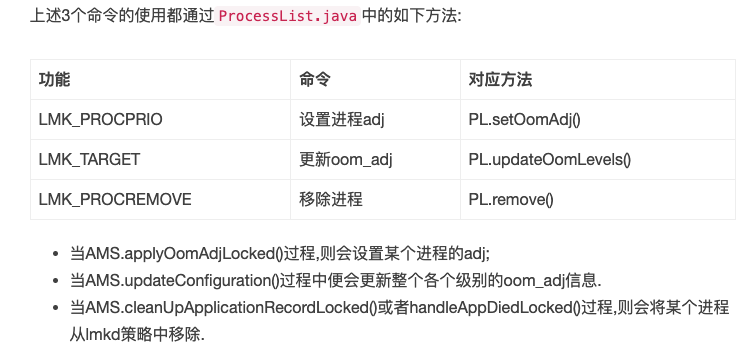
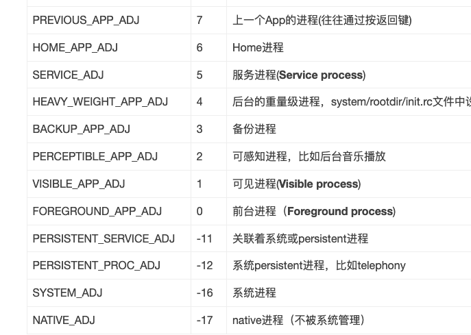

### trace程序

#### native进程 debuggerd

```bash
# -b 控制台打印
debuggerd -b <tid> 
debuggerd <tid>

# 输出日志 /data/tombstones/tombstone_XX

```

* Client进程调用send_request()方法向debuggerd服务端发出DEBUGGER_ACTION_DUMP_BACKTRACE命令；
* Debugggerd进程收到该命令，fork子进程中再执行worker_process()过程；ptrace进程
* 子进程通过perform_dump()方法来根据命令DEBUGGER_ACTION_DUMP_BACKTRACE，会调用到dump_backtrace()方法输出backtrace.

#### java进程

```bash
kill -3 <pid>

# 输出日志 /data/anr/traces.txt
```


### Installd守护进程
应用程序安装和卸载


### lmkd守护进程
LowMemoryKiller(低内存杀手)
调整进程优先级



进程优先级



### logd日志

```bash
logcat -b events // 输出指定buffer的log
logcat -s "ActivityManager"
logcat -L //上次重启时的log
logcat -f [filename] //将log保存到指定文件
logcat -g //缓冲区大小
logcat -S  //统计log信息
```

#### java层
```c++
//写入
Log.i-> println_native->__android_log_buf_write->ocket (“/dev/socket/logdw”)

//接收

```

#### 内核日志

```bash
printk(KERN_INFO x);

# 日志输出到文件/proc/kmsg，可通过cat /proc/kmsg来获取内核log信息。

cat /proc/sys/kernel/printk
```
