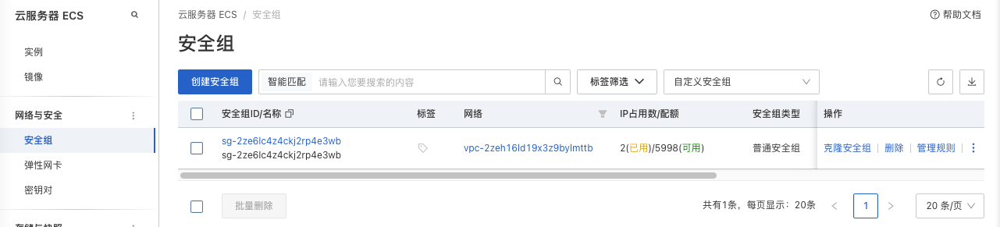
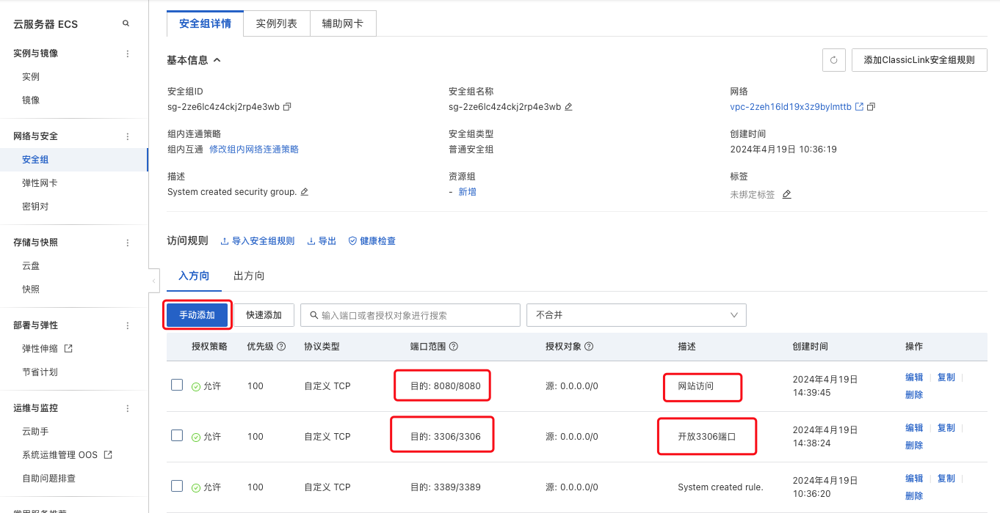

### 安全组


### 开放端口


### 配合ufw防火墙 做两层控制

安全组 控制外部访问

防火墙做内部控制, 采用远程接口调用+ufw命令做动态控制

### ufw防火墙
```bash
sudo ufw enable  # 开启防火墙

sudo ufw disable  # 关闭防火墙

sudo ufw status  # 查看端口状态
```

### 开放端口

```bash
# 允许外部访问3306端口（tcp/udp）
sudo ufw allow 3306  

# 允许此IP访问本机所有端口
sudo ufw allow from 192.168.1.100  

# 指定IP段访问特定端口
sudo ufw proto tcp from 192.168.1.0/24 to any port 443  

# 删除3306端口的访问权限（关闭端口的访问，外部无法访问该端口）
sudo ufw delete allow 3306  
```
